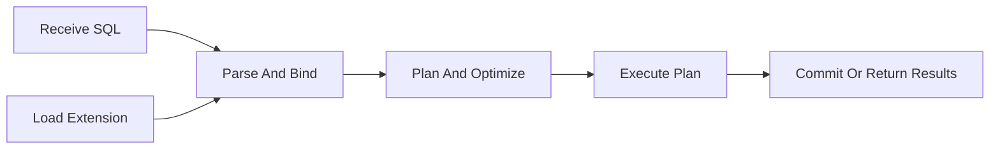
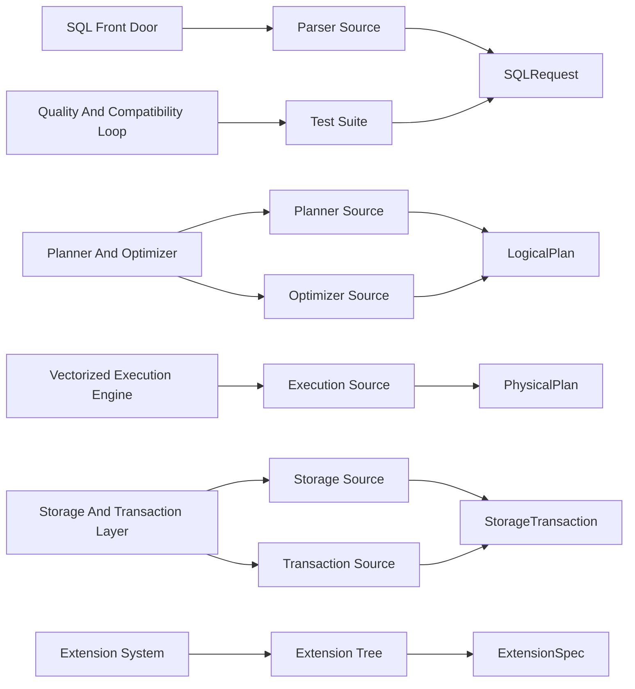
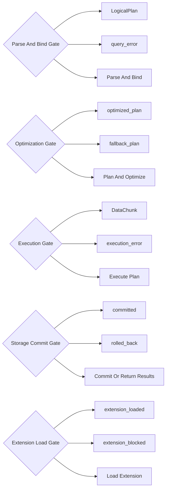
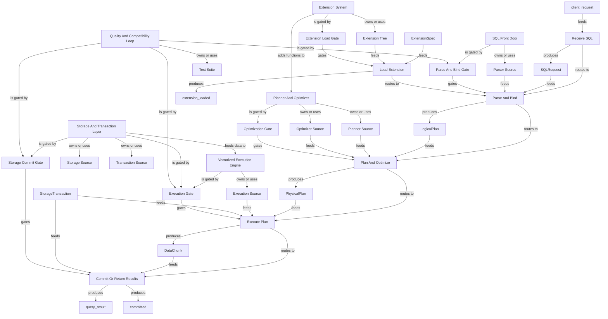

# DuckDB Public Repo System Review Graph

Generated: `2026-06-08T20:57:31+00:00`
Scope: A public-safe system map of the DuckDB open-source repository based on public source directories and documentation.
One line: DuckDB turns SQL and local data access into vectorized analytical execution inside an embedded database engine.
Depth: `deep`

## Bigger Picture

This example shows how to map a database engine repo. The system is not just a command-line tool or a client library; it is a layered execution engine where SQL is parsed, bound, planned, optimized, executed in vectorized operators, connected to storage and transactions, and extended through extensions. A reviewer should understand the route from query text to result chunks and persisted state.

## Current Truth

- `example_type`: `actual_public_repo`
- `repo`: `duckdb/duckdb`
- `source_accessed_at`: `2026-06-08`
- `private_database_required`: `false`
- `production_data_required`: `false`
- `official_maintainer_audit`: `false`

## Source Links

| Source | Notes |
|---|---|
| [GitHub repository](https://github.com/duckdb/duckdb) | Primary public source used for repo identity and source paths. |
| [DuckDB documentation](https://duckdb.org/docs/) | Public docs for SQL, clients, extensions, and engine behavior. |
| [DuckDB internals overview](https://duckdb.org/docs/stable/internals/overview) | Public internals documentation for engine orientation. |

## Report Registers

These registers turn the map into an audit surface: what is covered, what evidence supports it, what remains open, and what a reviewer should do next.

### Coverage Register

| Area | Count | What It Means | Reviewer Use |
|---|---:|---|---|
| Systems | 6 | Bounded contexts, services, subsystems, or product surfaces. | Use this to see whether the report maps the main operating areas. |
| Artifacts | 8 | Inspectable files, APIs, tables, dashboards, reports, or outputs. | Use this to trace where system claims can be inspected. |
| Schemas/contracts | 6 | Public or sanitized contracts for artifacts and handoffs. | Use this to rebuild examples without touching private data. |
| Decision gates | 5 | Rules that advance, wait, block, or require human review. | Use this to find where the system controls action. |
| Workflows | 6 | Lifecycle steps from input to output. | Use this to follow what happens end to end. |
| Graph edges | 49 | Explicit and derived relationships between manifest nodes. | Use this to audit connectivity and missing relationships. |
| Child maps | 0 | Linked subsystem maps for large repositories. | Use this to drill into a map-of-maps instead of one flat report. |
| Blueprint sections | 0 | Source-evidence-backed operating flows. | Use this to review deep behavior claims with proof anchors. |
| Blueprint evidence rows | 0 | Source paths, symbols, roles, and proof levels. | Use this to verify whether blueprint claims are source-backed. |
| Source links | 3 | External or public references used by the report. | Use this to confirm the report's public evidence base. |
| Known boundaries | 4 | Open limits, unproven claims, redactions, or scope exclusions. | Use this to avoid treating the report as stronger than it is. |
| Review questions | 5 | Questions a maintainer, auditor, or agent should answer next. | Use this as the human follow-up queue. |
| Rebuild phases | 2 | Documented commands or phases for reproducing the report. | Use this to regenerate or verify the report locally. |

### Evidence Register

| Evidence | Kind | Coverage | Proof | Reviewer Use |
|---|---|---|---|---|
| [GitHub repository](https://github.com/duckdb/duckdb) | source link | whole report | declared | Primary public source used for repo identity and source paths. |
| [DuckDB documentation](https://duckdb.org/docs/) | source link | whole report | declared | Public docs for SQL, clients, extensions, and engine behavior. |
| [DuckDB internals overview](https://duckdb.org/docs/stable/internals/overview) | source link | whole report | declared | Public internals documentation for engine orientation. |
| src/parser/ | source_directory | engine | safe_to_share | Turns SQL text into parsed statements. |
| src/planner/ | source_directory | engine | safe_to_share | Binds and plans parsed SQL into logical operators. |
| src/optimizer/ | source_directory | engine | safe_to_share | Rewrites and improves logical plans before physical execution. |
| src/execution/ | source_directory | engine | safe_to_share | Executes physical operators and data pipelines. |
| src/storage/ | source_directory | engine | safe_to_share | Handles table storage, persistence, scans, and writes. |
| src/transaction/ | source_directory | engine | safe_to_share | Coordinates transaction lifecycle and commit boundaries. |
| extension/ | source_directory | extensions | safe_to_share | Hosts built-in and optional extension surfaces such as parquet, json, icu, tpch, and tpcds. |
| test/ | tests | quality | safe_to_share | Protects SQL behavior, storage behavior, extensions, and compatibility. |
| SQLRequest | query_contract | sql_text, connection_context, parameters, transaction_state | contract declared | Represents incoming SQL and execution context before parsing and binding. |
| LogicalPlan | planning_contract | operators, bindings, types, catalog_refs | contract declared | Represents a query after parsing and semantic binding. |
| PhysicalPlan | execution_contract | physical_operators, pipelines, dependencies, estimated_costs | contract declared | Represents executable operator pipelines. |
| DataChunk | vectorized_data_contract | vectors, column_types, cardinality | contract declared | Represents batches of data flowing through vectorized execution. |
| StorageTransaction | storage_contract | catalog_state, table_state, write_set, commit_status | contract declared | Represents storage and transaction state for reads and writes. |
| ExtensionSpec | extension_contract | extension_name, functions, load_policy, compatibility | contract declared | Describes extension-provided functionality and loading boundaries. |

### Gap Register

| Gap | Area | Status | Boundary | Next Step |
|---|---|---|---|---|
| Known boundary | whole report | open | This is a public educational map, not an official DuckDB maintainer audit. | Accept the boundary or add evidence that closes it. |
| Known boundary | whole report | open | It maps high-level engine layers and public source paths, not every operator or internal invariant. | Accept the boundary or add evidence that closes it. |
| Known boundary | whole report | open | A real audit should inspect a specific commit, build configuration, tests, fuzzers, benchmarks, and release notes. | Accept the boundary or add evidence that closes it. |
| Known boundary | whole report | open | Do not use production SQL or private data in public examples. | Accept the boundary or add evidence that closes it. |
| System truth boundary | SQL Front Door | review | A parsed query is not executable until binding and planning succeed. | Inspect this boundary before making stronger behavior claims. |
| System truth boundary | Planner And Optimizer | review | Optimization must not change query meaning. | Inspect this boundary before making stronger behavior claims. |
| System truth boundary | Vectorized Execution Engine | review | Execution depends on valid plan, memory, transaction, and storage state. | Inspect this boundary before making stronger behavior claims. |
| System truth boundary | Storage And Transaction Layer | review | Storage behavior is valid only within transaction rules. | Inspect this boundary before making stronger behavior claims. |
| System truth boundary | Extension System | review | Extensions expand behavior but must respect engine compatibility and load policy. | Inspect this boundary before making stronger behavior claims. |
| System truth boundary | Quality And Compatibility Loop | review | This report does not replace upstream CI or benchmark review. | Inspect this boundary before making stronger behavior claims. |
| Blueprint not declared | whole report | optional | No source-backed blueprint sections were declared. | Add blueprint sections when the report needs source-level proof. |

### Action Register

| Action | Owner | Status | Trigger | Expected Output |
|---|---|---|---|---|
| Review question | maintainer / auditor | open | How does SQL move from text to parsed statement, logical plan, optimized plan, physical operators, and result chunks? | Answer from source, tests, docs, logs, or maintainer knowledge. |
| Review question | maintainer / auditor | open | Which gates preserve query semantics during binding and optimization? | Answer from source, tests, docs, logs, or maintainer knowledge. |
| Review question | maintainer / auditor | open | Where do storage and transaction boundaries constrain execution? | Answer from source, tests, docs, logs, or maintainer knowledge. |
| Review question | maintainer / auditor | open | How do extensions expand engine behavior without destabilizing the core? | Answer from source, tests, docs, logs, or maintainer knowledge. |
| Review question | maintainer / auditor | open | Which public tests, fuzzers, benchmarks, and release notes would a deeper audit inspect? | Answer from source, tests, docs, logs, or maintainer knowledge. |
| Resolve boundary | maintainer / auditor | open | This is a public educational map, not an official DuckDB maintainer audit. | Accept as scope or add proof that closes it. |
| Resolve boundary | maintainer / auditor | open | It maps high-level engine layers and public source paths, not every operator or internal invariant. | Accept as scope or add proof that closes it. |
| Resolve boundary | maintainer / auditor | open | A real audit should inspect a specific commit, build configuration, tests, fuzzers, benchmarks, and release notes. | Accept as scope or add proof that closes it. |
| Resolve boundary | maintainer / auditor | open | Do not use production SQL or private data in public examples. | Accept as scope or add proof that closes it. |
| Rebuild phase | maintainer / agent | repeatable | validate | Check the DuckDB public repo manifest. |
| Rebuild phase | maintainer / agent | repeatable | build | Generate the DuckDB system review report. |

## Lifecycle Map



## Artifact And Schema Map



## Gate Map



## Relationship Graph



## Expansion Index

| Level | Use It To Answer | Report Section |
|---|---|---|
| 0. Situation | What is true now? | Current Truth |
| 0.25. Registers | What is covered, proven, open, and actionable? | Report Registers |
| 0.5. Atlas | Which child map should I open next? | Map Of Maps |
| 0.75. Blueprint | Which source-backed flows explain the whole system? | Blueprint Sections |
| 1. Flow | How does the system move end to end? | Lifecycle Map |
| 2. Ownership | Which subsystem owns which artifact? | Artifact And Schema Map |
| 3. Control | Which rules advance, wait, or block? | Gate Map |
| 4. Implementation | Which files, APIs, docs, or outputs should I inspect? | System Details |
| 5. Audit | What should an external reviewer ask next? | Review Questions |

## Systems

| System | Owner | Stack | Architecture | Lifecycle | Boundary | Ideal Target |
|---|---|---|---|---|---|---|
| SQL Front Door | engine | C++, SQL | embedded database front end | SQLRequest -> parser -> binder -> LogicalPlan | A parsed query is not executable until binding and planning succeed. | Query errors are caught early with clear semantics. |
| Planner And Optimizer | engine | C++ | query planner and optimizer | LogicalPlan -> optimized plan -> PhysicalPlan | Optimization must not change query meaning. | The cheapest safe plan is selected for execution. |
| Vectorized Execution Engine | engine | C++ | vectorized analytical execution | PhysicalPlan -> operator pipeline -> DataChunk | Execution depends on valid plan, memory, transaction, and storage state. | Analytical queries execute predictably and efficiently. |
| Storage And Transaction Layer | engine | C++ | embedded storage manager | scan/write request -> storage state -> commit or rollback | Storage behavior is valid only within transaction rules. | Reads and writes remain consistent across local analytical workloads. |
| Extension System | extensions | C++ | extension framework | extension spec -> load gate -> functions/operators | Extensions expand behavior but must respect engine compatibility and load policy. | New capabilities plug in without destabilizing core execution. |
| Quality And Compatibility Loop | quality | C++, SQL, Python | test matrix | source change -> test cases -> release confidence | This report does not replace upstream CI or benchmark review. | Engine changes remain behaviorally compatible and measurable. |

## System Details

### SQL Front Door

- Purpose: Accepts SQL from clients and turns it into parsed and bound statements.
- Code surfaces: `src/parser/`, `src/main/`
- Artifacts: `parser_source`
- Decision gates: `parse_bind_gate`
- Boundary: A parsed query is not executable until binding and planning succeed.
- Ideal target: Query errors are caught early with clear semantics.

Artifact expansion:

| Artifact | Kind | Schema | Path | Why It Matters |
|---|---|---|---|---|
| Parser Source | source_directory | SQLRequest | src/parser/ | Turns SQL text into parsed statements. |

Gate expansion:

| Gate | Inputs | Outputs | Risk Boundary |
|---|---|---|---|
| Parse And Bind Gate | SQLRequest, catalog_state | LogicalPlan, query_error | Invalid SQL or missing catalog references should not reach execution. |

Workflow touchpoints:

| Step | Actor | Consumes | Produces | Gates |
|---|---|---|---|---|
| Receive SQL | SQL Front Door | client_request | SQLRequest |  |
| Parse And Bind | SQL Front Door | SQLRequest, parser_source | LogicalPlan | parse_bind_gate |

### Planner And Optimizer

- Purpose: Builds logical plans and rewrites them into better executable forms.
- Code surfaces: `src/planner/`, `src/optimizer/`
- Artifacts: `planner_source`, `optimizer_source`
- Decision gates: `optimization_gate`
- Boundary: Optimization must not change query meaning.
- Ideal target: The cheapest safe plan is selected for execution.

Artifact expansion:

| Artifact | Kind | Schema | Path | Why It Matters |
|---|---|---|---|---|
| Planner Source | source_directory | LogicalPlan | src/planner/ | Binds and plans parsed SQL into logical operators. |
| Optimizer Source | source_directory | LogicalPlan | src/optimizer/ | Rewrites and improves logical plans before physical execution. |

Gate expansion:

| Gate | Inputs | Outputs | Risk Boundary |
|---|---|---|---|
| Optimization Gate | LogicalPlan, statistics | optimized_plan, fallback_plan | Optimization should preserve query semantics. |

Workflow touchpoints:

| Step | Actor | Consumes | Produces | Gates |
|---|---|---|---|---|
| Plan And Optimize | Planner And Optimizer | LogicalPlan, planner_source, optimizer_source | PhysicalPlan | optimization_gate |

### Vectorized Execution Engine

- Purpose: Executes physical operator pipelines over data chunks.
- Code surfaces: `src/execution/`
- Artifacts: `execution_source`
- Decision gates: `execution_gate`
- Boundary: Execution depends on valid plan, memory, transaction, and storage state.
- Ideal target: Analytical queries execute predictably and efficiently.

Artifact expansion:

| Artifact | Kind | Schema | Path | Why It Matters |
|---|---|---|---|---|
| Execution Source | source_directory | PhysicalPlan | src/execution/ | Executes physical operators and data pipelines. |

Gate expansion:

| Gate | Inputs | Outputs | Risk Boundary |
|---|---|---|---|
| Execution Gate | PhysicalPlan, StorageTransaction | DataChunk, execution_error | Physical operators should respect transaction and memory boundaries. |

Workflow touchpoints:

| Step | Actor | Consumes | Produces | Gates |
|---|---|---|---|---|
| Execute Plan | Vectorized Execution Engine | PhysicalPlan, execution_source, StorageTransaction | DataChunk | execution_gate |

### Storage And Transaction Layer

- Purpose: Persists data, scans tables, and coordinates transaction boundaries.
- Code surfaces: `src/storage/`, `src/transaction/`
- Artifacts: `storage_source`, `transaction_source`
- Decision gates: `storage_commit_gate`, `execution_gate`
- Boundary: Storage behavior is valid only within transaction rules.
- Ideal target: Reads and writes remain consistent across local analytical workloads.

Artifact expansion:

| Artifact | Kind | Schema | Path | Why It Matters |
|---|---|---|---|---|
| Storage Source | source_directory | StorageTransaction | src/storage/ | Handles table storage, persistence, scans, and writes. |
| Transaction Source | source_directory | StorageTransaction | src/transaction/ | Coordinates transaction lifecycle and commit boundaries. |

Gate expansion:

| Gate | Inputs | Outputs | Risk Boundary |
|---|---|---|---|
| Storage Commit Gate | StorageTransaction | committed, rolled_back | Writes should commit atomically or roll back. |
| Execution Gate | PhysicalPlan, StorageTransaction | DataChunk, execution_error | Physical operators should respect transaction and memory boundaries. |

Workflow touchpoints:

| Step | Actor | Consumes | Produces | Gates |
|---|---|---|---|---|
| Execute Plan | Vectorized Execution Engine | PhysicalPlan, execution_source, StorageTransaction | DataChunk | execution_gate |
| Commit Or Return Results | Storage And Transaction Layer | DataChunk, StorageTransaction | query_result, committed | storage_commit_gate |

### Extension System

- Purpose: Adds optional capabilities and file/function integrations through extension modules.
- Code surfaces: `extension/`
- Artifacts: `extension_tree`
- Decision gates: `extension_load_gate`
- Boundary: Extensions expand behavior but must respect engine compatibility and load policy.
- Ideal target: New capabilities plug in without destabilizing core execution.

Artifact expansion:

| Artifact | Kind | Schema | Path | Why It Matters |
|---|---|---|---|---|
| Extension Tree | source_directory | ExtensionSpec | extension/ | Hosts built-in and optional extension surfaces such as parquet, json, icu, tpch, and tpcds. |

Gate expansion:

| Gate | Inputs | Outputs | Risk Boundary |
|---|---|---|---|
| Extension Load Gate | ExtensionSpec | extension_loaded, extension_blocked | Extensions should load only when compatible and allowed by policy. |

Workflow touchpoints:

| Step | Actor | Consumes | Produces | Gates |
|---|---|---|---|---|
| Load Extension | Extension System | ExtensionSpec, extension_tree | extension_loaded | extension_load_gate |

### Quality And Compatibility Loop

- Purpose: Exercises SQL, storage, extension, and compatibility scenarios.
- Code surfaces: `test/`
- Artifacts: `test_suite`
- Decision gates: `parse_bind_gate`, `execution_gate`, `storage_commit_gate`
- Boundary: This report does not replace upstream CI or benchmark review.
- Ideal target: Engine changes remain behaviorally compatible and measurable.

Artifact expansion:

| Artifact | Kind | Schema | Path | Why It Matters |
|---|---|---|---|---|
| Test Suite | tests | SQLRequest | test/ | Protects SQL behavior, storage behavior, extensions, and compatibility. |

Gate expansion:

| Gate | Inputs | Outputs | Risk Boundary |
|---|---|---|---|
| Parse And Bind Gate | SQLRequest, catalog_state | LogicalPlan, query_error | Invalid SQL or missing catalog references should not reach execution. |
| Execution Gate | PhysicalPlan, StorageTransaction | DataChunk, execution_error | Physical operators should respect transaction and memory boundaries. |
| Storage Commit Gate | StorageTransaction | committed, rolled_back | Writes should commit atomically or roll back. |

Workflow touchpoints:

| Step | Actor | Consumes | Produces | Gates |
|---|---|---|---|---|
| Parse And Bind | SQL Front Door | SQLRequest, parser_source | LogicalPlan | parse_bind_gate |
| Execute Plan | Vectorized Execution Engine | PhysicalPlan, execution_source, StorageTransaction | DataChunk | execution_gate |
| Commit Or Return Results | Storage And Transaction Layer | DataChunk, StorageTransaction | query_result, committed | storage_commit_gate |

## Artifacts

| Artifact | Kind | Schema | Owner | Path | Redaction | Purpose |
|---|---|---|---|---|---|---|
| Parser Source | source_directory | SQLRequest | engine | src/parser/ | safe_to_share | Turns SQL text into parsed statements. |
| Planner Source | source_directory | LogicalPlan | engine | src/planner/ | safe_to_share | Binds and plans parsed SQL into logical operators. |
| Optimizer Source | source_directory | LogicalPlan | engine | src/optimizer/ | safe_to_share | Rewrites and improves logical plans before physical execution. |
| Execution Source | source_directory | PhysicalPlan | engine | src/execution/ | safe_to_share | Executes physical operators and data pipelines. |
| Storage Source | source_directory | StorageTransaction | engine | src/storage/ | safe_to_share | Handles table storage, persistence, scans, and writes. |
| Transaction Source | source_directory | StorageTransaction | engine | src/transaction/ | safe_to_share | Coordinates transaction lifecycle and commit boundaries. |
| Extension Tree | source_directory | ExtensionSpec | extensions | extension/ | safe_to_share | Hosts built-in and optional extension surfaces such as parquet, json, icu, tpch, and tpcds. |
| Test Suite | tests | SQLRequest | quality | test/ | safe_to_share | Protects SQL behavior, storage behavior, extensions, and compatibility. |

## Schemas And Contracts

| Name | Kind | Required Fields | Privacy Notes | Purpose |
|---|---|---|---|---|
| SQLRequest | query_contract | sql_text, connection_context, parameters, transaction_state |  | Represents incoming SQL and execution context before parsing and binding. |
| LogicalPlan | planning_contract | operators, bindings, types, catalog_refs |  | Represents a query after parsing and semantic binding. |
| PhysicalPlan | execution_contract | physical_operators, pipelines, dependencies, estimated_costs |  | Represents executable operator pipelines. |
| DataChunk | vectorized_data_contract | vectors, column_types, cardinality |  | Represents batches of data flowing through vectorized execution. |
| StorageTransaction | storage_contract | catalog_state, table_state, write_set, commit_status |  | Represents storage and transaction state for reads and writes. |
| ExtensionSpec | extension_contract | extension_name, functions, load_policy, compatibility |  | Describes extension-provided functionality and loading boundaries. |

## Decision Gates

### Parse And Bind Gate

- Inputs: `SQLRequest, catalog_state`
- Outputs: `LogicalPlan, query_error`
- Human gate: `false`
- Risk boundary: Invalid SQL or missing catalog references should not reach execution.

| If | Then |
|---|---|
| SQL parses and all names/types bind | LogicalPlan |
| syntax, type, or catalog binding fails | query_error |

### Optimization Gate

- Inputs: `LogicalPlan, statistics`
- Outputs: `optimized_plan, fallback_plan`
- Human gate: `false`
- Risk boundary: Optimization should preserve query semantics.

| If | Then |
|---|---|
| rewrite is valid and beneficial | optimized_plan |
| rewrite is unsafe or not applicable | fallback_plan |

### Execution Gate

- Inputs: `PhysicalPlan, StorageTransaction`
- Outputs: `DataChunk, execution_error`
- Human gate: `false`
- Risk boundary: Physical operators should respect transaction and memory boundaries.

| If | Then |
|---|---|
| operators and resources are valid | DataChunk |
| runtime error, resource issue, or invalid state | execution_error |

### Storage Commit Gate

- Inputs: `StorageTransaction`
- Outputs: `committed, rolled_back`
- Human gate: `false`
- Risk boundary: Writes should commit atomically or roll back.

| If | Then |
|---|---|
| transaction validates and commit succeeds | committed |
| conflict or failure | rolled_back |

### Extension Load Gate

- Inputs: `ExtensionSpec`
- Outputs: `extension_loaded, extension_blocked`
- Human gate: `false`
- Risk boundary: Extensions should load only when compatible and allowed by policy.

| If | Then |
|---|---|
| extension is compatible and policy allows loading | extension_loaded |
| extension incompatible or policy blocks | extension_blocked |

## Workflows

| Step | Actor | Consumes | Gates | Produces | Next | Purpose |
|---|---|---|---|---|---|---|
| Receive SQL | SQL Front Door | client_request |  | SQLRequest | parse_and_bind | Capture SQL and connection context. |
| Parse And Bind | SQL Front Door | SQLRequest, parser_source | parse_bind_gate | LogicalPlan | plan_and_optimize | Convert SQL into a typed logical representation. |
| Plan And Optimize | Planner And Optimizer | LogicalPlan, planner_source, optimizer_source | optimization_gate | PhysicalPlan | execute_plan | Build executable operators while preserving semantics. |
| Execute Plan | Vectorized Execution Engine | PhysicalPlan, execution_source, StorageTransaction | execution_gate | DataChunk | commit_or_return | Run physical operators and move vectorized data. |
| Commit Or Return Results | Storage And Transaction Layer | DataChunk, StorageTransaction | storage_commit_gate | query_result, committed |  | Return read results or commit write transactions. |
| Load Extension | Extension System | ExtensionSpec, extension_tree | extension_load_gate | extension_loaded | parse_and_bind | Make extension functionality available to query planning and execution. |

## Architecture Patterns

### Database engine

- Works for: Embedded databases, query engines, storage engines, and analytical runtimes
- How to map it: Map front end, planner, optimizer, execution, storage, transaction, extension, and test loops.
- What to redact: Public repos can expose source paths; private engines can expose logical layers and interface contracts only.

### Private data strategy

- Works for: Companies that cannot expose databases or workloads
- How to map it: Use fake SQL examples, logical contracts, benchmark categories, and gate descriptions instead of production queries.
- What to redact: Never publish customer SQL, table names, data files, or workload traces without rights.

## Walkthroughs

### One query through the engine

A SQL request is parsed and bound into a logical plan, optimized, converted to physical operators, executed over data chunks, and either returned as a result or committed if it changes storage.

```json
{
  "gates": [
    "parse_bind_gate",
    "optimization_gate",
    "execution_gate"
  ],
  "input": "SELECT count(*) FROM sample_table",
  "path": [
    "SQLRequest",
    "LogicalPlan",
    "PhysicalPlan",
    "DataChunk",
    "query_result"
  ]
}
```

### How to audit a private engine without workload data

A reviewer can inspect logical layers, contracts, gates, tests, and fake workloads without seeing private datasets or production SQL.

```json
{
  "requires_customer_data": false,
  "safe_artifacts": [
    "src/parser/",
    "src/planner/",
    "src/optimizer/",
    "src/execution/",
    "src/storage/",
    "test/"
  ]
}
```

## Review Questions

- How does SQL move from text to parsed statement, logical plan, optimized plan, physical operators, and result chunks?
- Which gates preserve query semantics during binding and optimization?
- Where do storage and transaction boundaries constrain execution?
- How do extensions expand engine behavior without destabilizing the core?
- Which public tests, fuzzers, benchmarks, and release notes would a deeper audit inspect?

## Rebuild Recipe

### validate

- Goal: Check the DuckDB public repo manifest.

```bash
system-review-graph validate --manifest examples/actual_repos/duckdb/system_review_manifest.json
```

### build

- Goal: Generate the DuckDB system review report.

```bash
system-review-graph build --manifest examples/actual_repos/duckdb/system_review_manifest.json --out-dir examples/actual_repos/duckdb/reports
```

## Known Boundaries

- This is a public educational map, not an official DuckDB maintainer audit.
- It maps high-level engine layers and public source paths, not every operator or internal invariant.
- A real audit should inspect a specific commit, build configuration, tests, fuzzers, benchmarks, and release notes.
- Do not use production SQL or private data in public examples.
