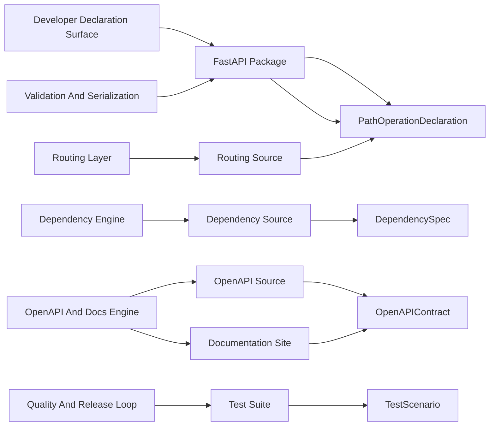
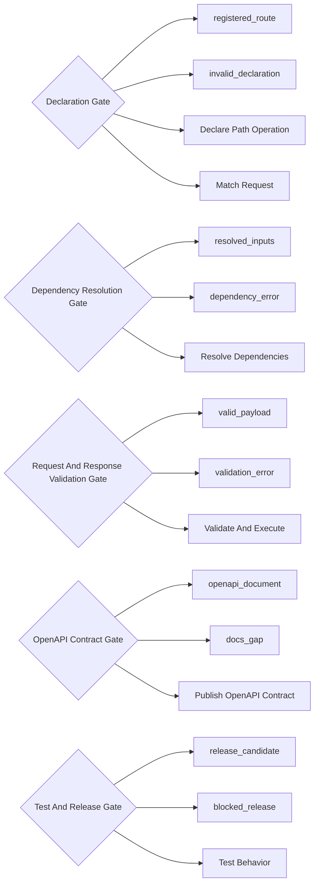
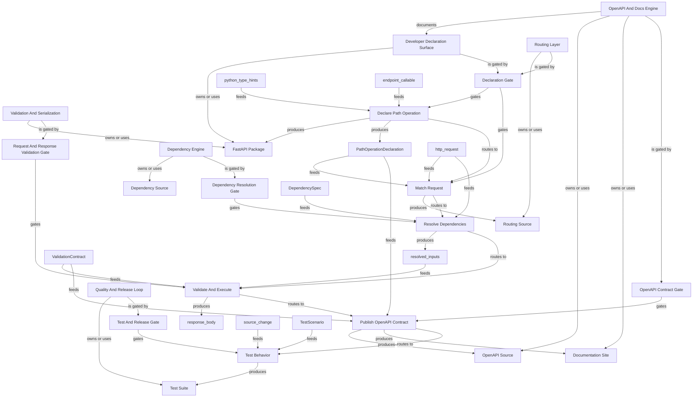

# FastAPI Public Repo System Review Graph

Generated: `2026-06-08T20:57:31+00:00`
Scope: A public-safe system map of the FastAPI open-source repository based on public source directories and documentation.
One line: FastAPI turns Python type hints and path-operation declarations into validated API runtime behavior and OpenAPI contracts.
Depth: `deep`

## Bigger Picture

This example shows how to map a framework repo. The system is not one deployed application; it is a reusable engine that lets application authors declare routes, dependencies, models, security, and documentation contracts. A reviewer should follow how a developer declaration becomes runtime routing, validation, response handling, and OpenAPI documentation.

## Current Truth

- `example_type`: `actual_public_repo`
- `repo`: `fastapi/fastapi`
- `source_accessed_at`: `2026-06-08`
- `private_database_required`: `false`
- `production_data_required`: `false`
- `official_maintainer_audit`: `false`

## Source Links

| Source | Notes |
|---|---|
| [GitHub repository](https://github.com/fastapi/fastapi) | Primary public source used for repo identity and source paths. |
| [FastAPI documentation](https://fastapi.tiangolo.com/) | Public docs for framework concepts and user-facing behavior. |
| [Public OpenAPI docs concept](https://fastapi.tiangolo.com/features/) | High-level feature surface for generated API documentation and validation. |

## Report Registers

These registers turn the map into an audit surface: what is covered, what evidence supports it, what remains open, and what a reviewer should do next.

### Coverage Register

| Area | Count | What It Means | Reviewer Use |
|---|---:|---|---|
| Systems | 6 | Bounded contexts, services, subsystems, or product surfaces. | Use this to see whether the report maps the main operating areas. |
| Artifacts | 6 | Inspectable files, APIs, tables, dashboards, reports, or outputs. | Use this to trace where system claims can be inspected. |
| Schemas/contracts | 5 | Public or sanitized contracts for artifacts and handoffs. | Use this to rebuild examples without touching private data. |
| Decision gates | 5 | Rules that advance, wait, block, or require human review. | Use this to find where the system controls action. |
| Workflows | 6 | Lifecycle steps from input to output. | Use this to follow what happens end to end. |
| Graph edges | 45 | Explicit and derived relationships between manifest nodes. | Use this to audit connectivity and missing relationships. |
| Child maps | 0 | Linked subsystem maps for large repositories. | Use this to drill into a map-of-maps instead of one flat report. |
| Blueprint sections | 0 | Source-evidence-backed operating flows. | Use this to review deep behavior claims with proof anchors. |
| Blueprint evidence rows | 0 | Source paths, symbols, roles, and proof levels. | Use this to verify whether blueprint claims are source-backed. |
| Source links | 3 | External or public references used by the report. | Use this to confirm the report's public evidence base. |
| Known boundaries | 4 | Open limits, unproven claims, redactions, or scope exclusions. | Use this to avoid treating the report as stronger than it is. |
| Review questions | 5 | Questions a maintainer, auditor, or agent should answer next. | Use this as the human follow-up queue. |
| Rebuild phases | 2 | Documented commands or phases for reproducing the report. | Use this to regenerate or verify the report locally. |

### Evidence Register

| Evidence | Kind | Coverage | Proof | Reviewer Use |
|---|---|---|---|---|
| [GitHub repository](https://github.com/fastapi/fastapi) | source link | whole report | declared | Primary public source used for repo identity and source paths. |
| [FastAPI documentation](https://fastapi.tiangolo.com/) | source link | whole report | declared | Public docs for framework concepts and user-facing behavior. |
| [Public OpenAPI docs concept](https://fastapi.tiangolo.com/features/) | source link | whole report | declared | High-level feature surface for generated API documentation and validation. |
| fastapi/ | python_package | framework | safe_to_share | Public framework package imported by application authors. |
| fastapi/routing.py | source_directory | framework | safe_to_share | Connects declared routes to request handling. |
| fastapi/dependencies/ | source_directory | framework | safe_to_share | Resolves dependency graphs and request-time inputs. |
| fastapi/openapi/ | source_directory | framework | safe_to_share | Builds OpenAPI artifacts from application declarations. |
| docs/ | public_docs | docs | safe_to_share | Explains framework usage and examples for application authors. |
| tests/ | tests | quality | safe_to_share | Protects behavior across routing, validation, docs, security, and compatibility. |
| PathOperationDeclaration | developer_contract | path, method, endpoint_callable, response_model, dependencies | contract declared | Describes what an application author declares when registering an API endpoint. |
| DependencySpec | runtime_contract | callable, scope, parameters, security_requirements | contract declared | Represents dependencies that must be resolved before an endpoint runs. |
| ValidationContract | request_response_contract | input_schema, output_schema, status_code, error_shape | contract declared | Connects Python type hints and model definitions to request and response validation. |
| OpenAPIContract | documentation_contract | paths, components, schemas, security, responses | contract declared | The generated machine-readable API contract used by docs and clients. |
| TestScenario | quality_contract | feature, input, expected_status, expected_body | contract declared | A public test scenario that protects framework behavior. |

### Gap Register

| Gap | Area | Status | Boundary | Next Step |
|---|---|---|---|---|
| Known boundary | whole report | open | This is a public educational map, not an official FastAPI maintainer audit. | Accept the boundary or add evidence that closes it. |
| Known boundary | whole report | open | It maps framework behavior, not a specific deployed FastAPI application. | Accept the boundary or add evidence that closes it. |
| Known boundary | whole report | open | Runtime details may evolve as the upstream repo changes. | Accept the boundary or add evidence that closes it. |
| Known boundary | whole report | open | A real audit should inspect the exact commit, CI status, tests, and release notes. | Accept the boundary or add evidence that closes it. |
| System truth boundary | Developer Declaration Surface | review | A declaration is intent; runtime gates still validate requests and dependencies. | Inspect this boundary before making stronger behavior claims. |
| System truth boundary | Routing Layer | review | Route matching does not mean endpoint execution is safe yet. | Inspect this boundary before making stronger behavior claims. |
| System truth boundary | Dependency Engine | review | Dependencies can block execution before endpoint logic runs. | Inspect this boundary before making stronger behavior claims. |
| System truth boundary | Validation And Serialization | review | Validation is bounded by declared models and framework compatibility behavior. | Inspect this boundary before making stronger behavior claims. |
| System truth boundary | OpenAPI And Docs Engine | review | Generated docs describe declared framework behavior, not an external production service. | Inspect this boundary before making stronger behavior claims. |
| System truth boundary | Quality And Release Loop | review | This public map does not replace maintainer CI or release policy. | Inspect this boundary before making stronger behavior claims. |
| Blueprint not declared | whole report | optional | No source-backed blueprint sections were declared. | Add blueprint sections when the report needs source-level proof. |

### Action Register

| Action | Owner | Status | Trigger | Expected Output |
|---|---|---|---|---|
| Review question | maintainer / auditor | open | How does a Python route declaration become runtime route behavior? | Answer from source, tests, docs, logs, or maintainer knowledge. |
| Review question | maintainer / auditor | open | Which gates prevent unresolved dependencies or invalid payloads from reaching endpoint logic? | Answer from source, tests, docs, logs, or maintainer knowledge. |
| Review question | maintainer / auditor | open | How does generated OpenAPI stay aligned with runtime behavior? | Answer from source, tests, docs, logs, or maintainer knowledge. |
| Review question | maintainer / auditor | open | Which tests protect compatibility for routing, validation, dependencies, security, and docs? | Answer from source, tests, docs, logs, or maintainer knowledge. |
| Review question | maintainer / auditor | open | What should a reviewer inspect if auditing a specific FastAPI application built on top of this framework? | Answer from source, tests, docs, logs, or maintainer knowledge. |
| Resolve boundary | maintainer / auditor | open | This is a public educational map, not an official FastAPI maintainer audit. | Accept as scope or add proof that closes it. |
| Resolve boundary | maintainer / auditor | open | It maps framework behavior, not a specific deployed FastAPI application. | Accept as scope or add proof that closes it. |
| Resolve boundary | maintainer / auditor | open | Runtime details may evolve as the upstream repo changes. | Accept as scope or add proof that closes it. |
| Resolve boundary | maintainer / auditor | open | A real audit should inspect the exact commit, CI status, tests, and release notes. | Accept as scope or add proof that closes it. |
| Rebuild phase | maintainer / agent | repeatable | validate | Check the FastAPI public repo manifest. |
| Rebuild phase | maintainer / agent | repeatable | build | Generate the FastAPI system review report. |

## Lifecycle Map

```mermaid
flowchart LR
  declare_path_operation["Declare Path Operation"]
  match_request["Match Request"]
  resolve_dependencies["Resolve Dependencies"]
  validate_and_execute["Validate And Execute"]
  publish_contract["Publish OpenAPI Contract"]
  test_behavior["Test Behavior"]
  declare_path_operation --> match_request["Match Request"]
  match_request --> resolve_dependencies["Resolve Dependencies"]
  resolve_dependencies --> validate_and_execute["Validate And Execute"]
  validate_and_execute --> publish_contract["Publish OpenAPI Contract"]
  publish_contract --> test_behavior["Test Behavior"]
```



## Artifact And Schema Map



## Gate Map



## Relationship Graph



## Expansion Index

| Level | Use It To Answer | Report Section |
|---|---|---|
| 0. Situation | What is true now? | Current Truth |
| 0.25. Registers | What is covered, proven, open, and actionable? | Report Registers |
| 0.5. Atlas | Which child map should I open next? | Map Of Maps |
| 0.75. Blueprint | Which source-backed flows explain the whole system? | Blueprint Sections |
| 1. Flow | How does the system move end to end? | Lifecycle Map |
| 2. Ownership | Which subsystem owns which artifact? | Artifact And Schema Map |
| 3. Control | Which rules advance, wait, or block? | Gate Map |
| 4. Implementation | Which files, APIs, docs, or outputs should I inspect? | System Details |
| 5. Audit | What should an external reviewer ask next? | Review Questions |

## Systems

| System | Owner | Stack | Architecture | Lifecycle | Boundary | Ideal Target |
|---|---|---|---|---|---|---|
| Developer Declaration Surface | framework | Python | library API | developer code -> path operation declaration -> route registry | A declaration is intent; runtime gates still validate requests and dependencies. | Small Python declarations produce predictable API behavior. |
| Routing Layer | framework | Python, ASGI | request router | request -> route match -> dependency resolution | Route matching does not mean endpoint execution is safe yet. | Every request lands on the right endpoint contract or fails clearly. |
| Dependency Engine | framework | Python | dependency graph resolver | route match -> dependency graph -> endpoint arguments | Dependencies can block execution before endpoint logic runs. | Dependency behavior is traceable and test-covered. |
| Validation And Serialization | framework | Python, Pydantic | schema-driven runtime validation | endpoint args -> endpoint result -> response model | Validation is bounded by declared models and framework compatibility behavior. | Runtime payloads match documented contracts. |
| OpenAPI And Docs Engine | docs | Python, Markdown | contract renderer | path operation declarations -> OpenAPI document -> docs UI | Generated docs describe declared framework behavior, not an external production service. | Docs and runtime contracts stay aligned. |
| Quality And Release Loop | quality | Python | test and maintainer gate | source change -> test scenario -> release candidate | This public map does not replace maintainer CI or release policy. | Framework changes are reviewable, tested, and documented. |

## System Details

### Developer Declaration Surface

- Purpose: The public API application authors use to declare routes, models, dependencies, and metadata.
- Code surfaces: `fastapi/`
- Artifacts: `fastapi_package`
- Decision gates: `declaration_gate`
- Boundary: A declaration is intent; runtime gates still validate requests and dependencies.
- Ideal target: Small Python declarations produce predictable API behavior.

Artifact expansion:

| Artifact | Kind | Schema | Path | Why It Matters |
|---|---|---|---|---|
| FastAPI Package | python_package | PathOperationDeclaration | fastapi/ | Public framework package imported by application authors. |

Gate expansion:

| Gate | Inputs | Outputs | Risk Boundary |
|---|---|---|---|
| Declaration Gate | PathOperationDeclaration | registered_route, invalid_declaration | Invalid route declarations should fail before they become runtime behavior. |

Workflow touchpoints:

| Step | Actor | Consumes | Produces | Gates |
|---|---|---|---|---|
| Declare Path Operation | Application Author | python_type_hints, endpoint_callable | fastapi_package, PathOperationDeclaration | declaration_gate |
| Match Request | Routing Layer | PathOperationDeclaration, http_request | routing_source | declaration_gate |

### Routing Layer

- Purpose: Matches incoming HTTP requests to declared path operations.
- Code surfaces: `fastapi/routing.py`
- Artifacts: `routing_source`
- Decision gates: `declaration_gate`
- Boundary: Route matching does not mean endpoint execution is safe yet.
- Ideal target: Every request lands on the right endpoint contract or fails clearly.

Artifact expansion:

| Artifact | Kind | Schema | Path | Why It Matters |
|---|---|---|---|---|
| Routing Source | source_directory | PathOperationDeclaration | fastapi/routing.py | Connects declared routes to request handling. |

Gate expansion:

| Gate | Inputs | Outputs | Risk Boundary |
|---|---|---|---|
| Declaration Gate | PathOperationDeclaration | registered_route, invalid_declaration | Invalid route declarations should fail before they become runtime behavior. |

Workflow touchpoints:

| Step | Actor | Consumes | Produces | Gates |
|---|---|---|---|---|
| Declare Path Operation | Application Author | python_type_hints, endpoint_callable | fastapi_package, PathOperationDeclaration | declaration_gate |
| Match Request | Routing Layer | PathOperationDeclaration, http_request | routing_source | declaration_gate |

### Dependency Engine

- Purpose: Resolves nested dependencies, security requirements, and request-time inputs.
- Code surfaces: `fastapi/dependencies/`
- Artifacts: `dependency_source`
- Decision gates: `dependency_resolution_gate`
- Boundary: Dependencies can block execution before endpoint logic runs.
- Ideal target: Dependency behavior is traceable and test-covered.

Artifact expansion:

| Artifact | Kind | Schema | Path | Why It Matters |
|---|---|---|---|---|
| Dependency Source | source_directory | DependencySpec | fastapi/dependencies/ | Resolves dependency graphs and request-time inputs. |

Gate expansion:

| Gate | Inputs | Outputs | Risk Boundary |
|---|---|---|---|
| Dependency Resolution Gate | DependencySpec, request_state | resolved_inputs, dependency_error | Endpoint code should not run with unresolved dependencies. |

Workflow touchpoints:

| Step | Actor | Consumes | Produces | Gates |
|---|---|---|---|---|
| Resolve Dependencies | Dependency Engine | DependencySpec, http_request | resolved_inputs | dependency_resolution_gate |

### Validation And Serialization

- Purpose: Validates request inputs and serializes endpoint responses according to declared contracts.
- Code surfaces: `fastapi/_compat/`, `fastapi/routing.py`
- Artifacts: `fastapi_package`
- Decision gates: `validation_gate`
- Boundary: Validation is bounded by declared models and framework compatibility behavior.
- Ideal target: Runtime payloads match documented contracts.

Artifact expansion:

| Artifact | Kind | Schema | Path | Why It Matters |
|---|---|---|---|---|
| FastAPI Package | python_package | PathOperationDeclaration | fastapi/ | Public framework package imported by application authors. |

Gate expansion:

| Gate | Inputs | Outputs | Risk Boundary |
|---|---|---|---|
| Request And Response Validation Gate | ValidationContract, request_body, response_body | valid_payload, validation_error | Payload shape should match declared contracts. |

Workflow touchpoints:

| Step | Actor | Consumes | Produces | Gates |
|---|---|---|---|---|
| Declare Path Operation | Application Author | python_type_hints, endpoint_callable | fastapi_package, PathOperationDeclaration | declaration_gate |
| Validate And Execute | Validation And Serialization | resolved_inputs, ValidationContract | response_body | validation_gate |

### OpenAPI And Docs Engine

- Purpose: Turns route declarations and schemas into machine-readable OpenAPI and human documentation.
- Code surfaces: `fastapi/openapi/`, `docs/`
- Artifacts: `openapi_source`, `docs_site`
- Decision gates: `openapi_contract_gate`
- Boundary: Generated docs describe declared framework behavior, not an external production service.
- Ideal target: Docs and runtime contracts stay aligned.

Artifact expansion:

| Artifact | Kind | Schema | Path | Why It Matters |
|---|---|---|---|---|
| OpenAPI Source | source_directory | OpenAPIContract | fastapi/openapi/ | Builds OpenAPI artifacts from application declarations. |
| Documentation Site | public_docs | OpenAPIContract | docs/ | Explains framework usage and examples for application authors. |

Gate expansion:

| Gate | Inputs | Outputs | Risk Boundary |
|---|---|---|---|
| OpenAPI Contract Gate | PathOperationDeclaration, ValidationContract | openapi_document, docs_gap | Generated docs should reflect declared API behavior. |

Workflow touchpoints:

| Step | Actor | Consumes | Produces | Gates |
|---|---|---|---|---|
| Publish OpenAPI Contract | OpenAPI And Docs Engine | PathOperationDeclaration, ValidationContract | openapi_source, docs_site | openapi_contract_gate |

### Quality And Release Loop

- Purpose: Uses tests and review to protect framework compatibility.
- Code surfaces: `tests/`
- Artifacts: `test_suite`
- Decision gates: `test_release_gate`
- Boundary: This public map does not replace maintainer CI or release policy.
- Ideal target: Framework changes are reviewable, tested, and documented.

Artifact expansion:

| Artifact | Kind | Schema | Path | Why It Matters |
|---|---|---|---|---|
| Test Suite | tests | TestScenario | tests/ | Protects behavior across routing, validation, docs, security, and compatibility. |

Gate expansion:

| Gate | Inputs | Outputs | Risk Boundary |
|---|---|---|---|
| Test And Release Gate | TestScenario, source_change | release_candidate, blocked_release | Framework behavior changes should be protected by tests and maintainer review. |

Workflow touchpoints:

| Step | Actor | Consumes | Produces | Gates |
|---|---|---|---|---|
| Test Behavior | Quality And Release Loop | source_change, TestScenario | test_suite | test_release_gate |

## Artifacts

| Artifact | Kind | Schema | Owner | Path | Redaction | Purpose |
|---|---|---|---|---|---|---|
| FastAPI Package | python_package | PathOperationDeclaration | framework | fastapi/ | safe_to_share | Public framework package imported by application authors. |
| Routing Source | source_directory | PathOperationDeclaration | framework | fastapi/routing.py | safe_to_share | Connects declared routes to request handling. |
| Dependency Source | source_directory | DependencySpec | framework | fastapi/dependencies/ | safe_to_share | Resolves dependency graphs and request-time inputs. |
| OpenAPI Source | source_directory | OpenAPIContract | framework | fastapi/openapi/ | safe_to_share | Builds OpenAPI artifacts from application declarations. |
| Documentation Site | public_docs | OpenAPIContract | docs | docs/ | safe_to_share | Explains framework usage and examples for application authors. |
| Test Suite | tests | TestScenario | quality | tests/ | safe_to_share | Protects behavior across routing, validation, docs, security, and compatibility. |

## Schemas And Contracts

| Name | Kind | Required Fields | Privacy Notes | Purpose |
|---|---|---|---|---|
| PathOperationDeclaration | developer_contract | path, method, endpoint_callable, response_model, dependencies | This is a framework contract, not user production data. | Describes what an application author declares when registering an API endpoint. |
| DependencySpec | runtime_contract | callable, scope, parameters, security_requirements |  | Represents dependencies that must be resolved before an endpoint runs. |
| ValidationContract | request_response_contract | input_schema, output_schema, status_code, error_shape |  | Connects Python type hints and model definitions to request and response validation. |
| OpenAPIContract | documentation_contract | paths, components, schemas, security, responses |  | The generated machine-readable API contract used by docs and clients. |
| TestScenario | quality_contract | feature, input, expected_status, expected_body |  | A public test scenario that protects framework behavior. |

## Decision Gates

### Declaration Gate

- Inputs: `PathOperationDeclaration`
- Outputs: `registered_route, invalid_declaration`
- Human gate: `false`
- Risk boundary: Invalid route declarations should fail before they become runtime behavior.

| If | Then |
|---|---|
| endpoint callable and method/path are valid | registered_route |
| required route metadata is malformed | invalid_declaration |

### Dependency Resolution Gate

- Inputs: `DependencySpec, request_state`
- Outputs: `resolved_inputs, dependency_error`
- Human gate: `false`
- Risk boundary: Endpoint code should not run with unresolved dependencies.

| If | Then |
|---|---|
| all dependencies resolve | resolved_inputs |
| dependency raises or security requirement fails | dependency_error |

### Request And Response Validation Gate

- Inputs: `ValidationContract, request_body, response_body`
- Outputs: `valid_payload, validation_error`
- Human gate: `false`
- Risk boundary: Payload shape should match declared contracts.

| If | Then |
|---|---|
| payload matches declared schema | valid_payload |
| payload violates declared schema | validation_error |

### OpenAPI Contract Gate

- Inputs: `PathOperationDeclaration, ValidationContract`
- Outputs: `openapi_document, docs_gap`
- Human gate: `false`
- Risk boundary: Generated docs should reflect declared API behavior.

| If | Then |
|---|---|
| route metadata and schemas are complete | openapi_document |
| documentation metadata is missing or inconsistent | docs_gap |

### Test And Release Gate

- Inputs: `TestScenario, source_change`
- Outputs: `release_candidate, blocked_release`
- Human gate: `true`
- Risk boundary: Framework behavior changes should be protected by tests and maintainer review.

| If | Then |
|---|---|
| tests pass and review accepts compatibility impact | release_candidate |
| regression or undocumented behavior change | blocked_release |

## Workflows

| Step | Actor | Consumes | Gates | Produces | Next | Purpose |
|---|---|---|---|---|---|---|
| Declare Path Operation | Application Author | python_type_hints, endpoint_callable | declaration_gate | fastapi_package, PathOperationDeclaration | match_request | Create the API contract from Python code. |
| Match Request | Routing Layer | PathOperationDeclaration, http_request | declaration_gate | routing_source | resolve_dependencies | Route incoming requests to the correct declared endpoint. |
| Resolve Dependencies | Dependency Engine | DependencySpec, http_request | dependency_resolution_gate | resolved_inputs | validate_and_execute | Build endpoint arguments and enforce dependency/security requirements. |
| Validate And Execute | Validation And Serialization | resolved_inputs, ValidationContract | validation_gate | response_body | publish_contract | Run endpoint logic after validation and serialize the result. |
| Publish OpenAPI Contract | OpenAPI And Docs Engine | PathOperationDeclaration, ValidationContract | openapi_contract_gate | openapi_source, docs_site | test_behavior | Expose route behavior as docs and machine-readable contract. |
| Test Behavior | Quality And Release Loop | source_change, TestScenario | test_release_gate | test_suite |  | Protect framework behavior before release. |

## Architecture Patterns

### Framework repo

- Works for: Web frameworks, SDKs, CLI frameworks, and runtime libraries
- How to map it: Map public APIs as systems, declaration objects as schemas, runtime guards as gates, and tests/docs as release surfaces.
- What to redact: Usually safe to share source paths; do not invent production deployment details.

### Generated contract surface

- Works for: OpenAPI, GraphQL, protobuf, and typed client generation
- How to map it: Show how developer declarations become generated contracts and how the contract is validated.
- What to redact: Use public sample schemas or fake app examples.

## Walkthroughs

### One route from declaration to response

A developer declares a path operation. FastAPI registers the route, resolves dependencies for an incoming request, validates inputs, executes endpoint logic, validates/serializes the response, and exposes the route in OpenAPI.

```json
{
  "developer_intent": "GET /items/{item_id}",
  "public_contract": "OpenAPIContract",
  "route_gate": "declaration_gate",
  "runtime_gates": [
    "dependency_resolution_gate",
    "validation_gate"
  ]
}
```

### How to audit without production data

A reviewer does not need a real app database. They inspect the framework path: declaration, routing, dependency resolution, validation, OpenAPI output, tests, and docs.

```json
{
  "requires_private_database": false,
  "review_artifacts": [
    "fastapi/routing.py",
    "fastapi/dependencies/",
    "fastapi/openapi/",
    "tests/",
    "docs/"
  ]
}
```

## Review Questions

- How does a Python route declaration become runtime route behavior?
- Which gates prevent unresolved dependencies or invalid payloads from reaching endpoint logic?
- How does generated OpenAPI stay aligned with runtime behavior?
- Which tests protect compatibility for routing, validation, dependencies, security, and docs?
- What should a reviewer inspect if auditing a specific FastAPI application built on top of this framework?

## Rebuild Recipe

### validate

- Goal: Check the FastAPI public repo manifest.

```bash
system-review-graph validate --manifest examples/actual_repos/fastapi/system_review_manifest.json
```

### build

- Goal: Generate the FastAPI system review report.

```bash
system-review-graph build --manifest examples/actual_repos/fastapi/system_review_manifest.json --out-dir examples/actual_repos/fastapi/reports
```

## Known Boundaries

- This is a public educational map, not an official FastAPI maintainer audit.
- It maps framework behavior, not a specific deployed FastAPI application.
- Runtime details may evolve as the upstream repo changes.
- A real audit should inspect the exact commit, CI status, tests, and release notes.
