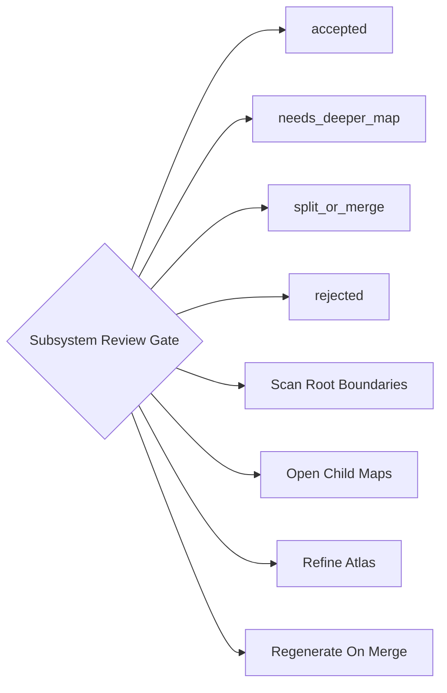

# Linux Kernel System Review Atlas

Generated: `2026-06-08T20:57:36+00:00`
Scope: Generated from Linux kernel git tree paths at commit 2d3090a; source blobs were not copied.
One line: Map-of-maps generated for a large repository: root atlas links to subsystem manifests.
Depth: `blueprint`

## Bigger Picture

This is a large-repository map-of-maps and blueprint stress test for System Review Graph. It uses real Linux kernel tracked paths plus source-evidence anchors to show the whole-system shape: build/config, boot/init, process scheduling, syscall entry, memory, filesystem/block IO, networking, driver probing, security hooks, modules/BPF/tracing, and Rust integration. The target reading experience is a blueprint wall: start with the root structure, then drill into the source-backed flow and child maps. It is still not an official Linux maintainer audit and does not prove runtime behavior without tests/traces.

## Current Truth

- `blueprint_depth`: `source-evidence-backed major Linux operational flows`
- `blueprint_limit`: `major flows and control planes, not every file or every architecture variant`
- `blueprint_section_count`: `11`
- `file_limit_per_map`: `6000`
- `map_strategy`: `root atlas plus linked child subsystem manifests`
- `max_subsystems`: `24`
- `path_only_mirror`: `true`
- `root_files_seen`: `6000`
- `runtime_behavior_proven`: `false`
- `scanner`: `language_neutral_atlas`
- `source_blobs_copied`: `false`
- `source_commit`: `2d3090a8aeb596a26935db0955d46c9a5db5c6ce`
- `source_commit_date`: `2026-06-08 07:58:32 -0700`
- `source_commit_subject`: `Merge tag 'v7.1-p5' of git://git.kernel.org/pub/scm/linux/kernel/git/herbert/crypto-2.6`
- `source_repository`: `https://github.com/torvalds/linux`
- `subsystem_count`: `24`

## Source Links

| Source | Notes |
|---|---|
| [Linux kernel repository](https://github.com/torvalds/linux) | Public source repository used for the path-tree stress test. |
| [Linux kernel commit 2d3090a](https://github.com/torvalds/linux/commit/2d3090a8aeb596a26935db0955d46c9a5db5c6ce) | Merge tag 'v7.1-p5' of git://git.kernel.org/pub/scm/linux/kernel/git/herbert/crypto-2.6 |

## Report Registers

These registers turn the map into an audit surface: what is covered, what evidence supports it, what remains open, and what a reviewer should do next.

### Coverage Register

| Area | Count | What It Means | Reviewer Use |
|---|---:|---|---|
| Systems | 24 | Bounded contexts, services, subsystems, or product surfaces. | Use this to see whether the report maps the main operating areas. |
| Artifacts | 24 | Inspectable files, APIs, tables, dashboards, reports, or outputs. | Use this to trace where system claims can be inspected. |
| Schemas/contracts | 1 | Public or sanitized contracts for artifacts and handoffs. | Use this to rebuild examples without touching private data. |
| Decision gates | 1 | Rules that advance, wait, block, or require human review. | Use this to find where the system controls action. |
| Workflows | 4 | Lifecycle steps from input to output. | Use this to follow what happens end to end. |
| Graph edges | 109 | Explicit and derived relationships between manifest nodes. | Use this to audit connectivity and missing relationships. |
| Child maps | 24 | Linked subsystem maps for large repositories. | Use this to drill into a map-of-maps instead of one flat report. |
| Blueprint sections | 11 | Source-evidence-backed operating flows. | Use this to review deep behavior claims with proof anchors. |
| Blueprint evidence rows | 56 | Source paths, symbols, roles, and proof levels. | Use this to verify whether blueprint claims are source-backed. |
| Source links | 2 | External or public references used by the report. | Use this to confirm the report's public evidence base. |
| Known boundaries | 17 | Open limits, unproven claims, redactions, or scope exclusions. | Use this to avoid treating the report as stronger than it is. |
| Review questions | 38 | Questions a maintainer, auditor, or agent should answer next. | Use this as the human follow-up queue. |
| Rebuild phases | 2 | Documented commands or phases for reproducing the report. | Use this to regenerate or verify the report locally. |

### Evidence Register

| Evidence | Kind | Coverage | Proof | Reviewer Use |
|---|---|---|---|---|
| [Linux kernel repository](https://github.com/torvalds/linux) | source link | whole report | declared | Public source repository used for the path-tree stress test. |
| [Linux kernel commit 2d3090a](https://github.com/torvalds/linux/commit/2d3090a8aeb596a26935db0955d46c9a5db5c6ce) | source link | whole report | declared | Merge tag 'v7.1-p5' of git://git.kernel.org/pub/scm/linux/kernel/git/herbert/crypto-2.6 |
| Kconfig:8 (source "scripts/Kconfig.include") | blueprint evidence | Whole Repository Coverage And Build Configuration: configuration root | source-confirmed | Top-level config includes helper macros first. |
| Kconfig:10-34 (source subsystem Kconfig files) | blueprint evidence | Whole Repository Coverage And Build Configuration: subsystem coverage fan-out | source-confirmed | Top-level Kconfig fans out to init, kernel, fs, mm, net, drivers, security, crypto, lib, docs, and io_uring. |
| Makefile:131-152 (KBUILD_EXTMOD) | blueprint evidence | Whole Repository Coverage And Build Configuration: external module boundary | source-confirmed | Main build supports external module roots and exports that path. |
| scripts/kconfig/Makefile:50-95 (Kconfig targets) | blueprint evidence | Whole Repository Coverage And Build Configuration: configuration command surface | source-confirmed | Kconfig tooling turns config targets into .config decisions. |
| init/main.c:1017 (start_kernel) | blueprint evidence | Boot, Kernel Init, And Userspace Handoff: generic kernel entry | source-confirmed | Generic initialization begins here after architecture handoff. |
| init/main.c:716 (rest_init) | blueprint evidence | Boot, Kernel Init, And Userspace Handoff: handoff to init threads | source-confirmed | Creates/continues the path toward kernel_init and idle scheduling. |
| init/main.c:1584 (kernel_init) | blueprint evidence | Boot, Kernel Init, And Userspace Handoff: init thread body | source-confirmed | Runs the late init path and userspace transition logic. |
| include/linux/module.h:82-130 (module_init and initcall macros) | blueprint evidence | Boot, Kernel Init, And Userspace Handoff: ordered init extension points | source-confirmed | Built-in init functions are ordered through initcall classes. |
| kernel/fork.c:1969 (copy_process) | blueprint evidence | Process Lifetime And Scheduler Control Plane: task construction | source-confirmed | Core task creation path used under clone/kernel_clone flows. |
| kernel/fork.c:2668 (kernel_clone) | blueprint evidence | Process Lifetime And Scheduler Control Plane: clone orchestration | source-confirmed | Turns clone arguments into a task creation request. |
| kernel/sched/core.c:7273 (schedule) | blueprint evidence | Process Lifetime And Scheduler Control Plane: scheduler entry | source-confirmed | Main scheduling call path. |
| kernel/sched/core.c:5999-6558 (pick_next_task) | blueprint evidence | Process Lifetime And Scheduler Control Plane: task selection | source-confirmed | Chooses the next task via scheduler class logic. |
| kernel/sched/core.c:4152 (try_to_wake_up) | blueprint evidence | Process Lifetime And Scheduler Control Plane: wakeup gate | source-confirmed | Moves blocked/sleeping tasks toward runnable state. |
| kernel/exit.c:896 (do_exit) | blueprint evidence | Process Lifetime And Scheduler Control Plane: task termination | source-confirmed | Core task exit path. |
| include/linux/syscalls.h:217-246 (SYSCALL_DEFINE macros) | blueprint evidence | User-Kernel Boundary And Syscall Dispatch: syscall declaration contract | source-confirmed | Defines syscall macro family and generated signatures. |
| fs/read_write.c:706 (ksys_read) | blueprint evidence | User-Kernel Boundary And Syscall Dispatch: kernel read helper | source-confirmed | Read syscall delegates into kernel read helper logic. |
| fs/read_write.c:724 (SYSCALL_DEFINE3(read)) | blueprint evidence | User-Kernel Boundary And Syscall Dispatch: read syscall entry | source-confirmed | Public read syscall wrapper. |
| fs/read_write.c:748 (SYSCALL_DEFINE3(write)) | blueprint evidence | User-Kernel Boundary And Syscall Dispatch: write syscall entry | source-confirmed | Public write syscall wrapper. |
| kernel/sys_ni.c:20 (sys_ni_syscall) | blueprint evidence | User-Kernel Boundary And Syscall Dispatch: missing syscall fallback | source-confirmed | Represents not-implemented syscall handling. |
| mm/mmap.c:280-336 (do_mmap) | blueprint evidence | Memory Management, Mappings, Faults, And Page Allocation: user mapping creation | source-confirmed | Creates userland memory mappings. |
| mm/memory.c:6465 (__handle_mm_fault) | blueprint evidence | Memory Management, Mappings, Faults, And Page Allocation: fault core | source-confirmed | Core page fault handling path. |
| mm/memory.c:6699 (handle_mm_fault) | blueprint evidence | Memory Management, Mappings, Faults, And Page Allocation: fault API | source-confirmed | Exported fault handling wrapper. |
| mm/page_alloc.c:4682 (__alloc_pages_slowpath) | blueprint evidence | Memory Management, Mappings, Faults, And Page Allocation: allocation pressure path | source-confirmed | Handles difficult allocation cases. |
| mm/page_alloc.c:5250 (__alloc_pages_noprof) | blueprint evidence | Memory Management, Mappings, Faults, And Page Allocation: page allocation API | source-confirmed | Core page allocation entry. |
| fs/open.c:1355 (do_sys_openat2) | blueprint evidence | Filesystem, VFS, Path Lookup, And Block IO: open syscall core | source-confirmed | Turns userspace open request into kernel open flow. |
| fs/namei.c:4838 (path_openat) | blueprint evidence | Filesystem, VFS, Path Lookup, And Block IO: path lookup/open | source-confirmed | Core path resolution/open helper. |
| fs/read_write.c:554 (vfs_read) | blueprint evidence | Filesystem, VFS, Path Lookup, And Block IO: VFS read | source-confirmed | VFS read entry once a file is resolved. |
| fs/read_write.c:668 (vfs_write) | blueprint evidence | Filesystem, VFS, Path Lookup, And Block IO: VFS write | source-confirmed | VFS write entry once a file is resolved. |
| block/blk-core.c:904-916 (submit_bio) | blueprint evidence | Filesystem, VFS, Path Lookup, And Block IO: block IO submission | source-confirmed | Submits BIO requests to block layer. |
| block/blk-mq.c:3112-3124 (blk_mq_submit_bio) | blueprint evidence | Filesystem, VFS, Path Lookup, And Block IO: multi-queue block submission | source-confirmed | Creates/sends block requests. |
| net/core/dev.c:6440-6454 (netif_receive_skb) | blueprint evidence | Networking Packet Receive, Protocol Dispatch, And Transmit: RX packet entry | source-confirmed | Main receive data processing function. |
| net/core/dev.c:5972 (__netif_receive_skb_core) | blueprint evidence | Networking Packet Receive, Protocol Dispatch, And Transmit: RX core routing | source-confirmed | Core packet receive path. |
| net/ipv4/ip_input.c:603 (ip_rcv) | blueprint evidence | Networking Packet Receive, Protocol Dispatch, And Transmit: IPv4 receive | source-confirmed | IPv4 packet receive handler. |
| net/ipv4/tcp_ipv4.c:2068 (tcp_v4_rcv) | blueprint evidence | Networking Packet Receive, Protocol Dispatch, And Transmit: TCP receive | source-confirmed | TCP over IPv4 receive handler. |
| net/core/dev.c:4766 (__dev_queue_xmit) | blueprint evidence | Networking Packet Receive, Protocol Dispatch, And Transmit: TX queue entry | source-confirmed | Transmits skb toward device queue. |
| drivers/base/driver.c:218-249 (driver_register) | blueprint evidence | Driver Model, Device Matching, And Probe: driver registration | source-confirmed | Registers driver and passes work to bus_add_driver. |
| drivers/base/bus.c:722-725 (bus_add_driver) | blueprint evidence | Driver Model, Device Matching, And Probe: bus integration | source-confirmed | Adds a driver to a bus. |
| drivers/base/dd.c:655 (really_probe) | blueprint evidence | Driver Model, Device Matching, And Probe: actual probe path | source-confirmed | Core device-driver binding/probe function. |
| drivers/base/dd.c:895 (driver_probe_device) | blueprint evidence | Driver Model, Device Matching, And Probe: probe attempt | source-confirmed | Attempts to bind device and driver together. |
| drivers/base/dd.c:1142 (device_attach) | blueprint evidence | Driver Model, Device Matching, And Probe: device attach path | source-confirmed | Tries to attach a device to a driver. |
| include/linux/lsm_hook_defs.h:18-29 (LSM_HOOK macro list) | blueprint evidence | Security And LSM Permission Hooks: security hook contract | source-confirmed | Defines the hook inventory used by LSM infrastructure. |
| include/linux/lsm_hook_defs.h:142 (inode_permission) | blueprint evidence | Security And LSM Permission Hooks: inode permission hook | source-confirmed | One concrete filesystem permission hook. |
| security/security.c:488 (call_int_hook) | blueprint evidence | Security And LSM Permission Hooks: hook dispatch | source-confirmed | Dispatches int-returning LSM hooks. |
| security/security.c:1838 (security_inode_permission) | blueprint evidence | Security And LSM Permission Hooks: inode permission gate | source-confirmed | Calls inode_permission hook implementations. |
| Documentation/security/lsm.rst:119 (security_inode_permission example) | blueprint evidence | Security And LSM Permission Hooks: documentation anchor | docs-confirmed | Docs mention inode permission as an example hook. |
| include/linux/module.h:82-131 (module_init) | blueprint evidence | Extensibility, Modules, BPF, And Tracing: module/initcall contract | source-confirmed | Drivers and modules declare initialization entry points. |
| kernel/module/main.c:3422 (load_module) | blueprint evidence | Extensibility, Modules, BPF, And Tracing: module load core | source-confirmed | Core module loading implementation. |
| kernel/module/main.c:3634 (SYSCALL_DEFINE3(init_module)) | blueprint evidence | Extensibility, Modules, BPF, And Tracing: module syscall entry | source-confirmed | Userspace module load syscall path. |
| kernel/module/main.c:3799 (SYSCALL_DEFINE3(finit_module)) | blueprint evidence | Extensibility, Modules, BPF, And Tracing: fd-based module syscall | source-confirmed | Loads module from file descriptor path. |
| kernel/bpf/syscall.c:2864 (bpf_prog_load) | blueprint evidence | Extensibility, Modules, BPF, And Tracing: BPF program load core | source-confirmed | Loads/verifies BPF programs. |
| kernel/bpf/syscall.c:6385 (SYSCALL_DEFINE3(bpf)) | blueprint evidence | Extensibility, Modules, BPF, And Tracing: BPF syscall entry | source-confirmed | Userspace BPF command syscall. |
| init/Kconfig:2190 (config RUST) | blueprint evidence | Rust Kernel Integration And Safety Boundary: Rust enablement gate | source-confirmed | Rust support is configured under general setup. |
| Makefile:1103 (ifdef CONFIG_RUST) | blueprint evidence | Rust Kernel Integration And Safety Boundary: Rust build flag gate | source-confirmed | Top-level build changes behavior when Rust is enabled. |
| rust/Makefile:6-24 (obj-$(CONFIG_RUST)) | blueprint evidence | Rust Kernel Integration And Safety Boundary: Rust build products | source-confirmed | Rust core/helpers/bindings/uapi/kernel objects are config-gated. |
| Documentation/rust/general-information.rst:13 (Rust support constraints) | blueprint evidence | Rust Kernel Integration And Safety Boundary: documentation anchor | docs-confirmed | Docs describe what Rust support can link. |
| Documentation/rust/general-information.rst:118-131 (bindings and wrappers) | blueprint evidence | Rust Kernel Integration And Safety Boundary: C/Rust boundary | docs-confirmed | Docs describe generated bindings and wrappers around unsafe functionality. |
| subsystems/arch/system_review_manifest.json | child_system_map | unknown | safe_to_share | Machine-readable child map for a top-level subsystem boundary. |
| subsystems/block/system_review_manifest.json | child_system_map | unknown | safe_to_share | Machine-readable child map for a top-level subsystem boundary. |
| subsystems/certs/system_review_manifest.json | child_system_map | unknown | safe_to_share | Machine-readable child map for a top-level subsystem boundary. |
| subsystems/crypto/system_review_manifest.json | child_system_map | unknown | safe_to_share | Machine-readable child map for a top-level subsystem boundary. |
| subsystems/documentation/system_review_manifest.json | child_system_map | unknown | safe_to_share | Machine-readable child map for a top-level subsystem boundary. |
| subsystems/drivers/system_review_manifest.json | child_system_map | unknown | safe_to_share | Machine-readable child map for a top-level subsystem boundary. |
| subsystems/fs/system_review_manifest.json | child_system_map | unknown | safe_to_share | Machine-readable child map for a top-level subsystem boundary. |
| subsystems/include/system_review_manifest.json | child_system_map | unknown | safe_to_share | Machine-readable child map for a top-level subsystem boundary. |
| subsystems/init/system_review_manifest.json | child_system_map | unknown | safe_to_share | Machine-readable child map for a top-level subsystem boundary. |
| subsystems/io_uring/system_review_manifest.json | child_system_map | unknown | safe_to_share | Machine-readable child map for a top-level subsystem boundary. |
| subsystems/ipc/system_review_manifest.json | child_system_map | unknown | safe_to_share | Machine-readable child map for a top-level subsystem boundary. |
| subsystems/kernel/system_review_manifest.json | child_system_map | unknown | safe_to_share | Machine-readable child map for a top-level subsystem boundary. |
| subsystems/lib/system_review_manifest.json | child_system_map | unknown | safe_to_share | Machine-readable child map for a top-level subsystem boundary. |
| subsystems/mm/system_review_manifest.json | child_system_map | unknown | safe_to_share | Machine-readable child map for a top-level subsystem boundary. |
| subsystems/net/system_review_manifest.json | child_system_map | unknown | safe_to_share | Machine-readable child map for a top-level subsystem boundary. |
| subsystems/rust/system_review_manifest.json | child_system_map | unknown | safe_to_share | Machine-readable child map for a top-level subsystem boundary. |
| subsystems/samples/system_review_manifest.json | child_system_map | unknown | safe_to_share | Machine-readable child map for a top-level subsystem boundary. |
| subsystems/scripts/system_review_manifest.json | child_system_map | unknown | safe_to_share | Machine-readable child map for a top-level subsystem boundary. |
| subsystems/security/system_review_manifest.json | child_system_map | unknown | safe_to_share | Machine-readable child map for a top-level subsystem boundary. |
| subsystems/sound/system_review_manifest.json | child_system_map | unknown | safe_to_share | Machine-readable child map for a top-level subsystem boundary. |
| subsystems/tools/system_review_manifest.json | child_system_map | unknown | safe_to_share | Machine-readable child map for a top-level subsystem boundary. |
| subsystems/usr/system_review_manifest.json | child_system_map | unknown | safe_to_share | Machine-readable child map for a top-level subsystem boundary. |
| subsystems/virt/system_review_manifest.json | child_system_map | unknown | safe_to_share | Machine-readable child map for a top-level subsystem boundary. |
| subsystems/licenses/system_review_manifest.json | child_system_map | unknown | safe_to_share | Machine-readable child map for a top-level subsystem boundary. |
| SubsystemMap | atlas_contract | map_id, path, scope, systems, status | contract declared | A child system review map that a root atlas can link, upload, and hand to reviewers or agents. |

### Gap Register

| Gap | Area | Status | Boundary | Next Step |
|---|---|---|---|---|
| Known boundary | whole report | open | Atlas boundaries are inferred from source-tree directories and markers. | Accept the boundary or add evidence that closes it. |
| Known boundary | whole report | open | A child map gives review context; it does not prove runtime behavior by itself. | Accept the boundary or add evidence that closes it. |
| Known boundary | whole report | open | Very large systems still need maintainers or deeper agents to refine real workflows. | Accept the boundary or add evidence that closes it. |
| Known boundary | whole report | open | CI regeneration can detect drift, but deciding meaning still needs review gates. | Accept the boundary or add evidence that closes it. |
| Known boundary | whole report | open | The Linux example was generated from a path-only mirror of the git tree; file contents, build configuration, runtime behavior, and maintainer ownership were not audited. | Accept the boundary or add evidence that closes it. |
| Known boundary | whole report | open | Blueprint sections cover major Linux operational flows, but not every file, architecture variant, driver family, filesystem, network protocol, scheduler class, or security module implementation. | Accept the boundary or add evidence that closes it. |
| System truth boundary | arch/ | review | Directory boundary is source-grounded; runtime responsibility and exact behavior require maintainer or deeper agent review. | Inspect this boundary before making stronger behavior claims. |
| System truth boundary | block/ | review | Directory boundary is source-grounded; runtime responsibility and exact behavior require maintainer or deeper agent review. | Inspect this boundary before making stronger behavior claims. |
| System truth boundary | certs/ | review | Directory boundary is source-grounded; runtime responsibility and exact behavior require maintainer or deeper agent review. | Inspect this boundary before making stronger behavior claims. |
| System truth boundary | crypto/ | review | Directory boundary is source-grounded; runtime responsibility and exact behavior require maintainer or deeper agent review. | Inspect this boundary before making stronger behavior claims. |
| System truth boundary | Documentation/ | review | Directory boundary is source-grounded; runtime responsibility and exact behavior require maintainer or deeper agent review. | Inspect this boundary before making stronger behavior claims. |
| System truth boundary | drivers/ | review | Directory boundary is source-grounded; runtime responsibility and exact behavior require maintainer or deeper agent review. | Inspect this boundary before making stronger behavior claims. |
| System truth boundary | fs/ | review | Directory boundary is source-grounded; runtime responsibility and exact behavior require maintainer or deeper agent review. | Inspect this boundary before making stronger behavior claims. |
| System truth boundary | include/ | review | Directory boundary is source-grounded; runtime responsibility and exact behavior require maintainer or deeper agent review. | Inspect this boundary before making stronger behavior claims. |
| System truth boundary | init/ | review | Directory boundary is source-grounded; runtime responsibility and exact behavior require maintainer or deeper agent review. | Inspect this boundary before making stronger behavior claims. |
| System truth boundary | io_uring/ | review | Directory boundary is source-grounded; runtime responsibility and exact behavior require maintainer or deeper agent review. | Inspect this boundary before making stronger behavior claims. |
| System truth boundary | ipc/ | review | Directory boundary is source-grounded; runtime responsibility and exact behavior require maintainer or deeper agent review. | Inspect this boundary before making stronger behavior claims. |
| System truth boundary | kernel/ | review | Directory boundary is source-grounded; runtime responsibility and exact behavior require maintainer or deeper agent review. | Inspect this boundary before making stronger behavior claims. |
| System truth boundary | lib/ | review | Directory boundary is source-grounded; runtime responsibility and exact behavior require maintainer or deeper agent review. | Inspect this boundary before making stronger behavior claims. |
| System truth boundary | mm/ | review | Directory boundary is source-grounded; runtime responsibility and exact behavior require maintainer or deeper agent review. | Inspect this boundary before making stronger behavior claims. |
| System truth boundary | net/ | review | Directory boundary is source-grounded; runtime responsibility and exact behavior require maintainer or deeper agent review. | Inspect this boundary before making stronger behavior claims. |
| System truth boundary | rust/ | review | Directory boundary is source-grounded; runtime responsibility and exact behavior require maintainer or deeper agent review. | Inspect this boundary before making stronger behavior claims. |
| System truth boundary | samples/ | review | Directory boundary is source-grounded; runtime responsibility and exact behavior require maintainer or deeper agent review. | Inspect this boundary before making stronger behavior claims. |
| System truth boundary | scripts/ | review | Directory boundary is source-grounded; runtime responsibility and exact behavior require maintainer or deeper agent review. | Inspect this boundary before making stronger behavior claims. |
| System truth boundary | security/ | review | Directory boundary is source-grounded; runtime responsibility and exact behavior require maintainer or deeper agent review. | Inspect this boundary before making stronger behavior claims. |
| System truth boundary | sound/ | review | Directory boundary is source-grounded; runtime responsibility and exact behavior require maintainer or deeper agent review. | Inspect this boundary before making stronger behavior claims. |
| System truth boundary | tools/ | review | Directory boundary is source-grounded; runtime responsibility and exact behavior require maintainer or deeper agent review. | Inspect this boundary before making stronger behavior claims. |
| System truth boundary | usr/ | review | Directory boundary is source-grounded; runtime responsibility and exact behavior require maintainer or deeper agent review. | Inspect this boundary before making stronger behavior claims. |
| System truth boundary | virt/ | review | Directory boundary is source-grounded; runtime responsibility and exact behavior require maintainer or deeper agent review. | Inspect this boundary before making stronger behavior claims. |
| System truth boundary | LICENSES/ | review | Directory boundary is source-grounded; runtime responsibility and exact behavior require maintainer or deeper agent review. | Inspect this boundary before making stronger behavior claims. |
| Blueprint gap | Whole Repository Coverage And Build Configuration | open | This blueprint maps source/build control surfaces, not a specific .config or compiled image. | Add source evidence, tests, traces, or child-map detail. |
| Blueprint gap | Boot, Kernel Init, And Userspace Handoff | open | This section uses generic source anchors and does not map every architecture boot file. | Add source evidence, tests, traces, or child-map detail. |
| Blueprint gap | Process Lifetime And Scheduler Control Plane | open | This section does not expand every scheduler class, CPU topology path, or architecture context switch implementation. | Add source evidence, tests, traces, or child-map detail. |
| Blueprint gap | User-Kernel Boundary And Syscall Dispatch | open | Architecture-specific syscall table files are not fully expanded in this root blueprint. | Add source evidence, tests, traces, or child-map detail. |
| Blueprint gap | Memory Management, Mappings, Faults, And Page Allocation | open | Slab, vmalloc, huge pages, memcg, NUMA, and architecture fault entry are not fully expanded here. | Add source evidence, tests, traces, or child-map detail. |
| Blueprint gap | Filesystem, VFS, Path Lookup, And Block IO | open | Specific filesystem implementations such as ext4, btrfs, xfs, and network filesystems need child blueprints. | Add source evidence, tests, traces, or child-map detail. |
| Blueprint gap | Networking Packet Receive, Protocol Dispatch, And Transmit | open | IPv6, UDP, netfilter, namespaces, routing tables, qdisc, and NIC-specific drivers need child blueprints. | Add source evidence, tests, traces, or child-map detail. |
| Blueprint gap | Driver Model, Device Matching, And Probe | open | PCI, USB, platform, ACPI, device-tree, and individual driver families need child blueprints. | Add source evidence, tests, traces, or child-map detail. |
| Blueprint gap | Security And LSM Permission Hooks | open | SELinux, AppArmor, Smack, Landlock, BPF LSM, IMA/EVM, and capabilities need separate child blueprints. | Add source evidence, tests, traces, or child-map detail. |
| Blueprint gap | Extensibility, Modules, BPF, And Tracing | open | Module signing, livepatch, perf, ftrace, kprobes, uprobes, and BPF verifier internals need child blueprints. | Add source evidence, tests, traces, or child-map detail. |
| Blueprint gap | Rust Kernel Integration And Safety Boundary | open | This blueprint does not inspect each Rust abstraction, unsafe block, or Rust driver implementation. | Add source evidence, tests, traces, or child-map detail. |

### Action Register

| Action | Owner | Status | Trigger | Expected Output |
|---|---|---|---|---|
| Review question | maintainer / auditor | open | Which child maps changed since the last merge? | Answer from source, tests, docs, logs, or maintainer knowledge. |
| Review question | maintainer / auditor | open | Which subsystem boundary is too broad and needs splitting? | Answer from source, tests, docs, logs, or maintainer knowledge. |
| Review question | maintainer / auditor | open | Which subsystem lacks workflow, gate, schema, or test evidence? | Answer from source, tests, docs, logs, or maintainer knowledge. |
| Review question | maintainer / auditor | open | Can reviewers reproduce the map from the declared rebuild recipe? | Answer from source, tests, docs, logs, or maintainer knowledge. |
| Review question | maintainer / auditor | open | Where does the atlas overclaim beyond source-surface evidence? | Answer from source, tests, docs, logs, or maintainer knowledge. |
| Blueprint review | maintainer / auditor | open | Whole Repository Coverage And Build Configuration: Which top-level directories are config-selected into the build? | Answer before using this blueprint as a final architecture claim. |
| Blueprint review | maintainer / auditor | open | Whole Repository Coverage And Build Configuration: Which generated headers or scripts become hidden contracts for later source paths? | Answer before using this blueprint as a final architecture claim. |
| Blueprint review | maintainer / auditor | open | Whole Repository Coverage And Build Configuration: Which subsystem is absent in this atlas because it is build-generated rather than source-tree visible? | Answer before using this blueprint as a final architecture claim. |
| Close blueprint gap | maintainer / auditor | open | Whole Repository Coverage And Build Configuration: This blueprint maps source/build control surfaces, not a specific .config or compiled image. | Add evidence or explicitly preserve the boundary. |
| Blueprint review | maintainer / auditor | open | Boot, Kernel Init, And Userspace Handoff: Which initcalls are required before filesystems, drivers, and userspace can run? | Answer before using this blueprint as a final architecture claim. |
| Blueprint review | maintainer / auditor | open | Boot, Kernel Init, And Userspace Handoff: Which boot path is architecture-specific and which is generic? | Answer before using this blueprint as a final architecture claim. |
| Blueprint review | maintainer / auditor | open | Boot, Kernel Init, And Userspace Handoff: Where would a boot failure be proven by logs or tracepoints? | Answer before using this blueprint as a final architecture claim. |
| Close blueprint gap | maintainer / auditor | open | Boot, Kernel Init, And Userspace Handoff: This section uses generic source anchors and does not map every architecture boot file. | Add evidence or explicitly preserve the boundary. |
| Blueprint review | maintainer / auditor | open | Process Lifetime And Scheduler Control Plane: Which scheduler class owns the task at each moment? | Answer before using this blueprint as a final architecture claim. |
| Blueprint review | maintainer / auditor | open | Process Lifetime And Scheduler Control Plane: Which locks or barriers protect wakeup and task state? | Answer before using this blueprint as a final architecture claim. |
| Blueprint review | maintainer / auditor | open | Process Lifetime And Scheduler Control Plane: Which tests or traces prove latency and fairness for a specific workload? | Answer before using this blueprint as a final architecture claim. |
| Close blueprint gap | maintainer / auditor | open | Process Lifetime And Scheduler Control Plane: This section does not expand every scheduler class, CPU topology path, or architecture context switch implementation. | Add evidence or explicitly preserve the boundary. |
| Blueprint review | maintainer / auditor | open | User-Kernel Boundary And Syscall Dispatch: Which architecture entry file maps the syscall number to the generic implementation? | Answer before using this blueprint as a final architecture claim. |
| Blueprint review | maintainer / auditor | open | User-Kernel Boundary And Syscall Dispatch: Which subsystem owns the post-syscall object model? | Answer before using this blueprint as a final architecture claim. |
| Blueprint review | maintainer / auditor | open | User-Kernel Boundary And Syscall Dispatch: Where is user memory copied, checked, or faulted? | Answer before using this blueprint as a final architecture claim. |
| Close blueprint gap | maintainer / auditor | open | User-Kernel Boundary And Syscall Dispatch: Architecture-specific syscall table files are not fully expanded in this root blueprint. | Add evidence or explicitly preserve the boundary. |
| Blueprint review | maintainer / auditor | open | Memory Management, Mappings, Faults, And Page Allocation: Which memory path is user mapping, kernel allocation, slab, vmalloc, or page cache? | Answer before using this blueprint as a final architecture claim. |
| Blueprint review | maintainer / auditor | open | Memory Management, Mappings, Faults, And Page Allocation: Which GFP flags and context determine blocking behavior? | Answer before using this blueprint as a final architecture claim. |
| Blueprint review | maintainer / auditor | open | Memory Management, Mappings, Faults, And Page Allocation: Which tracepoints prove allocation pressure in runtime? | Answer before using this blueprint as a final architecture claim. |
| Close blueprint gap | maintainer / auditor | open | Memory Management, Mappings, Faults, And Page Allocation: Slab, vmalloc, huge pages, memcg, NUMA, and architecture fault entry are not fully expanded here. | Add evidence or explicitly preserve the boundary. |
| Blueprint review | maintainer / auditor | open | Filesystem, VFS, Path Lookup, And Block IO: Which filesystem file_operations implementation is reached for a specific path? | Answer before using this blueprint as a final architecture claim. |
| Blueprint review | maintainer / auditor | open | Filesystem, VFS, Path Lookup, And Block IO: Does the path hit page cache, direct IO, or block IO? | Answer before using this blueprint as a final architecture claim. |
| Blueprint review | maintainer / auditor | open | Filesystem, VFS, Path Lookup, And Block IO: Which LSM or mount namespace decision can stop the operation? | Answer before using this blueprint as a final architecture claim. |
| Close blueprint gap | maintainer / auditor | open | Filesystem, VFS, Path Lookup, And Block IO: Specific filesystem implementations such as ext4, btrfs, xfs, and network filesystems need child blueprints. | Add evidence or explicitly preserve the boundary. |
| Blueprint review | maintainer / auditor | open | Networking Packet Receive, Protocol Dispatch, And Transmit: Which driver/NAPI path creates the skb? | Answer before using this blueprint as a final architecture claim. |
| Blueprint review | maintainer / auditor | open | Networking Packet Receive, Protocol Dispatch, And Transmit: Which netfilter, BPF, or qdisc hooks can intercept this packet? | Answer before using this blueprint as a final architecture claim. |
| Blueprint review | maintainer / auditor | open | Networking Packet Receive, Protocol Dispatch, And Transmit: Which tracepoints prove drops versus delivery? | Answer before using this blueprint as a final architecture claim. |
| Close blueprint gap | maintainer / auditor | open | Networking Packet Receive, Protocol Dispatch, And Transmit: IPv6, UDP, netfilter, namespaces, routing tables, qdisc, and NIC-specific drivers need child blueprints. | Add evidence or explicitly preserve the boundary. |
| Blueprint review | maintainer / auditor | open | Driver Model, Device Matching, And Probe: Which bus-specific match function controls this device? | Answer before using this blueprint as a final architecture claim. |
| Blueprint review | maintainer / auditor | open | Driver Model, Device Matching, And Probe: What resources are acquired during probe and released on remove? | Answer before using this blueprint as a final architecture claim. |
| Blueprint review | maintainer / auditor | open | Driver Model, Device Matching, And Probe: Which deferred-probe or firmware dependency blocks binding? | Answer before using this blueprint as a final architecture claim. |
| Close blueprint gap | maintainer / auditor | open | Driver Model, Device Matching, And Probe: PCI, USB, platform, ACPI, device-tree, and individual driver families need child blueprints. | Add evidence or explicitly preserve the boundary. |
| Blueprint review | maintainer / auditor | open | Security And LSM Permission Hooks: Which security_* wrapper is called by the subsystem path? | Answer before using this blueprint as a final architecture claim. |
| Blueprint review | maintainer / auditor | open | Security And LSM Permission Hooks: Which configured LSM implementations register the hook? | Answer before using this blueprint as a final architecture claim. |
| Blueprint review | maintainer / auditor | open | Security And LSM Permission Hooks: Is the operation denied, audited, or only labeled? | Answer before using this blueprint as a final architecture claim. |
| Close blueprint gap | maintainer / auditor | open | Security And LSM Permission Hooks: SELinux, AppArmor, Smack, Landlock, BPF LSM, IMA/EVM, and capabilities need separate child blueprints. | Add evidence or explicitly preserve the boundary. |
| Blueprint review | maintainer / auditor | open | Extensibility, Modules, BPF, And Tracing: Which runtime behavior is built in, module-loaded, or BPF-attached? | Answer before using this blueprint as a final architecture claim. |
| Blueprint review | maintainer / auditor | open | Extensibility, Modules, BPF, And Tracing: Which security and signature checks gate extension loading? | Answer before using this blueprint as a final architecture claim. |
| Blueprint review | maintainer / auditor | open | Extensibility, Modules, BPF, And Tracing: Which tracepoints prove this path at runtime? | Answer before using this blueprint as a final architecture claim. |
| Close blueprint gap | maintainer / auditor | open | Extensibility, Modules, BPF, And Tracing: Module signing, livepatch, perf, ftrace, kprobes, uprobes, and BPF verifier internals need child blueprints. | Add evidence or explicitly preserve the boundary. |
| Blueprint review | maintainer / auditor | open | Rust Kernel Integration And Safety Boundary: Which Rust wrappers encapsulate unsafe C/kernel behavior? | Answer before using this blueprint as a final architecture claim. |
| Blueprint review | maintainer / auditor | open | Rust Kernel Integration And Safety Boundary: Which generated bindings are relied on by a driver? | Answer before using this blueprint as a final architecture claim. |
| Blueprint review | maintainer / auditor | open | Rust Kernel Integration And Safety Boundary: Does the driver enter normal module/driver probe paths after Rust build integration? | Answer before using this blueprint as a final architecture claim. |
| Close blueprint gap | maintainer / auditor | open | Rust Kernel Integration And Safety Boundary: This blueprint does not inspect each Rust abstraction, unsafe block, or Rust driver implementation. | Add evidence or explicitly preserve the boundary. |
| Resolve boundary | maintainer / auditor | open | Atlas boundaries are inferred from source-tree directories and markers. | Accept as scope or add proof that closes it. |
| Resolve boundary | maintainer / auditor | open | A child map gives review context; it does not prove runtime behavior by itself. | Accept as scope or add proof that closes it. |
| Resolve boundary | maintainer / auditor | open | Very large systems still need maintainers or deeper agents to refine real workflows. | Accept as scope or add proof that closes it. |
| Resolve boundary | maintainer / auditor | open | CI regeneration can detect drift, but deciding meaning still needs review gates. | Accept as scope or add proof that closes it. |
| Resolve boundary | maintainer / auditor | open | The Linux example was generated from a path-only mirror of the git tree; file contents, build configuration, runtime behavior, and maintainer ownership were not audited. | Accept as scope or add proof that closes it. |
| Resolve boundary | maintainer / auditor | open | Blueprint sections cover major Linux operational flows, but not every file, architecture variant, driver family, filesystem, network protocol, scheduler class, or security module implementation. | Accept as scope or add proof that closes it. |
| Rebuild phase | maintainer / agent | repeatable | atlas-scan | Generate root and child subsystem maps. |
| Rebuild phase | maintainer / agent | repeatable | merge-regeneration | Regenerate reports in CI after a merge or major milestone. |

## Map Of Maps

```mermaid
flowchart TD
  root["Linux Kernel System Review Atlas"]
  root --> child_arch["arch/ subsystem map\ninferred_from_source_tree"]
  child_arch --> child_arch_c_cpp["c_cpp"]
  root --> child_block["block/ subsystem map\ninferred_from_source_tree"]
  child_block --> child_block_c_cpp["c_cpp"]
  root --> child_certs["certs/ subsystem map\ninferred_from_source_tree"]
  child_certs --> child_certs_c_cpp["c_cpp"]
  root --> child_crypto["crypto/ subsystem map\ninferred_from_source_tree"]
  child_crypto --> child_crypto_c_cpp["c_cpp"]
  root --> child_documentation["Documentation/ subsystem map\ninferred_from_source_tree"]
  child_documentation --> child_documentation_python["python"]
  child_documentation --> child_documentation_c_cpp["c_cpp"]
  root --> child_drivers["drivers/ subsystem map\ninferred_from_source_tree"]
  child_drivers --> child_drivers_c_cpp["c_cpp"]
  child_drivers --> child_drivers_rust["rust"]
  root --> child_fs["fs/ subsystem map\ninferred_from_source_tree"]
  child_fs --> child_fs_c_cpp["c_cpp"]
  root --> child_include["include/ subsystem map\ninferred_from_source_tree"]
  child_include --> child_include_c_cpp["c_cpp"]
  root --> child_init["init/ subsystem map\ninferred_from_source_tree"]
  child_init --> child_init_c_cpp["c_cpp"]
  root --> child_io_uring["io_uring/ subsystem map\ninferred_from_source_tree"]
  child_io_uring --> child_io_uring_c_cpp["c_cpp"]
  root --> child_ipc["ipc/ subsystem map\ninferred_from_source_tree"]
  child_ipc --> child_ipc_c_cpp["c_cpp"]
  root --> child_kernel["kernel/ subsystem map\ninferred_from_source_tree"]
  child_kernel --> child_kernel_c_cpp["c_cpp"]
  root --> child_lib["lib/ subsystem map\ninferred_from_source_tree"]
  child_lib --> child_lib_c_cpp["c_cpp"]
  child_lib --> child_lib_rust["rust"]
  root --> child_mm["mm/ subsystem map\ninferred_from_source_tree"]
  child_mm --> child_mm_c_cpp["c_cpp"]
  child_mm --> child_mm_rust["rust"]
  root --> child_net["net/ subsystem map\ninferred_from_source_tree"]
  child_net --> child_net_c_cpp["c_cpp"]
  root --> child_rust["rust/ subsystem map\ninferred_from_source_tree"]
  child_rust --> child_rust_c_cpp["c_cpp"]
  child_rust --> child_rust_rust["rust"]
  root --> child_samples["samples/ subsystem map\ninferred_from_source_tree"]
  child_samples --> child_samples_c_cpp["c_cpp"]
  child_samples --> child_samples_rust["rust"]
  root --> child_scripts["scripts/ subsystem map\ninferred_from_source_tree"]
  child_scripts --> child_scripts_python["python"]
  child_scripts --> child_scripts_c_cpp["c_cpp"]
  child_scripts --> child_scripts_rust["rust"]
  root --> child_security["security/ subsystem map\ninferred_from_source_tree"]
  child_security --> child_security_c_cpp["c_cpp"]
  root --> child_sound["sound/ subsystem map\ninferred_from_source_tree"]
  child_sound --> child_sound_c_cpp["c_cpp"]
  root --> child_tools["tools/ subsystem map\ninferred_from_source_tree"]
  child_tools --> child_tools_python["python"]
  child_tools --> child_tools_c_cpp["c_cpp"]
  child_tools --> child_tools_rust["rust"]
  root --> child_usr["usr/ subsystem map\ninferred_from_source_tree"]
  child_usr --> child_usr_c_cpp["c_cpp"]
  root --> child_virt["virt/ subsystem map\ninferred_from_source_tree"]
  child_virt --> child_virt_c_cpp["c_cpp"]
  root --> child_licenses["LICENSES/ subsystem map\ninferred_from_source_tree"]
```



## Blueprint Map

```mermaid
flowchart TD
  root["Linux Kernel System Review Atlas"]
  root --> blueprint_whole_repo_build_config["Whole Repository Coverage And Build Configuration"]
  blueprint_whole_repo_build_config --> blueprint_whole_repo_build_config_Kconfig["Kconfig"]
  blueprint_whole_repo_build_config --> blueprint_whole_repo_build_config_Makefile["Makefile"]
  blueprint_whole_repo_build_config --> blueprint_whole_repo_build_config_scripts["scripts"]
  blueprint_whole_repo_build_config --> blueprint_whole_repo_build_config_arch["arch"]
  blueprint_whole_repo_build_config --> blueprint_whole_repo_build_config_init["init"]
  blueprint_whole_repo_build_config --> blueprint_whole_repo_build_config_kernel["kernel"]
  blueprint_whole_repo_build_config --> blueprint_whole_repo_build_config_drivers["drivers"]
  blueprint_whole_repo_build_config --> blueprint_whole_repo_build_config_fs["fs"]
  blueprint_whole_repo_build_config --> blueprint_whole_repo_build_config_mm["mm"]
  blueprint_whole_repo_build_config --> blueprint_whole_repo_build_config_net["net"]
  root --> blueprint_boot_init_userspace["Boot, Kernel Init, And Userspace Handoff"]
  blueprint_boot_init_userspace --> blueprint_boot_init_userspace_arch["arch"]
  blueprint_boot_init_userspace --> blueprint_boot_init_userspace_init["init"]
  blueprint_boot_init_userspace --> blueprint_boot_init_userspace_kernel["kernel"]
  blueprint_boot_init_userspace --> blueprint_boot_init_userspace_usr["usr"]
  blueprint_boot_init_userspace --> blueprint_boot_init_userspace_drivers["drivers"]
  blueprint_boot_init_userspace --> blueprint_boot_init_userspace_fs["fs"]
  root --> blueprint_process_scheduler_lifecycle["Process Lifetime And Scheduler Control Plane"]
  blueprint_process_scheduler_lifecycle --> blueprint_process_scheduler_lifecycle_kernel["kernel"]
  blueprint_process_scheduler_lifecycle --> blueprint_process_scheduler_lifecycle_include["include"]
  blueprint_process_scheduler_lifecycle --> blueprint_process_scheduler_lifecycle_arch["arch"]
  root --> blueprint_syscall_user_kernel_boundary["User-Kernel Boundary And Syscall Dispatch"]
  blueprint_syscall_user_kernel_boundary --> blueprint_syscall_user_kernel_boundary_arch["arch"]
  blueprint_syscall_user_kernel_boundary --> blueprint_syscall_user_kernel_boundary_include["include"]
  blueprint_syscall_user_kernel_boundary --> blueprint_syscall_user_kernel_boundary_kernel["kernel"]
  blueprint_syscall_user_kernel_boundary --> blueprint_syscall_user_kernel_boundary_fs["fs"]
  root --> blueprint_memory_management_faults_allocations["Memory Management, Mappings, Faults, And Page Allocation"]
  blueprint_memory_management_faults_allocations --> blueprint_memory_management_faults_allocations_mm["mm"]
  blueprint_memory_management_faults_allocations --> blueprint_memory_management_faults_allocations_include["include"]
  blueprint_memory_management_faults_allocations --> blueprint_memory_management_faults_allocations_kernel["kernel"]
  blueprint_memory_management_faults_allocations --> blueprint_memory_management_faults_allocations_arch["arch"]
  root --> blueprint_vfs_filesystem_block_io["Filesystem, VFS, Path Lookup, And Block IO"]
  blueprint_vfs_filesystem_block_io --> blueprint_vfs_filesystem_block_io_fs["fs"]
  blueprint_vfs_filesystem_block_io --> blueprint_vfs_filesystem_block_io_block["block"]
  blueprint_vfs_filesystem_block_io --> blueprint_vfs_filesystem_block_io_include["include"]
  blueprint_vfs_filesystem_block_io --> blueprint_vfs_filesystem_block_io_security["security"]
  blueprint_vfs_filesystem_block_io --> blueprint_vfs_filesystem_block_io_drivers["drivers"]
  root --> blueprint_network_packet_lifecycle["Networking Packet Receive, Protocol Dispatch, And Transmit"]
  blueprint_network_packet_lifecycle --> blueprint_network_packet_lifecycle_net["net"]
  blueprint_network_packet_lifecycle --> blueprint_network_packet_lifecycle_drivers["drivers"]
  blueprint_network_packet_lifecycle --> blueprint_network_packet_lifecycle_include["include"]
  blueprint_network_packet_lifecycle --> blueprint_network_packet_lifecycle_security["security"]
  root --> blueprint_driver_model_device_probe["Driver Model, Device Matching, And Probe"]
  blueprint_driver_model_device_probe --> blueprint_driver_model_device_probe_drivers["drivers"]
  blueprint_driver_model_device_probe --> blueprint_driver_model_device_probe_include["include"]
  blueprint_driver_model_device_probe --> blueprint_driver_model_device_probe_modules["modules"]
  blueprint_driver_model_device_probe --> blueprint_driver_model_device_probe_bus_specific_subsystems["bus-specific subsystems"]
  root --> blueprint_security_lsm_permission_hooks["Security And LSM Permission Hooks"]
  blueprint_security_lsm_permission_hooks --> blueprint_security_lsm_permission_hooks_security["security"]
  blueprint_security_lsm_permission_hooks --> blueprint_security_lsm_permission_hooks_include["include"]
  blueprint_security_lsm_permission_hooks --> blueprint_security_lsm_permission_hooks_fs["fs"]
  blueprint_security_lsm_permission_hooks --> blueprint_security_lsm_permission_hooks_kernel["kernel"]
  blueprint_security_lsm_permission_hooks --> blueprint_security_lsm_permission_hooks_net["net"]
  blueprint_security_lsm_permission_hooks --> blueprint_security_lsm_permission_hooks_bpf["bpf"]
  root --> blueprint_extensibility_modules_bpf_tracing["Extensibility, Modules, BPF, And Tracing"]
  blueprint_extensibility_modules_bpf_tracing --> blueprint_extensibility_modules_bpf_tracing_kernel["kernel"]
  blueprint_extensibility_modules_bpf_tracing --> blueprint_extensibility_modules_bpf_tracing_include["include"]
  blueprint_extensibility_modules_bpf_tracing --> blueprint_extensibility_modules_bpf_tracing_scripts["scripts"]
  blueprint_extensibility_modules_bpf_tracing --> blueprint_extensibility_modules_bpf_tracing_security["security"]
  blueprint_extensibility_modules_bpf_tracing --> blueprint_extensibility_modules_bpf_tracing_tools["tools"]
  root --> blueprint_rust_kernel_integration["Rust Kernel Integration And Safety Boundary"]
  blueprint_rust_kernel_integration --> blueprint_rust_kernel_integration_rust["rust"]
  blueprint_rust_kernel_integration --> blueprint_rust_kernel_integration_drivers["drivers"]
  blueprint_rust_kernel_integration --> blueprint_rust_kernel_integration_samples["samples"]
  blueprint_rust_kernel_integration --> blueprint_rust_kernel_integration_scripts["scripts"]
  blueprint_rust_kernel_integration --> blueprint_rust_kernel_integration_init["init"]
  blueprint_rust_kernel_integration --> blueprint_rust_kernel_integration_Makefile["Makefile"]
```



## Lifecycle Map


## Artifact And Schema Map

```mermaid
flowchart LR
  system_arch["arch/"]
  system_arch --> artifact_arch_child_map["arch/ Child System Map"]
  artifact_arch_child_map --> schema_SubsystemMap["SubsystemMap"]
  system_block["block/"]
  system_block --> artifact_block_child_map["block/ Child System Map"]
  artifact_block_child_map --> schema_SubsystemMap["SubsystemMap"]
  system_certs["certs/"]
  system_certs --> artifact_certs_child_map["certs/ Child System Map"]
  artifact_certs_child_map --> schema_SubsystemMap["SubsystemMap"]
  system_crypto["crypto/"]
  system_crypto --> artifact_crypto_child_map["crypto/ Child System Map"]
  artifact_crypto_child_map --> schema_SubsystemMap["SubsystemMap"]
  system_documentation["Documentation/"]
  system_documentation --> artifact_documentation_child_map["Documentation/ Child System Map"]
  artifact_documentation_child_map --> schema_SubsystemMap["SubsystemMap"]
  system_drivers["drivers/"]
  system_drivers --> artifact_drivers_child_map["drivers/ Child System Map"]
  artifact_drivers_child_map --> schema_SubsystemMap["SubsystemMap"]
  system_fs["fs/"]
  system_fs --> artifact_fs_child_map["fs/ Child System Map"]
  artifact_fs_child_map --> schema_SubsystemMap["SubsystemMap"]
  system_include["include/"]
  system_include --> artifact_include_child_map["include/ Child System Map"]
  artifact_include_child_map --> schema_SubsystemMap["SubsystemMap"]
  system_init["init/"]
  system_init --> artifact_init_child_map["init/ Child System Map"]
  artifact_init_child_map --> schema_SubsystemMap["SubsystemMap"]
  system_io_uring["io_uring/"]
  system_io_uring --> artifact_io_uring_child_map["io_uring/ Child System Map"]
  artifact_io_uring_child_map --> schema_SubsystemMap["SubsystemMap"]
  system_ipc["ipc/"]
  system_ipc --> artifact_ipc_child_map["ipc/ Child System Map"]
  artifact_ipc_child_map --> schema_SubsystemMap["SubsystemMap"]
  system_kernel["kernel/"]
  system_kernel --> artifact_kernel_child_map["kernel/ Child System Map"]
  artifact_kernel_child_map --> schema_SubsystemMap["SubsystemMap"]
  system_lib["lib/"]
  system_lib --> artifact_lib_child_map["lib/ Child System Map"]
  artifact_lib_child_map --> schema_SubsystemMap["SubsystemMap"]
  system_mm["mm/"]
  system_mm --> artifact_mm_child_map["mm/ Child System Map"]
  artifact_mm_child_map --> schema_SubsystemMap["SubsystemMap"]
  system_net["net/"]
  system_net --> artifact_net_child_map["net/ Child System Map"]
  artifact_net_child_map --> schema_SubsystemMap["SubsystemMap"]
  system_rust["rust/"]
  system_rust --> artifact_rust_child_map["rust/ Child System Map"]
  artifact_rust_child_map --> schema_SubsystemMap["SubsystemMap"]
  system_samples["samples/"]
  system_samples --> artifact_samples_child_map["samples/ Child System Map"]
  artifact_samples_child_map --> schema_SubsystemMap["SubsystemMap"]
  system_scripts["scripts/"]
  system_scripts --> artifact_scripts_child_map["scripts/ Child System Map"]
  artifact_scripts_child_map --> schema_SubsystemMap["SubsystemMap"]
  system_security["security/"]
  system_security --> artifact_security_child_map["security/ Child System Map"]
  artifact_security_child_map --> schema_SubsystemMap["SubsystemMap"]
  system_sound["sound/"]
  system_sound --> artifact_sound_child_map["sound/ Child System Map"]
  artifact_sound_child_map --> schema_SubsystemMap["SubsystemMap"]
  system_tools["tools/"]
  system_tools --> artifact_tools_child_map["tools/ Child System Map"]
  artifact_tools_child_map --> schema_SubsystemMap["SubsystemMap"]
  system_usr["usr/"]
  system_usr --> artifact_usr_child_map["usr/ Child System Map"]
  artifact_usr_child_map --> schema_SubsystemMap["SubsystemMap"]
  system_virt["virt/"]
  system_virt --> artifact_virt_child_map["virt/ Child System Map"]
  artifact_virt_child_map --> schema_SubsystemMap["SubsystemMap"]
  system_licenses["LICENSES/"]
  system_licenses --> artifact_licenses_child_map["LICENSES/ Child System Map"]
  artifact_licenses_child_map --> schema_SubsystemMap["SubsystemMap"]
```



## Gate Map



## Relationship Graph

```mermaid
flowchart TD
  arch["arch/ subsystem map"] -- "owns or uses" --> arch_child_map["arch/ Child System Map"]
  arch["arch/ subsystem map"] -- "is gated by" --> subsystem_review_gate["Subsystem Review Gate"]
  block["block/ subsystem map"] -- "owns or uses" --> block_child_map["block/ Child System Map"]
  block["block/ subsystem map"] -- "is gated by" --> subsystem_review_gate["Subsystem Review Gate"]
  certs["certs/ subsystem map"] -- "owns or uses" --> certs_child_map["certs/ Child System Map"]
  certs["certs/ subsystem map"] -- "is gated by" --> subsystem_review_gate["Subsystem Review Gate"]
  crypto["crypto/ subsystem map"] -- "owns or uses" --> crypto_child_map["crypto/ Child System Map"]
  crypto["crypto/ subsystem map"] -- "is gated by" --> subsystem_review_gate["Subsystem Review Gate"]
  documentation["Documentation/ subsystem map"] -- "owns or uses" --> documentation_child_map["Documentation/ Child System Map"]
  documentation["Documentation/ subsystem map"] -- "is gated by" --> subsystem_review_gate["Subsystem Review Gate"]
  drivers["drivers/ subsystem map"] -- "owns or uses" --> drivers_child_map["drivers/ Child System Map"]
  drivers["drivers/ subsystem map"] -- "is gated by" --> subsystem_review_gate["Subsystem Review Gate"]
  fs["fs/ subsystem map"] -- "owns or uses" --> fs_child_map["fs/ Child System Map"]
  fs["fs/ subsystem map"] -- "is gated by" --> subsystem_review_gate["Subsystem Review Gate"]
  include["include/ subsystem map"] -- "owns or uses" --> include_child_map["include/ Child System Map"]
  include["include/ subsystem map"] -- "is gated by" --> subsystem_review_gate["Subsystem Review Gate"]
  init["init/ subsystem map"] -- "owns or uses" --> init_child_map["init/ Child System Map"]
  init["init/ subsystem map"] -- "is gated by" --> subsystem_review_gate["Subsystem Review Gate"]
  io_uring["io_uring/ subsystem map"] -- "owns or uses" --> io_uring_child_map["io_uring/ Child System Map"]
  io_uring["io_uring/ subsystem map"] -- "is gated by" --> subsystem_review_gate["Subsystem Review Gate"]
  ipc["ipc/ subsystem map"] -- "owns or uses" --> ipc_child_map["ipc/ Child System Map"]
  ipc["ipc/ subsystem map"] -- "is gated by" --> subsystem_review_gate["Subsystem Review Gate"]
  kernel["kernel/ subsystem map"] -- "owns or uses" --> kernel_child_map["kernel/ Child System Map"]
  kernel["kernel/ subsystem map"] -- "is gated by" --> subsystem_review_gate["Subsystem Review Gate"]
  lib["lib/ subsystem map"] -- "owns or uses" --> lib_child_map["lib/ Child System Map"]
  lib["lib/ subsystem map"] -- "is gated by" --> subsystem_review_gate["Subsystem Review Gate"]
  mm["mm/ subsystem map"] -- "owns or uses" --> mm_child_map["mm/ Child System Map"]
  mm["mm/ subsystem map"] -- "is gated by" --> subsystem_review_gate["Subsystem Review Gate"]
  net["net/ subsystem map"] -- "owns or uses" --> net_child_map["net/ Child System Map"]
  net["net/ subsystem map"] -- "is gated by" --> subsystem_review_gate["Subsystem Review Gate"]
  rust["rust/ subsystem map"] -- "owns or uses" --> rust_child_map["rust/ Child System Map"]
  rust["rust/ subsystem map"] -- "is gated by" --> subsystem_review_gate["Subsystem Review Gate"]
  samples["samples/ subsystem map"] -- "owns or uses" --> samples_child_map["samples/ Child System Map"]
  samples["samples/ subsystem map"] -- "is gated by" --> subsystem_review_gate["Subsystem Review Gate"]
  scripts["scripts/ subsystem map"] -- "owns or uses" --> scripts_child_map["scripts/ Child System Map"]
  scripts["scripts/ subsystem map"] -- "is gated by" --> subsystem_review_gate["Subsystem Review Gate"]
  security["security/ subsystem map"] -- "owns or uses" --> security_child_map["security/ Child System Map"]
  security["security/ subsystem map"] -- "is gated by" --> subsystem_review_gate["Subsystem Review Gate"]
  sound["sound/ subsystem map"] -- "owns or uses" --> sound_child_map["sound/ Child System Map"]
  sound["sound/ subsystem map"] -- "is gated by" --> subsystem_review_gate["Subsystem Review Gate"]
  tools["tools/ subsystem map"] -- "owns or uses" --> tools_child_map["tools/ Child System Map"]
  tools["tools/ subsystem map"] -- "is gated by" --> subsystem_review_gate["Subsystem Review Gate"]
  usr["usr/ subsystem map"] -- "owns or uses" --> usr_child_map["usr/ Child System Map"]
  usr["usr/ subsystem map"] -- "is gated by" --> subsystem_review_gate["Subsystem Review Gate"]
  virt["virt/ subsystem map"] -- "owns or uses" --> virt_child_map["virt/ Child System Map"]
  virt["virt/ subsystem map"] -- "is gated by" --> subsystem_review_gate["Subsystem Review Gate"]
  licenses["LICENSES/ subsystem map"] -- "owns or uses" --> licenses_child_map["LICENSES/ Child System Map"]
  licenses["LICENSES/ subsystem map"] -- "is gated by" --> subsystem_review_gate["Subsystem Review Gate"]
  scan_root_boundaries["Scan Root Boundaries"] -- "produces" --> arch_child_map["arch/ Child System Map"]
  scan_root_boundaries["Scan Root Boundaries"] -- "produces" --> block_child_map["block/ Child System Map"]
  scan_root_boundaries["Scan Root Boundaries"] -- "produces" --> certs_child_map["certs/ Child System Map"]
  scan_root_boundaries["Scan Root Boundaries"] -- "produces" --> crypto_child_map["crypto/ Child System Map"]
  scan_root_boundaries["Scan Root Boundaries"] -- "produces" --> documentation_child_map["Documentation/ Child System Map"]
  scan_root_boundaries["Scan Root Boundaries"] -- "produces" --> drivers_child_map["drivers/ Child System Map"]
  scan_root_boundaries["Scan Root Boundaries"] -- "produces" --> fs_child_map["fs/ Child System Map"]
  scan_root_boundaries["Scan Root Boundaries"] -- "produces" --> include_child_map["include/ Child System Map"]
  scan_root_boundaries["Scan Root Boundaries"] -- "produces" --> init_child_map["init/ Child System Map"]
  scan_root_boundaries["Scan Root Boundaries"] -- "produces" --> io_uring_child_map["io_uring/ Child System Map"]
  scan_root_boundaries["Scan Root Boundaries"] -- "produces" --> ipc_child_map["ipc/ Child System Map"]
  scan_root_boundaries["Scan Root Boundaries"] -- "produces" --> kernel_child_map["kernel/ Child System Map"]
  scan_root_boundaries["Scan Root Boundaries"] -- "produces" --> lib_child_map["lib/ Child System Map"]
  scan_root_boundaries["Scan Root Boundaries"] -- "produces" --> mm_child_map["mm/ Child System Map"]
  scan_root_boundaries["Scan Root Boundaries"] -- "produces" --> net_child_map["net/ Child System Map"]
  scan_root_boundaries["Scan Root Boundaries"] -- "produces" --> rust_child_map["rust/ Child System Map"]
  scan_root_boundaries["Scan Root Boundaries"] -- "produces" --> samples_child_map["samples/ Child System Map"]
  scan_root_boundaries["Scan Root Boundaries"] -- "produces" --> scripts_child_map["scripts/ Child System Map"]
  scan_root_boundaries["Scan Root Boundaries"] -- "produces" --> security_child_map["security/ Child System Map"]
  scan_root_boundaries["Scan Root Boundaries"] -- "produces" --> sound_child_map["sound/ Child System Map"]
  scan_root_boundaries["Scan Root Boundaries"] -- "produces" --> tools_child_map["tools/ Child System Map"]
  scan_root_boundaries["Scan Root Boundaries"] -- "produces" --> usr_child_map["usr/ Child System Map"]
  scan_root_boundaries["Scan Root Boundaries"] -- "produces" --> virt_child_map["virt/ Child System Map"]
  scan_root_boundaries["Scan Root Boundaries"] -- "produces" --> licenses_child_map["LICENSES/ Child System Map"]
  subsystem_review_gate["Subsystem Review Gate"] -- "gates" --> scan_root_boundaries["Scan Root Boundaries"]
  scan_root_boundaries["Scan Root Boundaries"] -- "routes to" --> open_child_maps["Open Child Maps"]
  arch_child_map["arch/ Child System Map"] -- "feeds" --> open_child_maps["Open Child Maps"]
  block_child_map["block/ Child System Map"] -- "feeds" --> open_child_maps["Open Child Maps"]
  certs_child_map["certs/ Child System Map"] -- "feeds" --> open_child_maps["Open Child Maps"]
  crypto_child_map["crypto/ Child System Map"] -- "feeds" --> open_child_maps["Open Child Maps"]
  documentation_child_map["Documentation/ Child System Map"] -- "feeds" --> open_child_maps["Open Child Maps"]
  drivers_child_map["drivers/ Child System Map"] -- "feeds" --> open_child_maps["Open Child Maps"]
  root_atlas["Atlas"] -- "links to" --> arch["arch/ subsystem map"]
  root_atlas["Atlas"] -- "links to" --> block["block/ subsystem map"]
  root_atlas["Atlas"] -- "links to" --> certs["certs/ subsystem map"]
  root_atlas["Atlas"] -- "links to" --> crypto["crypto/ subsystem map"]
  root_atlas["Atlas"] -- "links to" --> documentation["Documentation/ subsystem map"]
  root_atlas["Atlas"] -- "links to" --> drivers["drivers/ subsystem map"]
  root_atlas["Atlas"] -- "links to" --> fs["fs/ subsystem map"]
  root_atlas["Atlas"] -- "links to" --> include["include/ subsystem map"]
  root_atlas["Atlas"] -- "links to" --> init["init/ subsystem map"]
  root_atlas["Atlas"] -- "links to" --> io_uring["io_uring/ subsystem map"]
  root_atlas["Atlas"] -- "links to" --> ipc["ipc/ subsystem map"]
  root_atlas["Atlas"] -- "links to" --> kernel["kernel/ subsystem map"]
  root_atlas["Atlas"] -- "links to" --> lib["lib/ subsystem map"]
  root_atlas["Atlas"] -- "links to" --> mm["mm/ subsystem map"]
  root_atlas["Atlas"] -- "links to" --> net["net/ subsystem map"]
  root_atlas["Atlas"] -- "links to" --> rust["rust/ subsystem map"]
  root_atlas["Atlas"] -- "links to" --> samples["samples/ subsystem map"]
  root_atlas["Atlas"] -- "links to" --> scripts["scripts/ subsystem map"]
  root_atlas["Atlas"] -- "links to" --> security["security/ subsystem map"]
  root_atlas["Atlas"] -- "links to" --> sound["sound/ subsystem map"]
  root_atlas["Atlas"] -- "links to" --> tools["tools/ subsystem map"]
  root_atlas["Atlas"] -- "links to" --> usr["usr/ subsystem map"]
  root_atlas["Atlas"] -- "links to" --> virt["virt/ subsystem map"]
  root_atlas["Atlas"] -- "links to" --> licenses["LICENSES/ subsystem map"]
```



## Expansion Index

| Level | Use It To Answer | Report Section |
|---|---|---|
| 0. Situation | What is true now? | Current Truth |
| 0.25. Registers | What is covered, proven, open, and actionable? | Report Registers |
| 0.5. Atlas | Which child map should I open next? | Map Of Maps |
| 0.75. Blueprint | Which source-backed flows explain the whole system? | Blueprint Sections |
| 1. Flow | How does the system move end to end? | Lifecycle Map |
| 2. Ownership | Which subsystem owns which artifact? | Artifact And Schema Map |
| 3. Control | Which rules advance, wait, or block? | Gate Map |
| 4. Implementation | Which files, APIs, docs, or outputs should I inspect? | System Details |
| 5. Audit | What should an external reviewer ask next? | Review Questions |

## Systems

| System | Owner | Stack | Architecture | Lifecycle | Boundary | Ideal Target |
|---|---|---|---|---|---|---|
| arch/ | unknown | C, C++ | top-level source-tree subsystem | open child map -> inspect source surfaces -> refine real workflows | Directory boundary is source-grounded; runtime responsibility and exact behavior require maintainer or deeper agent review. | Replace inferred directory node with exact subsystem workflows, APIs, contracts, risks, and tests. |
| block/ | unknown | C, C++ | top-level source-tree subsystem | open child map -> inspect source surfaces -> refine real workflows | Directory boundary is source-grounded; runtime responsibility and exact behavior require maintainer or deeper agent review. | Replace inferred directory node with exact subsystem workflows, APIs, contracts, risks, and tests. |
| certs/ | unknown | C, C++ | top-level source-tree subsystem | open child map -> inspect source surfaces -> refine real workflows | Directory boundary is source-grounded; runtime responsibility and exact behavior require maintainer or deeper agent review. | Replace inferred directory node with exact subsystem workflows, APIs, contracts, risks, and tests. |
| crypto/ | unknown | C, C++ | top-level source-tree subsystem | open child map -> inspect source surfaces -> refine real workflows | Directory boundary is source-grounded; runtime responsibility and exact behavior require maintainer or deeper agent review. | Replace inferred directory node with exact subsystem workflows, APIs, contracts, risks, and tests. |
| Documentation/ | unknown | C, C++, Python | top-level source-tree subsystem | open child map -> inspect source surfaces -> refine real workflows | Directory boundary is source-grounded; runtime responsibility and exact behavior require maintainer or deeper agent review. | Replace inferred directory node with exact subsystem workflows, APIs, contracts, risks, and tests. |
| drivers/ | unknown | C, C++, Rust | top-level source-tree subsystem | open child map -> inspect source surfaces -> refine real workflows | Directory boundary is source-grounded; runtime responsibility and exact behavior require maintainer or deeper agent review. | Replace inferred directory node with exact subsystem workflows, APIs, contracts, risks, and tests. |
| fs/ | unknown | C, C++ | top-level source-tree subsystem | open child map -> inspect source surfaces -> refine real workflows | Directory boundary is source-grounded; runtime responsibility and exact behavior require maintainer or deeper agent review. | Replace inferred directory node with exact subsystem workflows, APIs, contracts, risks, and tests. |
| include/ | unknown | C, C++ | top-level source-tree subsystem | open child map -> inspect source surfaces -> refine real workflows | Directory boundary is source-grounded; runtime responsibility and exact behavior require maintainer or deeper agent review. | Replace inferred directory node with exact subsystem workflows, APIs, contracts, risks, and tests. |
| init/ | unknown | C, C++ | top-level source-tree subsystem | open child map -> inspect source surfaces -> refine real workflows | Directory boundary is source-grounded; runtime responsibility and exact behavior require maintainer or deeper agent review. | Replace inferred directory node with exact subsystem workflows, APIs, contracts, risks, and tests. |
| io_uring/ | unknown | C, C++ | top-level source-tree subsystem | open child map -> inspect source surfaces -> refine real workflows | Directory boundary is source-grounded; runtime responsibility and exact behavior require maintainer or deeper agent review. | Replace inferred directory node with exact subsystem workflows, APIs, contracts, risks, and tests. |
| ipc/ | unknown | C, C++ | top-level source-tree subsystem | open child map -> inspect source surfaces -> refine real workflows | Directory boundary is source-grounded; runtime responsibility and exact behavior require maintainer or deeper agent review. | Replace inferred directory node with exact subsystem workflows, APIs, contracts, risks, and tests. |
| kernel/ | unknown | C, C++ | top-level source-tree subsystem | open child map -> inspect source surfaces -> refine real workflows | Directory boundary is source-grounded; runtime responsibility and exact behavior require maintainer or deeper agent review. | Replace inferred directory node with exact subsystem workflows, APIs, contracts, risks, and tests. |
| lib/ | unknown | C, C++, Rust | top-level source-tree subsystem | open child map -> inspect source surfaces -> refine real workflows | Directory boundary is source-grounded; runtime responsibility and exact behavior require maintainer or deeper agent review. | Replace inferred directory node with exact subsystem workflows, APIs, contracts, risks, and tests. |
| mm/ | unknown | C, C++, Rust | top-level source-tree subsystem | open child map -> inspect source surfaces -> refine real workflows | Directory boundary is source-grounded; runtime responsibility and exact behavior require maintainer or deeper agent review. | Replace inferred directory node with exact subsystem workflows, APIs, contracts, risks, and tests. |
| net/ | unknown | C, C++ | top-level source-tree subsystem | open child map -> inspect source surfaces -> refine real workflows | Directory boundary is source-grounded; runtime responsibility and exact behavior require maintainer or deeper agent review. | Replace inferred directory node with exact subsystem workflows, APIs, contracts, risks, and tests. |
| rust/ | unknown | C, C++, Rust | top-level source-tree subsystem | open child map -> inspect source surfaces -> refine real workflows | Directory boundary is source-grounded; runtime responsibility and exact behavior require maintainer or deeper agent review. | Replace inferred directory node with exact subsystem workflows, APIs, contracts, risks, and tests. |
| samples/ | unknown | C, C++, Rust | top-level source-tree subsystem | open child map -> inspect source surfaces -> refine real workflows | Directory boundary is source-grounded; runtime responsibility and exact behavior require maintainer or deeper agent review. | Replace inferred directory node with exact subsystem workflows, APIs, contracts, risks, and tests. |
| scripts/ | unknown | C, C++, Python, Rust | top-level source-tree subsystem | open child map -> inspect source surfaces -> refine real workflows | Directory boundary is source-grounded; runtime responsibility and exact behavior require maintainer or deeper agent review. | Replace inferred directory node with exact subsystem workflows, APIs, contracts, risks, and tests. |
| security/ | unknown | C, C++ | top-level source-tree subsystem | open child map -> inspect source surfaces -> refine real workflows | Directory boundary is source-grounded; runtime responsibility and exact behavior require maintainer or deeper agent review. | Replace inferred directory node with exact subsystem workflows, APIs, contracts, risks, and tests. |
| sound/ | unknown | C, C++ | top-level source-tree subsystem | open child map -> inspect source surfaces -> refine real workflows | Directory boundary is source-grounded; runtime responsibility and exact behavior require maintainer or deeper agent review. | Replace inferred directory node with exact subsystem workflows, APIs, contracts, risks, and tests. |
| tools/ | unknown | C, C++, Python, Rust | top-level source-tree subsystem | open child map -> inspect source surfaces -> refine real workflows | Directory boundary is source-grounded; runtime responsibility and exact behavior require maintainer or deeper agent review. | Replace inferred directory node with exact subsystem workflows, APIs, contracts, risks, and tests. |
| usr/ | unknown | C, C++ | top-level source-tree subsystem | open child map -> inspect source surfaces -> refine real workflows | Directory boundary is source-grounded; runtime responsibility and exact behavior require maintainer or deeper agent review. | Replace inferred directory node with exact subsystem workflows, APIs, contracts, risks, and tests. |
| virt/ | unknown | C, C++ | top-level source-tree subsystem | open child map -> inspect source surfaces -> refine real workflows | Directory boundary is source-grounded; runtime responsibility and exact behavior require maintainer or deeper agent review. | Replace inferred directory node with exact subsystem workflows, APIs, contracts, risks, and tests. |
| LICENSES/ | unknown |  | top-level source-tree subsystem | open child map -> inspect source surfaces -> refine real workflows | Directory boundary is source-grounded; runtime responsibility and exact behavior require maintainer or deeper agent review. | Replace inferred directory node with exact subsystem workflows, APIs, contracts, risks, and tests. |

## Child Maps

| Map | Manifest | Status | Scope | Systems | Review Hint |
|---|---|---|---|---|---|
| [arch/ subsystem map](../subsystems/arch/reports/system_review_graph.md) | [manifest](../subsystems/arch/system_review_manifest.json) | inferred_from_source_tree | arch | c_cpp | Open subsystems/arch/system_review_manifest.json first, then inspect real Linux source/docs/tests for the workflows and gates this inferred child map cannot prove. |
| [block/ subsystem map](../subsystems/block/reports/system_review_graph.md) | [manifest](../subsystems/block/system_review_manifest.json) | inferred_from_source_tree | block | c_cpp | Open subsystems/block/system_review_manifest.json first, then inspect real Linux source/docs/tests for the workflows and gates this inferred child map cannot prove. |
| [certs/ subsystem map](../subsystems/certs/reports/system_review_graph.md) | [manifest](../subsystems/certs/system_review_manifest.json) | inferred_from_source_tree | certs | c_cpp | Open subsystems/certs/system_review_manifest.json first, then inspect real Linux source/docs/tests for the workflows and gates this inferred child map cannot prove. |
| [crypto/ subsystem map](../subsystems/crypto/reports/system_review_graph.md) | [manifest](../subsystems/crypto/system_review_manifest.json) | inferred_from_source_tree | crypto | c_cpp | Open subsystems/crypto/system_review_manifest.json first, then inspect real Linux source/docs/tests for the workflows and gates this inferred child map cannot prove. |
| [Documentation/ subsystem map](../subsystems/documentation/reports/system_review_graph.md) | [manifest](../subsystems/documentation/system_review_manifest.json) | inferred_from_source_tree | Documentation | python, c_cpp | Open subsystems/documentation/system_review_manifest.json first, then inspect real Linux source/docs/tests for the workflows and gates this inferred child map cannot prove. |
| [drivers/ subsystem map](../subsystems/drivers/reports/system_review_graph.md) | [manifest](../subsystems/drivers/system_review_manifest.json) | inferred_from_source_tree | drivers | c_cpp, rust | Open subsystems/drivers/system_review_manifest.json first, then inspect real Linux source/docs/tests for the workflows and gates this inferred child map cannot prove. |
| [fs/ subsystem map](../subsystems/fs/reports/system_review_graph.md) | [manifest](../subsystems/fs/system_review_manifest.json) | inferred_from_source_tree | fs | c_cpp | Open subsystems/fs/system_review_manifest.json first, then inspect real Linux source/docs/tests for the workflows and gates this inferred child map cannot prove. |
| [include/ subsystem map](../subsystems/include/reports/system_review_graph.md) | [manifest](../subsystems/include/system_review_manifest.json) | inferred_from_source_tree | include | c_cpp | Open subsystems/include/system_review_manifest.json first, then inspect real Linux source/docs/tests for the workflows and gates this inferred child map cannot prove. |
| [init/ subsystem map](../subsystems/init/reports/system_review_graph.md) | [manifest](../subsystems/init/system_review_manifest.json) | inferred_from_source_tree | init | c_cpp | Open subsystems/init/system_review_manifest.json first, then inspect real Linux source/docs/tests for the workflows and gates this inferred child map cannot prove. |
| [io_uring/ subsystem map](../subsystems/io_uring/reports/system_review_graph.md) | [manifest](../subsystems/io_uring/system_review_manifest.json) | inferred_from_source_tree | io_uring | c_cpp | Open subsystems/io_uring/system_review_manifest.json first, then inspect real Linux source/docs/tests for the workflows and gates this inferred child map cannot prove. |
| [ipc/ subsystem map](../subsystems/ipc/reports/system_review_graph.md) | [manifest](../subsystems/ipc/system_review_manifest.json) | inferred_from_source_tree | ipc | c_cpp | Open subsystems/ipc/system_review_manifest.json first, then inspect real Linux source/docs/tests for the workflows and gates this inferred child map cannot prove. |
| [kernel/ subsystem map](../subsystems/kernel/reports/system_review_graph.md) | [manifest](../subsystems/kernel/system_review_manifest.json) | inferred_from_source_tree | kernel | c_cpp | Open subsystems/kernel/system_review_manifest.json first, then inspect real Linux source/docs/tests for the workflows and gates this inferred child map cannot prove. |
| [lib/ subsystem map](../subsystems/lib/reports/system_review_graph.md) | [manifest](../subsystems/lib/system_review_manifest.json) | inferred_from_source_tree | lib | c_cpp, rust | Open subsystems/lib/system_review_manifest.json first, then inspect real Linux source/docs/tests for the workflows and gates this inferred child map cannot prove. |
| [mm/ subsystem map](../subsystems/mm/reports/system_review_graph.md) | [manifest](../subsystems/mm/system_review_manifest.json) | inferred_from_source_tree | mm | c_cpp, rust | Open subsystems/mm/system_review_manifest.json first, then inspect real Linux source/docs/tests for the workflows and gates this inferred child map cannot prove. |
| [net/ subsystem map](../subsystems/net/reports/system_review_graph.md) | [manifest](../subsystems/net/system_review_manifest.json) | inferred_from_source_tree | net | c_cpp | Open subsystems/net/system_review_manifest.json first, then inspect real Linux source/docs/tests for the workflows and gates this inferred child map cannot prove. |
| [rust/ subsystem map](../subsystems/rust/reports/system_review_graph.md) | [manifest](../subsystems/rust/system_review_manifest.json) | inferred_from_source_tree | rust | c_cpp, rust | Open subsystems/rust/system_review_manifest.json first, then inspect real Linux source/docs/tests for the workflows and gates this inferred child map cannot prove. |
| [samples/ subsystem map](../subsystems/samples/reports/system_review_graph.md) | [manifest](../subsystems/samples/system_review_manifest.json) | inferred_from_source_tree | samples | c_cpp, rust | Open subsystems/samples/system_review_manifest.json first, then inspect real Linux source/docs/tests for the workflows and gates this inferred child map cannot prove. |
| [scripts/ subsystem map](../subsystems/scripts/reports/system_review_graph.md) | [manifest](../subsystems/scripts/system_review_manifest.json) | inferred_from_source_tree | scripts | python, c_cpp, rust | Open subsystems/scripts/system_review_manifest.json first, then inspect real Linux source/docs/tests for the workflows and gates this inferred child map cannot prove. |
| [security/ subsystem map](../subsystems/security/reports/system_review_graph.md) | [manifest](../subsystems/security/system_review_manifest.json) | inferred_from_source_tree | security | c_cpp | Open subsystems/security/system_review_manifest.json first, then inspect real Linux source/docs/tests for the workflows and gates this inferred child map cannot prove. |
| [sound/ subsystem map](../subsystems/sound/reports/system_review_graph.md) | [manifest](../subsystems/sound/system_review_manifest.json) | inferred_from_source_tree | sound | c_cpp | Open subsystems/sound/system_review_manifest.json first, then inspect real Linux source/docs/tests for the workflows and gates this inferred child map cannot prove. |
| [tools/ subsystem map](../subsystems/tools/reports/system_review_graph.md) | [manifest](../subsystems/tools/system_review_manifest.json) | inferred_from_source_tree | tools | python, c_cpp, rust | Open subsystems/tools/system_review_manifest.json first, then inspect real Linux source/docs/tests for the workflows and gates this inferred child map cannot prove. |
| [usr/ subsystem map](../subsystems/usr/reports/system_review_graph.md) | [manifest](../subsystems/usr/system_review_manifest.json) | inferred_from_source_tree | usr | c_cpp | Open subsystems/usr/system_review_manifest.json first, then inspect real Linux source/docs/tests for the workflows and gates this inferred child map cannot prove. |
| [virt/ subsystem map](../subsystems/virt/reports/system_review_graph.md) | [manifest](../subsystems/virt/system_review_manifest.json) | inferred_from_source_tree | virt | c_cpp | Open subsystems/virt/system_review_manifest.json first, then inspect real Linux source/docs/tests for the workflows and gates this inferred child map cannot prove. |
| [LICENSES/ subsystem map](../subsystems/licenses/reports/system_review_graph.md) | [manifest](../subsystems/licenses/system_review_manifest.json) | inferred_from_source_tree | LICENSES |  | Open subsystems/licenses/system_review_manifest.json first, then inspect real Linux source/docs/tests for the workflows and gates this inferred child map cannot prove. |

## Blueprint Sections

| Section | Purpose | Subsystems | Evidence | Flow Steps | Control Points |
|---|---|---|---|---|---|
| Whole Repository Coverage And Build Configuration | Shows how the top-level Linux source tree becomes configured build intent instead of treating directories as isolated folders. | Kconfig, Makefile, scripts, arch, init, kernel, drivers, fs, mm, net, security, crypto, lib, io_uring, rust | 4 | 3 | 2 |
| Boot, Kernel Init, And Userspace Handoff | Tracks the early kernel path from architecture handoff into generic kernel init and the first userspace process. | arch, init, kernel, usr, drivers, fs | 4 | 4 | 2 |
| Process Lifetime And Scheduler Control Plane | Maps how tasks are created, made runnable, selected, switched, woken, and exited. | kernel, include, arch | 6 | 5 | 3 |
| User-Kernel Boundary And Syscall Dispatch | Shows how user requests enter kernel-defined syscall contracts and land in subsystem implementations. | arch, include, kernel, fs | 5 | 3 | 2 |
| Memory Management, Mappings, Faults, And Page Allocation | Connects mmap/VMA decisions, page faults, allocator fast/slow paths, reclaim/compaction/OOM pressure, and exported memory contracts. | mm, include, kernel, arch | 5 | 4 | 2 |
| Filesystem, VFS, Path Lookup, And Block IO | Shows how file-oriented syscalls move through path lookup, file objects, VFS read/write, filesystem operations, and block-device submission. | fs, block, include, security, drivers | 6 | 4 | 3 |
| Networking Packet Receive, Protocol Dispatch, And Transmit | Maps packets from network device buffers through core receive, IP/TCP dispatch, and transmit queue submission. | net, drivers, include, security | 5 | 5 | 3 |
| Driver Model, Device Matching, And Probe | Shows how drivers register with buses, devices match to drivers, and probe binds runtime device behavior. | drivers, include, modules, bus-specific subsystems | 5 | 4 | 2 |
| Security And LSM Permission Hooks | Maps the reusable security hook layer that lets security modules gate file, inode, process, network, BPF, and other kernel operations. | security, include, fs, kernel, net, bpf | 5 | 3 | 2 |
| Extensibility, Modules, BPF, And Tracing | Shows how Linux extends runtime behavior through loadable modules, initcall/module_init surfaces, BPF program loading, and tracepoint/observability surfaces. | kernel, include, scripts, security, tools | 6 | 4 | 2 |
| Rust Kernel Integration And Safety Boundary | Maps Rust as a kernel language surface: config-gated availability, build integration, generated bindings, safe abstractions, and driver/sample integration. | rust, drivers, samples, scripts, init, Makefile | 5 | 4 | 2 |

### Whole Repository Coverage And Build Configuration

Shows how the top-level Linux source tree becomes configured build intent instead of treating directories as isolated folders.

- Subsystems: `Kconfig`, `Makefile`, `scripts`, `arch`, `init`, `kernel`, `drivers`, `fs`, `mm`, `net`, `security`, `crypto`, `lib`, `io_uring`, `rust`

Source evidence:

| Path | Symbol | Role | Notes | Proof Level |
|---|---|---|---|---|
| Kconfig:8 | source "scripts/Kconfig.include" | configuration root | Top-level config includes helper macros first. | source-confirmed |
| Kconfig:10-34 | source subsystem Kconfig files | subsystem coverage fan-out | Top-level Kconfig fans out to init, kernel, fs, mm, net, drivers, security, crypto, lib, docs, and io_uring. | source-confirmed |
| Makefile:131-152 | KBUILD_EXTMOD | external module boundary | Main build supports external module roots and exports that path. | source-confirmed |
| scripts/kconfig/Makefile:50-95 | Kconfig targets | configuration command surface | Kconfig tooling turns config targets into .config decisions. | source-confirmed |

Operational flow:

| Step | Actor | Consumes | Produces | Next | Evidence |
|---|---|---|---|---|---|
| Select architecture and config | Kconfig and arch config | Kconfig, arch/*/configs, toolchain facts | .config intent | Build dependency graph | Kconfig:8-34 |
| Resolve build graph | Makefile/Kbuild | .config, Makefile, Kbuild files | object/library/module build plan | Compile vmlinux/modules | Makefile and Kbuild surface |
| Compile kernel and modules | Kbuild | source tree and config-selected objects | vmlinux, modules, generated headers | Boot/runtime init | Makefile:2208 and subsystem Kbuild files |

Control points:

| Gate | Location | Decision | Failure Mode | Evidence |
|---|---|---|---|---|
| Config dependency gate | Kconfig files | enable, disable, or require options | feature absent from build or dependency conflict | Kconfig source fan-out |
| External module boundary | Makefile:131-152 | in-tree build or external module build | external path invalid or incompatible with config | KBUILD_EXTMOD |

Review questions:
- Which top-level directories are config-selected into the build?
- Which generated headers or scripts become hidden contracts for later source paths?
- Which subsystem is absent in this atlas because it is build-generated rather than source-tree visible?

Known gaps:
- This blueprint maps source/build control surfaces, not a specific .config or compiled image.


### Boot, Kernel Init, And Userspace Handoff

Tracks the early kernel path from architecture handoff into generic kernel init and the first userspace process.

- Subsystems: `arch`, `init`, `kernel`, `usr`, `drivers`, `fs`

Source evidence:

| Path | Symbol | Role | Notes | Proof Level |
|---|---|---|---|---|
| init/main.c:1017 | start_kernel | generic kernel entry | Generic initialization begins here after architecture handoff. | source-confirmed |
| init/main.c:716 | rest_init | handoff to init threads | Creates/continues the path toward kernel_init and idle scheduling. | source-confirmed |
| init/main.c:1584 | kernel_init | init thread body | Runs the late init path and userspace transition logic. | source-confirmed |
| include/linux/module.h:82-130 | module_init and initcall macros | ordered init extension points | Built-in init functions are ordered through initcall classes. | source-confirmed |

Operational flow:

| Step | Actor | Consumes | Produces | Next | Evidence |
|---|---|---|---|---|---|
| Architecture boot hands off | arch startup code | firmware/bootloader state | generic kernel entry state | start_kernel | arch/* plus init/main.c:start_kernel |
| Generic kernel initialization | start_kernel | early memory, CPU, scheduler, IRQ, console state | initialized core services | rest_init | init/main.c:1017 |
| Create init execution path | rest_init | initialized core kernel | kernel_init path and idle context | kernel_init | init/main.c:716 |
| Run late init and userspace handoff | kernel_init | initcalls, rootfs, command line | first userspace process or failure | runtime system | init/main.c:1584 |

Control points:

| Gate | Location | Decision | Failure Mode | Evidence |
|---|---|---|---|---|
| Initcall ordering gate | include/linux/module.h:112-126 | early/core/subsys/fs/device/late order | dependency starts too early or too late | initcall macro classes |
| Userspace handoff gate | init/main.c:kernel_init | launch init path or fail | no init process or rootfs issue | kernel_init path |

Review questions:
- Which initcalls are required before filesystems, drivers, and userspace can run?
- Which boot path is architecture-specific and which is generic?
- Where would a boot failure be proven by logs or tracepoints?

Known gaps:
- This section uses generic source anchors and does not map every architecture boot file.


### Process Lifetime And Scheduler Control Plane

Maps how tasks are created, made runnable, selected, switched, woken, and exited.

- Subsystems: `kernel`, `include`, `arch`

Source evidence:

| Path | Symbol | Role | Notes | Proof Level |
|---|---|---|---|---|
| kernel/fork.c:1969 | copy_process | task construction | Core task creation path used under clone/kernel_clone flows. | source-confirmed |
| kernel/fork.c:2668 | kernel_clone | clone orchestration | Turns clone arguments into a task creation request. | source-confirmed |
| kernel/sched/core.c:7273 | schedule | scheduler entry | Main scheduling call path. | source-confirmed |
| kernel/sched/core.c:5999-6558 | pick_next_task | task selection | Chooses the next task via scheduler class logic. | source-confirmed |
| kernel/sched/core.c:4152 | try_to_wake_up | wakeup gate | Moves blocked/sleeping tasks toward runnable state. | source-confirmed |
| kernel/exit.c:896 | do_exit | task termination | Core task exit path. | source-confirmed |

Operational flow:

| Step | Actor | Consumes | Produces | Next | Evidence |
|---|---|---|---|---|---|
| Request process/thread creation | clone/clone3/kernel caller | clone arguments and credentials | kernel_clone request | copy_process | kernel/fork.c:2668 |
| Build task_struct and resources | copy_process | mm/files/signal/namespace state | new task | runnable/wakeup path | kernel/fork.c:1969 |
| Schedule runnable work | schedule and scheduler classes | run queues and task state | selected next task | context switch | kernel/sched/core.c:7273 |
| Wake sleeping work | try_to_wake_up | blocked task and wake condition | runnable task state | pick_next_task | kernel/sched/core.c:4152 |
| Exit and cleanup | do_exit | task exit code and owned resources | released task state and parent notification | scheduler continuation | kernel/exit.c:896 |

Control points:

| Gate | Location | Decision | Failure Mode | Evidence |
|---|---|---|---|---|
| Clone argument gate | kernel/fork.c clone/clone3 helpers | valid task creation or error | invalid flags, limits, namespace, or resource failure | kernel/fork.c |
| Scheduler class gate | kernel/sched/core.c pick_next_task | which runnable task executes next | latency, starvation, or priority inversion if invariants break | pick_next_task |
| Wakeup serialization gate | kernel/sched/core.c try_to_wake_up | wake or leave blocked | lost wakeup or wrong runqueue placement | try_to_wake_up comments and locks |

Review questions:
- Which scheduler class owns the task at each moment?
- Which locks or barriers protect wakeup and task state?
- Which tests or traces prove latency and fairness for a specific workload?

Known gaps:
- This section does not expand every scheduler class, CPU topology path, or architecture context switch implementation.


### User-Kernel Boundary And Syscall Dispatch

Shows how user requests enter kernel-defined syscall contracts and land in subsystem implementations.

- Subsystems: `arch`, `include`, `kernel`, `fs`

Source evidence:

| Path | Symbol | Role | Notes | Proof Level |
|---|---|---|---|---|
| include/linux/syscalls.h:217-246 | SYSCALL_DEFINE macros | syscall declaration contract | Defines syscall macro family and generated signatures. | source-confirmed |
| fs/read_write.c:706 | ksys_read | kernel read helper | Read syscall delegates into kernel read helper logic. | source-confirmed |
| fs/read_write.c:724 | SYSCALL_DEFINE3(read) | read syscall entry | Public read syscall wrapper. | source-confirmed |
| fs/read_write.c:748 | SYSCALL_DEFINE3(write) | write syscall entry | Public write syscall wrapper. | source-confirmed |
| kernel/sys_ni.c:20 | sys_ni_syscall | missing syscall fallback | Represents not-implemented syscall handling. | source-confirmed |

Operational flow:

| Step | Actor | Consumes | Produces | Next | Evidence |
|---|---|---|---|---|---|
| Userspace invokes syscall ABI | architecture entry code | register arguments and syscall number | kernel syscall dispatch | SYSCALL_DEFINE wrapper | arch entry surface plus syscall macros |
| Typed syscall wrapper executes | SYSCALL_DEFINE macro expansion | typed arguments | subsystem helper call | ksys or subsystem function | include/linux/syscalls.h |
| Subsystem handles request | fs/kernel/mm/net subsystem | kernel objects and user pointers | result or errno | return to userspace | fs/read_write.c read/write example |

Control points:

| Gate | Location | Decision | Failure Mode | Evidence |
|---|---|---|---|---|
| ABI/syscall table gate | arch syscall tables and entry code | valid syscall number and ABI route | not implemented or wrong ABI dispatch | sys_ni_syscall and arch surfaces |
| User pointer gate | subsystem syscall implementations | copy/check user memory safely | EFAULT or unsafe memory access | read/write user buffer signatures |

Review questions:
- Which architecture entry file maps the syscall number to the generic implementation?
- Which subsystem owns the post-syscall object model?
- Where is user memory copied, checked, or faulted?

Known gaps:
- Architecture-specific syscall table files are not fully expanded in this root blueprint.


### Memory Management, Mappings, Faults, And Page Allocation

Connects mmap/VMA decisions, page faults, allocator fast/slow paths, reclaim/compaction/OOM pressure, and exported memory contracts.

- Subsystems: `mm`, `include`, `kernel`, `arch`

Source evidence:

| Path | Symbol | Role | Notes | Proof Level |
|---|---|---|---|---|
| mm/mmap.c:280-336 | do_mmap | user mapping creation | Creates userland memory mappings. | source-confirmed |
| mm/memory.c:6465 | __handle_mm_fault | fault core | Core page fault handling path. | source-confirmed |
| mm/memory.c:6699 | handle_mm_fault | fault API | Exported fault handling wrapper. | source-confirmed |
| mm/page_alloc.c:4682 | __alloc_pages_slowpath | allocation pressure path | Handles difficult allocation cases. | source-confirmed |
| mm/page_alloc.c:5250 | __alloc_pages_noprof | page allocation API | Core page allocation entry. | source-confirmed |

Operational flow:

| Step | Actor | Consumes | Produces | Next | Evidence |
|---|---|---|---|---|---|
| Create virtual mapping | do_mmap | file, address, flags, protections | VMA/mapping | access triggers fault | mm/mmap.c:280 |
| Handle page fault | handle_mm_fault | VMA, address, fault flags | mapped page or fault result | allocator path if needed | mm/memory.c:6699 |
| Allocate physical pages | __alloc_pages_noprof | GFP flags, order, node constraints | page or allocation failure | slowpath/reclaim/compaction/OOM if pressure | mm/page_alloc.c:5250 |
| Resolve pressure | __alloc_pages_slowpath | failed fast allocation state | page, reclaim outcome, or failure | fault returns | mm/page_alloc.c:4682 |

Control points:

| Gate | Location | Decision | Failure Mode | Evidence |
|---|---|---|---|---|
| VMA permission gate | mmap/fault path | map allowed or denied | permission fault or bad mapping | do_mmap and handle_mm_fault |
| Allocator pressure gate | page_alloc slowpath | reclaim, compact, OOM, or fail | OOM kill, allocation failure, latency spike | __alloc_pages_slowpath |

Review questions:
- Which memory path is user mapping, kernel allocation, slab, vmalloc, or page cache?
- Which GFP flags and context determine blocking behavior?
- Which tracepoints prove allocation pressure in runtime?

Known gaps:
- Slab, vmalloc, huge pages, memcg, NUMA, and architecture fault entry are not fully expanded here.


### Filesystem, VFS, Path Lookup, And Block IO

Shows how file-oriented syscalls move through path lookup, file objects, VFS read/write, filesystem operations, and block-device submission.

- Subsystems: `fs`, `block`, `include`, `security`, `drivers`

Source evidence:

| Path | Symbol | Role | Notes | Proof Level |
|---|---|---|---|---|
| fs/open.c:1355 | do_sys_openat2 | open syscall core | Turns userspace open request into kernel open flow. | source-confirmed |
| fs/namei.c:4838 | path_openat | path lookup/open | Core path resolution/open helper. | source-confirmed |
| fs/read_write.c:554 | vfs_read | VFS read | VFS read entry once a file is resolved. | source-confirmed |
| fs/read_write.c:668 | vfs_write | VFS write | VFS write entry once a file is resolved. | source-confirmed |
| block/blk-core.c:904-916 | submit_bio | block IO submission | Submits BIO requests to block layer. | source-confirmed |
| block/blk-mq.c:3112-3124 | blk_mq_submit_bio | multi-queue block submission | Creates/sends block requests. | source-confirmed |

Operational flow:

| Step | Actor | Consumes | Produces | Next | Evidence |
|---|---|---|---|---|---|
| Open path | do_sys_openat2/path_openat | dfd, filename, open flags | struct file | read/write/ioctl/mmap | fs/open.c and fs/namei.c |
| Read or write through VFS | vfs_read/vfs_write | struct file, user buffer, count, position | bytes or errno | filesystem operations | fs/read_write.c |
| Filesystem resolves storage operation | filesystem implementation | inode, page cache, file ops | bio or cache result | block layer if backed by block device | fs and include/linux/fs.h surfaces |
| Submit block IO | submit_bio/blk_mq_submit_bio | bio | block request to device queue | driver/device completion | block/blk-core.c and block/blk-mq.c |

Control points:

| Gate | Location | Decision | Failure Mode | Evidence |
|---|---|---|---|---|
| Path lookup gate | fs/namei.c path_openat | resolve path or error | ENOENT, permissions, RCU lookup fallback | path_openat |
| VFS permission/security gate | VFS and security hooks | allow open/read/write | EACCES or LSM denial | vfs_read/vfs_write and security hooks |
| Block queue gate | blk-mq/block layer | queue, split, merge, dispatch | IO latency, congestion, device error | submit_bio and blk_mq_submit_bio |

Review questions:
- Which filesystem file_operations implementation is reached for a specific path?
- Does the path hit page cache, direct IO, or block IO?
- Which LSM or mount namespace decision can stop the operation?

Known gaps:
- Specific filesystem implementations such as ext4, btrfs, xfs, and network filesystems need child blueprints.


### Networking Packet Receive, Protocol Dispatch, And Transmit

Maps packets from network device buffers through core receive, IP/TCP dispatch, and transmit queue submission.

- Subsystems: `net`, `drivers`, `include`, `security`

Source evidence:

| Path | Symbol | Role | Notes | Proof Level |
|---|---|---|---|---|
| net/core/dev.c:6440-6454 | netif_receive_skb | RX packet entry | Main receive data processing function. | source-confirmed |
| net/core/dev.c:5972 | __netif_receive_skb_core | RX core routing | Core packet receive path. | source-confirmed |
| net/ipv4/ip_input.c:603 | ip_rcv | IPv4 receive | IPv4 packet receive handler. | source-confirmed |
| net/ipv4/tcp_ipv4.c:2068 | tcp_v4_rcv | TCP receive | TCP over IPv4 receive handler. | source-confirmed |
| net/core/dev.c:4766 | __dev_queue_xmit | TX queue entry | Transmits skb toward device queue. | source-confirmed |

Operational flow:

| Step | Actor | Consumes | Produces | Next | Evidence |
|---|---|---|---|---|---|
| Driver hands packet to stack | network driver/NAPI | received skb | netif_receive_skb call | core receive routing | netif_receive_skb |
| Core receive path classifies packet | __netif_receive_skb_core | skb and packet type handlers | protocol handler call | ip_rcv or other protocol | net/core/dev.c:5972 |
| IP layer validates/routes | ip_rcv/ip_rcv_finish | IPv4 skb | transport handler dispatch or drop | tcp_v4_rcv or UDP/etc | net/ipv4/ip_input.c |
| TCP layer handles segment | tcp_v4_rcv | TCP skb | socket state update/data delivery/drop | userspace socket or response TX | net/ipv4/tcp_ipv4.c:2068 |
| Transmit packet | __dev_queue_xmit | skb | queued device transmit | driver/hardware | net/core/dev.c:4766 |

Control points:

| Gate | Location | Decision | Failure Mode | Evidence |
|---|---|---|---|---|
| Packet classification gate | __netif_receive_skb_core | which protocol handler receives skb | drop, wrong handler, filter path | packet type dispatch |
| Protocol validation gate | ip_rcv/tcp_v4_rcv | accept, route, deliver, or drop packet | invalid header, checksum, policy, congestion | IP/TCP receive handlers |
| TX queue gate | __dev_queue_xmit | queue or drop transmit skb | device queue pressure or qdisc drop | net/core/dev.c:4766 |

Review questions:
- Which driver/NAPI path creates the skb?
- Which netfilter, BPF, or qdisc hooks can intercept this packet?
- Which tracepoints prove drops versus delivery?

Known gaps:
- IPv6, UDP, netfilter, namespaces, routing tables, qdisc, and NIC-specific drivers need child blueprints.


### Driver Model, Device Matching, And Probe

Shows how drivers register with buses, devices match to drivers, and probe binds runtime device behavior.

- Subsystems: `drivers`, `include`, `modules`, `bus-specific subsystems`

Source evidence:

| Path | Symbol | Role | Notes | Proof Level |
|---|---|---|---|---|
| drivers/base/driver.c:218-249 | driver_register | driver registration | Registers driver and passes work to bus_add_driver. | source-confirmed |
| drivers/base/bus.c:722-725 | bus_add_driver | bus integration | Adds a driver to a bus. | source-confirmed |
| drivers/base/dd.c:655 | really_probe | actual probe path | Core device-driver binding/probe function. | source-confirmed |
| drivers/base/dd.c:895 | driver_probe_device | probe attempt | Attempts to bind device and driver together. | source-confirmed |
| drivers/base/dd.c:1142 | device_attach | device attach path | Tries to attach a device to a driver. | source-confirmed |

Operational flow:

| Step | Actor | Consumes | Produces | Next | Evidence |
|---|---|---|---|---|---|
| Driver registers | driver_register/module init | struct device_driver and bus | driver visible to bus | bus_add_driver | drivers/base/driver.c:218 |
| Bus manages driver | bus_add_driver | driver and bus state | match/probe opportunities | device attach/probe | drivers/base/bus.c:722 |
| Device-driver match attempts | device_attach/driver_probe_device | device, driver, match rules | probe call or no match | really_probe | drivers/base/dd.c |
| Probe binds behavior | really_probe | matched device and driver | bound device, resources, callbacks | runtime IO/interrupt/power paths | drivers/base/dd.c:655 |

Control points:

| Gate | Location | Decision | Failure Mode | Evidence |
|---|---|---|---|---|
| Bus match gate | bus/driver model | driver matches device or not | device remains unbound | device_attach and driver_probe_device |
| Probe resource gate | really_probe | resources initialized and driver bound | probe error, deferred probe, broken device | really_probe |

Review questions:
- Which bus-specific match function controls this device?
- What resources are acquired during probe and released on remove?
- Which deferred-probe or firmware dependency blocks binding?

Known gaps:
- PCI, USB, platform, ACPI, device-tree, and individual driver families need child blueprints.


### Security And LSM Permission Hooks

Maps the reusable security hook layer that lets security modules gate file, inode, process, network, BPF, and other kernel operations.

- Subsystems: `security`, `include`, `fs`, `kernel`, `net`, `bpf`

Source evidence:

| Path | Symbol | Role | Notes | Proof Level |
|---|---|---|---|---|
| include/linux/lsm_hook_defs.h:18-29 | LSM_HOOK macro list | security hook contract | Defines the hook inventory used by LSM infrastructure. | source-confirmed |
| include/linux/lsm_hook_defs.h:142 | inode_permission | inode permission hook | One concrete filesystem permission hook. | source-confirmed |
| security/security.c:488 | call_int_hook | hook dispatch | Dispatches int-returning LSM hooks. | source-confirmed |
| security/security.c:1838 | security_inode_permission | inode permission gate | Calls inode_permission hook implementations. | source-confirmed |
| Documentation/security/lsm.rst:119 | security_inode_permission example | documentation anchor | Docs mention inode permission as an example hook. | docs-confirmed |

Operational flow:

| Step | Actor | Consumes | Produces | Next | Evidence |
|---|---|---|---|---|---|
| Subsystem reaches security checkpoint | fs/kernel/net/bpf subsystem | operation context | security_* hook call | LSM dispatch | security_inode_permission example |
| Security layer dispatches hooks | call_int_hook/security.c | hook name and arguments | LSM decision aggregation | allow or deny operation | security/security.c:488 |
| Operation continues or fails | calling subsystem | LSM result | continued action or errno | runtime result | security_* wrapper functions |

Control points:

| Gate | Location | Decision | Failure Mode | Evidence |
|---|---|---|---|---|
| LSM hook gate | security/security.c wrappers | allow, deny, annotate, or audit operation | EACCES/EPERM or policy denial | call_int_hook |
| Hook inventory gate | include/linux/lsm_hook_defs.h | which operations can be controlled by LSMs | operation has no hook or wrong hook semantics | LSM_HOOK definitions |

Review questions:
- Which security_* wrapper is called by the subsystem path?
- Which configured LSM implementations register the hook?
- Is the operation denied, audited, or only labeled?

Known gaps:
- SELinux, AppArmor, Smack, Landlock, BPF LSM, IMA/EVM, and capabilities need separate child blueprints.


### Extensibility, Modules, BPF, And Tracing

Shows how Linux extends runtime behavior through loadable modules, initcall/module_init surfaces, BPF program loading, and tracepoint/observability surfaces.

- Subsystems: `kernel`, `include`, `scripts`, `security`, `tools`

Source evidence:

| Path | Symbol | Role | Notes | Proof Level |
|---|---|---|---|---|
| include/linux/module.h:82-131 | module_init | module/initcall contract | Drivers and modules declare initialization entry points. | source-confirmed |
| kernel/module/main.c:3422 | load_module | module load core | Core module loading implementation. | source-confirmed |
| kernel/module/main.c:3634 | SYSCALL_DEFINE3(init_module) | module syscall entry | Userspace module load syscall path. | source-confirmed |
| kernel/module/main.c:3799 | SYSCALL_DEFINE3(finit_module) | fd-based module syscall | Loads module from file descriptor path. | source-confirmed |
| kernel/bpf/syscall.c:2864 | bpf_prog_load | BPF program load core | Loads/verifies BPF programs. | source-confirmed |
| kernel/bpf/syscall.c:6385 | SYSCALL_DEFINE3(bpf) | BPF syscall entry | Userspace BPF command syscall. | source-confirmed |

Operational flow:

| Step | Actor | Consumes | Produces | Next | Evidence |
|---|---|---|---|---|---|
| Load module | init_module/finit_module | module image, args, flags | load_module request | module validation/init | kernel/module/main.c |
| Run module/init entry | module_init/initcall | loaded code and kernel APIs | registered driver/subsystem behavior | runtime callbacks | include/linux/module.h |
| Load BPF program | bpf syscall and bpf_prog_load | BPF command and attr payload | verified/loaded BPF program or error | attach to hook/link/map | kernel/bpf/syscall.c |
| Observe runtime | tracepoints/tracing/BPF | kernel event sites | trace records or program callbacks | debugging/audit/perf output | kernel/trace and bpf surfaces |

Control points:

| Gate | Location | Decision | Failure Mode | Evidence |
|---|---|---|---|---|
| Module load gate | kernel/module/main.c | accept, reject, initialize, or fail module | bad signature, bad format, unresolved symbol, init failure | load_module |
| BPF verifier/security gate | kernel/bpf/syscall.c | program accepted and attachable or rejected | verifier failure, security_bpf_prog_load denial | bpf_prog_load and security_bpf_prog_load |

Review questions:
- Which runtime behavior is built in, module-loaded, or BPF-attached?
- Which security and signature checks gate extension loading?
- Which tracepoints prove this path at runtime?

Known gaps:
- Module signing, livepatch, perf, ftrace, kprobes, uprobes, and BPF verifier internals need child blueprints.


### Rust Kernel Integration And Safety Boundary

Maps Rust as a kernel language surface: config-gated availability, build integration, generated bindings, safe abstractions, and driver/sample integration.

- Subsystems: `rust`, `drivers`, `samples`, `scripts`, `init`, `Makefile`

Source evidence:

| Path | Symbol | Role | Notes | Proof Level |
|---|---|---|---|---|
| init/Kconfig:2190 | config RUST | Rust enablement gate | Rust support is configured under general setup. | source-confirmed |
| Makefile:1103 | ifdef CONFIG_RUST | Rust build flag gate | Top-level build changes behavior when Rust is enabled. | source-confirmed |
| rust/Makefile:6-24 | obj-$(CONFIG_RUST) | Rust build products | Rust core/helpers/bindings/uapi/kernel objects are config-gated. | source-confirmed |
| Documentation/rust/general-information.rst:13 | Rust support constraints | documentation anchor | Docs describe what Rust support can link. | docs-confirmed |
| Documentation/rust/general-information.rst:118-131 | bindings and wrappers | C/Rust boundary | Docs describe generated bindings and wrappers around unsafe functionality. | docs-confirmed |

Operational flow:

| Step | Actor | Consumes | Produces | Next | Evidence |
|---|---|---|---|---|---|
| Enable Rust support | Kconfig | toolchain availability and config choice | CONFIG_RUST state | Rust build graph | init/Kconfig:2190 |
| Generate Rust bindings/helpers | rust/Makefile and bindgen helpers | C headers and helper wrappers | generated Rust bindings | kernel crate build | rust/Makefile:19-24 |
| Build Rust kernel abstractions | rust/kernel | generated bindings and core crate | safe-ish kernel APIs | drivers/samples use abstractions | Documentation/rust/general-information.rst |
| Integrate Rust driver/module | drivers or samples | Rust abstractions and kernel module model | driver behavior | driver model/probe path | drivers/rust/samples surfaces |

Control points:

| Gate | Location | Decision | Failure Mode | Evidence |
|---|---|---|---|---|
| Rust availability gate | init/Kconfig:70-2190 | Rust support available/enabled | toolchain mismatch or config disabled | RUST_IS_AVAILABLE and config RUST |
| Unsafe boundary gate | rust/kernel and generated bindings | wrap C kernel APIs safely enough for Rust caller | incorrect wrapper invariants or unsafe contract violation | Documentation/rust/general-information.rst |

Review questions:
- Which Rust wrappers encapsulate unsafe C/kernel behavior?
- Which generated bindings are relied on by a driver?
- Does the driver enter normal module/driver probe paths after Rust build integration?

Known gaps:
- This blueprint does not inspect each Rust abstraction, unsafe block, or Rust driver implementation.


## System Details

### arch/

- Purpose: Top-level repository subsystem inferred from directory boundary. Use the child map for language surfaces and first review targets.
- Code surfaces: `arch`
- Artifacts: `arch_child_map`
- Decision gates: `subsystem_review_gate`
- Boundary: Directory boundary is source-grounded; runtime responsibility and exact behavior require maintainer or deeper agent review.
- Ideal target: Replace inferred directory node with exact subsystem workflows, APIs, contracts, risks, and tests.

Artifact expansion:

| Artifact | Kind | Schema | Path | Why It Matters |
|---|---|---|---|---|
| arch/ Child System Map | child_system_map | SubsystemMap | subsystems/arch/system_review_manifest.json | Machine-readable child map for a top-level subsystem boundary. |

Gate expansion:

| Gate | Inputs | Outputs | Risk Boundary |
|---|---|---|---|
| Subsystem Review Gate | root directory boundary, child subsystem map, maintainer review | accepted, needs_deeper_map, split_or_merge, rejected | Atlas output is a navigation structure and source-surface hypothesis, not proof of runtime behavior. |

Workflow touchpoints:

| Step | Actor | Consumes | Produces | Gates |
|---|---|---|---|---|
| Scan Root Boundaries | System Review Graph scanner |  | arch_child_map, block_child_map, certs_child_map, crypto_child_map, documentation_child_map, drivers_child_map, fs_child_map, include_child_map, init_child_map, io_uring_child_map, ipc_child_map, kernel_child_map, lib_child_map, mm_child_map, net_child_map, rust_child_map, samples_child_map, scripts_child_map, security_child_map, sound_child_map, tools_child_map, usr_child_map, virt_child_map, licenses_child_map | subsystem_review_gate |
| Open Child Maps | Reviewer or agent | arch_child_map, block_child_map, certs_child_map, crypto_child_map, documentation_child_map, drivers_child_map, fs_child_map, include_child_map, init_child_map, io_uring_child_map, ipc_child_map, kernel_child_map, lib_child_map, mm_child_map, net_child_map, rust_child_map, samples_child_map, scripts_child_map, security_child_map, sound_child_map, tools_child_map, usr_child_map, virt_child_map, licenses_child_map | subsystem_review_context | subsystem_review_gate |
| Refine Atlas | Maintainer | subsystem_review_context | accepted_system_review_atlas | subsystem_review_gate |
| Regenerate On Merge | CI | accepted_system_review_atlas | fresh_review_reports, drift_findings | subsystem_review_gate |

### block/

- Purpose: Top-level repository subsystem inferred from directory boundary. Use the child map for language surfaces and first review targets.
- Code surfaces: `block`
- Artifacts: `block_child_map`
- Decision gates: `subsystem_review_gate`
- Boundary: Directory boundary is source-grounded; runtime responsibility and exact behavior require maintainer or deeper agent review.
- Ideal target: Replace inferred directory node with exact subsystem workflows, APIs, contracts, risks, and tests.

Artifact expansion:

| Artifact | Kind | Schema | Path | Why It Matters |
|---|---|---|---|---|
| block/ Child System Map | child_system_map | SubsystemMap | subsystems/block/system_review_manifest.json | Machine-readable child map for a top-level subsystem boundary. |

Gate expansion:

| Gate | Inputs | Outputs | Risk Boundary |
|---|---|---|---|
| Subsystem Review Gate | root directory boundary, child subsystem map, maintainer review | accepted, needs_deeper_map, split_or_merge, rejected | Atlas output is a navigation structure and source-surface hypothesis, not proof of runtime behavior. |

Workflow touchpoints:

| Step | Actor | Consumes | Produces | Gates |
|---|---|---|---|---|
| Scan Root Boundaries | System Review Graph scanner |  | arch_child_map, block_child_map, certs_child_map, crypto_child_map, documentation_child_map, drivers_child_map, fs_child_map, include_child_map, init_child_map, io_uring_child_map, ipc_child_map, kernel_child_map, lib_child_map, mm_child_map, net_child_map, rust_child_map, samples_child_map, scripts_child_map, security_child_map, sound_child_map, tools_child_map, usr_child_map, virt_child_map, licenses_child_map | subsystem_review_gate |
| Open Child Maps | Reviewer or agent | arch_child_map, block_child_map, certs_child_map, crypto_child_map, documentation_child_map, drivers_child_map, fs_child_map, include_child_map, init_child_map, io_uring_child_map, ipc_child_map, kernel_child_map, lib_child_map, mm_child_map, net_child_map, rust_child_map, samples_child_map, scripts_child_map, security_child_map, sound_child_map, tools_child_map, usr_child_map, virt_child_map, licenses_child_map | subsystem_review_context | subsystem_review_gate |
| Refine Atlas | Maintainer | subsystem_review_context | accepted_system_review_atlas | subsystem_review_gate |
| Regenerate On Merge | CI | accepted_system_review_atlas | fresh_review_reports, drift_findings | subsystem_review_gate |

### certs/

- Purpose: Top-level repository subsystem inferred from directory boundary. Use the child map for language surfaces and first review targets.
- Code surfaces: `certs`
- Artifacts: `certs_child_map`
- Decision gates: `subsystem_review_gate`
- Boundary: Directory boundary is source-grounded; runtime responsibility and exact behavior require maintainer or deeper agent review.
- Ideal target: Replace inferred directory node with exact subsystem workflows, APIs, contracts, risks, and tests.

Artifact expansion:

| Artifact | Kind | Schema | Path | Why It Matters |
|---|---|---|---|---|
| certs/ Child System Map | child_system_map | SubsystemMap | subsystems/certs/system_review_manifest.json | Machine-readable child map for a top-level subsystem boundary. |

Gate expansion:

| Gate | Inputs | Outputs | Risk Boundary |
|---|---|---|---|
| Subsystem Review Gate | root directory boundary, child subsystem map, maintainer review | accepted, needs_deeper_map, split_or_merge, rejected | Atlas output is a navigation structure and source-surface hypothesis, not proof of runtime behavior. |

Workflow touchpoints:

| Step | Actor | Consumes | Produces | Gates |
|---|---|---|---|---|
| Scan Root Boundaries | System Review Graph scanner |  | arch_child_map, block_child_map, certs_child_map, crypto_child_map, documentation_child_map, drivers_child_map, fs_child_map, include_child_map, init_child_map, io_uring_child_map, ipc_child_map, kernel_child_map, lib_child_map, mm_child_map, net_child_map, rust_child_map, samples_child_map, scripts_child_map, security_child_map, sound_child_map, tools_child_map, usr_child_map, virt_child_map, licenses_child_map | subsystem_review_gate |
| Open Child Maps | Reviewer or agent | arch_child_map, block_child_map, certs_child_map, crypto_child_map, documentation_child_map, drivers_child_map, fs_child_map, include_child_map, init_child_map, io_uring_child_map, ipc_child_map, kernel_child_map, lib_child_map, mm_child_map, net_child_map, rust_child_map, samples_child_map, scripts_child_map, security_child_map, sound_child_map, tools_child_map, usr_child_map, virt_child_map, licenses_child_map | subsystem_review_context | subsystem_review_gate |
| Refine Atlas | Maintainer | subsystem_review_context | accepted_system_review_atlas | subsystem_review_gate |
| Regenerate On Merge | CI | accepted_system_review_atlas | fresh_review_reports, drift_findings | subsystem_review_gate |

### crypto/

- Purpose: Top-level repository subsystem inferred from directory boundary. Use the child map for language surfaces and first review targets.
- Code surfaces: `crypto`
- Artifacts: `crypto_child_map`
- Decision gates: `subsystem_review_gate`
- Boundary: Directory boundary is source-grounded; runtime responsibility and exact behavior require maintainer or deeper agent review.
- Ideal target: Replace inferred directory node with exact subsystem workflows, APIs, contracts, risks, and tests.

Artifact expansion:

| Artifact | Kind | Schema | Path | Why It Matters |
|---|---|---|---|---|
| crypto/ Child System Map | child_system_map | SubsystemMap | subsystems/crypto/system_review_manifest.json | Machine-readable child map for a top-level subsystem boundary. |

Gate expansion:

| Gate | Inputs | Outputs | Risk Boundary |
|---|---|---|---|
| Subsystem Review Gate | root directory boundary, child subsystem map, maintainer review | accepted, needs_deeper_map, split_or_merge, rejected | Atlas output is a navigation structure and source-surface hypothesis, not proof of runtime behavior. |

Workflow touchpoints:

| Step | Actor | Consumes | Produces | Gates |
|---|---|---|---|---|
| Scan Root Boundaries | System Review Graph scanner |  | arch_child_map, block_child_map, certs_child_map, crypto_child_map, documentation_child_map, drivers_child_map, fs_child_map, include_child_map, init_child_map, io_uring_child_map, ipc_child_map, kernel_child_map, lib_child_map, mm_child_map, net_child_map, rust_child_map, samples_child_map, scripts_child_map, security_child_map, sound_child_map, tools_child_map, usr_child_map, virt_child_map, licenses_child_map | subsystem_review_gate |
| Open Child Maps | Reviewer or agent | arch_child_map, block_child_map, certs_child_map, crypto_child_map, documentation_child_map, drivers_child_map, fs_child_map, include_child_map, init_child_map, io_uring_child_map, ipc_child_map, kernel_child_map, lib_child_map, mm_child_map, net_child_map, rust_child_map, samples_child_map, scripts_child_map, security_child_map, sound_child_map, tools_child_map, usr_child_map, virt_child_map, licenses_child_map | subsystem_review_context | subsystem_review_gate |
| Refine Atlas | Maintainer | subsystem_review_context | accepted_system_review_atlas | subsystem_review_gate |
| Regenerate On Merge | CI | accepted_system_review_atlas | fresh_review_reports, drift_findings | subsystem_review_gate |

### Documentation/

- Purpose: Top-level repository subsystem inferred from directory boundary. Use the child map for language surfaces and first review targets.
- Code surfaces: `Documentation`
- Artifacts: `documentation_child_map`
- Decision gates: `subsystem_review_gate`
- Boundary: Directory boundary is source-grounded; runtime responsibility and exact behavior require maintainer or deeper agent review.
- Ideal target: Replace inferred directory node with exact subsystem workflows, APIs, contracts, risks, and tests.

Artifact expansion:

| Artifact | Kind | Schema | Path | Why It Matters |
|---|---|---|---|---|
| Documentation/ Child System Map | child_system_map | SubsystemMap | subsystems/documentation/system_review_manifest.json | Machine-readable child map for a top-level subsystem boundary. |

Gate expansion:

| Gate | Inputs | Outputs | Risk Boundary |
|---|---|---|---|
| Subsystem Review Gate | root directory boundary, child subsystem map, maintainer review | accepted, needs_deeper_map, split_or_merge, rejected | Atlas output is a navigation structure and source-surface hypothesis, not proof of runtime behavior. |

Workflow touchpoints:

| Step | Actor | Consumes | Produces | Gates |
|---|---|---|---|---|
| Scan Root Boundaries | System Review Graph scanner |  | arch_child_map, block_child_map, certs_child_map, crypto_child_map, documentation_child_map, drivers_child_map, fs_child_map, include_child_map, init_child_map, io_uring_child_map, ipc_child_map, kernel_child_map, lib_child_map, mm_child_map, net_child_map, rust_child_map, samples_child_map, scripts_child_map, security_child_map, sound_child_map, tools_child_map, usr_child_map, virt_child_map, licenses_child_map | subsystem_review_gate |
| Open Child Maps | Reviewer or agent | arch_child_map, block_child_map, certs_child_map, crypto_child_map, documentation_child_map, drivers_child_map, fs_child_map, include_child_map, init_child_map, io_uring_child_map, ipc_child_map, kernel_child_map, lib_child_map, mm_child_map, net_child_map, rust_child_map, samples_child_map, scripts_child_map, security_child_map, sound_child_map, tools_child_map, usr_child_map, virt_child_map, licenses_child_map | subsystem_review_context | subsystem_review_gate |
| Refine Atlas | Maintainer | subsystem_review_context | accepted_system_review_atlas | subsystem_review_gate |
| Regenerate On Merge | CI | accepted_system_review_atlas | fresh_review_reports, drift_findings | subsystem_review_gate |

### drivers/

- Purpose: Top-level repository subsystem inferred from directory boundary. Use the child map for language surfaces and first review targets.
- Code surfaces: `drivers`
- Artifacts: `drivers_child_map`
- Decision gates: `subsystem_review_gate`
- Boundary: Directory boundary is source-grounded; runtime responsibility and exact behavior require maintainer or deeper agent review.
- Ideal target: Replace inferred directory node with exact subsystem workflows, APIs, contracts, risks, and tests.

Artifact expansion:

| Artifact | Kind | Schema | Path | Why It Matters |
|---|---|---|---|---|
| drivers/ Child System Map | child_system_map | SubsystemMap | subsystems/drivers/system_review_manifest.json | Machine-readable child map for a top-level subsystem boundary. |

Gate expansion:

| Gate | Inputs | Outputs | Risk Boundary |
|---|---|---|---|
| Subsystem Review Gate | root directory boundary, child subsystem map, maintainer review | accepted, needs_deeper_map, split_or_merge, rejected | Atlas output is a navigation structure and source-surface hypothesis, not proof of runtime behavior. |

Workflow touchpoints:

| Step | Actor | Consumes | Produces | Gates |
|---|---|---|---|---|
| Scan Root Boundaries | System Review Graph scanner |  | arch_child_map, block_child_map, certs_child_map, crypto_child_map, documentation_child_map, drivers_child_map, fs_child_map, include_child_map, init_child_map, io_uring_child_map, ipc_child_map, kernel_child_map, lib_child_map, mm_child_map, net_child_map, rust_child_map, samples_child_map, scripts_child_map, security_child_map, sound_child_map, tools_child_map, usr_child_map, virt_child_map, licenses_child_map | subsystem_review_gate |
| Open Child Maps | Reviewer or agent | arch_child_map, block_child_map, certs_child_map, crypto_child_map, documentation_child_map, drivers_child_map, fs_child_map, include_child_map, init_child_map, io_uring_child_map, ipc_child_map, kernel_child_map, lib_child_map, mm_child_map, net_child_map, rust_child_map, samples_child_map, scripts_child_map, security_child_map, sound_child_map, tools_child_map, usr_child_map, virt_child_map, licenses_child_map | subsystem_review_context | subsystem_review_gate |
| Refine Atlas | Maintainer | subsystem_review_context | accepted_system_review_atlas | subsystem_review_gate |
| Regenerate On Merge | CI | accepted_system_review_atlas | fresh_review_reports, drift_findings | subsystem_review_gate |

### fs/

- Purpose: Top-level repository subsystem inferred from directory boundary. Use the child map for language surfaces and first review targets.
- Code surfaces: `fs`
- Artifacts: `fs_child_map`
- Decision gates: `subsystem_review_gate`
- Boundary: Directory boundary is source-grounded; runtime responsibility and exact behavior require maintainer or deeper agent review.
- Ideal target: Replace inferred directory node with exact subsystem workflows, APIs, contracts, risks, and tests.

Artifact expansion:

| Artifact | Kind | Schema | Path | Why It Matters |
|---|---|---|---|---|
| fs/ Child System Map | child_system_map | SubsystemMap | subsystems/fs/system_review_manifest.json | Machine-readable child map for a top-level subsystem boundary. |

Gate expansion:

| Gate | Inputs | Outputs | Risk Boundary |
|---|---|---|---|
| Subsystem Review Gate | root directory boundary, child subsystem map, maintainer review | accepted, needs_deeper_map, split_or_merge, rejected | Atlas output is a navigation structure and source-surface hypothesis, not proof of runtime behavior. |

Workflow touchpoints:

| Step | Actor | Consumes | Produces | Gates |
|---|---|---|---|---|
| Scan Root Boundaries | System Review Graph scanner |  | arch_child_map, block_child_map, certs_child_map, crypto_child_map, documentation_child_map, drivers_child_map, fs_child_map, include_child_map, init_child_map, io_uring_child_map, ipc_child_map, kernel_child_map, lib_child_map, mm_child_map, net_child_map, rust_child_map, samples_child_map, scripts_child_map, security_child_map, sound_child_map, tools_child_map, usr_child_map, virt_child_map, licenses_child_map | subsystem_review_gate |
| Open Child Maps | Reviewer or agent | arch_child_map, block_child_map, certs_child_map, crypto_child_map, documentation_child_map, drivers_child_map, fs_child_map, include_child_map, init_child_map, io_uring_child_map, ipc_child_map, kernel_child_map, lib_child_map, mm_child_map, net_child_map, rust_child_map, samples_child_map, scripts_child_map, security_child_map, sound_child_map, tools_child_map, usr_child_map, virt_child_map, licenses_child_map | subsystem_review_context | subsystem_review_gate |
| Refine Atlas | Maintainer | subsystem_review_context | accepted_system_review_atlas | subsystem_review_gate |
| Regenerate On Merge | CI | accepted_system_review_atlas | fresh_review_reports, drift_findings | subsystem_review_gate |

### include/

- Purpose: Top-level repository subsystem inferred from directory boundary. Use the child map for language surfaces and first review targets.
- Code surfaces: `include`
- Artifacts: `include_child_map`
- Decision gates: `subsystem_review_gate`
- Boundary: Directory boundary is source-grounded; runtime responsibility and exact behavior require maintainer or deeper agent review.
- Ideal target: Replace inferred directory node with exact subsystem workflows, APIs, contracts, risks, and tests.

Artifact expansion:

| Artifact | Kind | Schema | Path | Why It Matters |
|---|---|---|---|---|
| include/ Child System Map | child_system_map | SubsystemMap | subsystems/include/system_review_manifest.json | Machine-readable child map for a top-level subsystem boundary. |

Gate expansion:

| Gate | Inputs | Outputs | Risk Boundary |
|---|---|---|---|
| Subsystem Review Gate | root directory boundary, child subsystem map, maintainer review | accepted, needs_deeper_map, split_or_merge, rejected | Atlas output is a navigation structure and source-surface hypothesis, not proof of runtime behavior. |

Workflow touchpoints:

| Step | Actor | Consumes | Produces | Gates |
|---|---|---|---|---|
| Scan Root Boundaries | System Review Graph scanner |  | arch_child_map, block_child_map, certs_child_map, crypto_child_map, documentation_child_map, drivers_child_map, fs_child_map, include_child_map, init_child_map, io_uring_child_map, ipc_child_map, kernel_child_map, lib_child_map, mm_child_map, net_child_map, rust_child_map, samples_child_map, scripts_child_map, security_child_map, sound_child_map, tools_child_map, usr_child_map, virt_child_map, licenses_child_map | subsystem_review_gate |
| Open Child Maps | Reviewer or agent | arch_child_map, block_child_map, certs_child_map, crypto_child_map, documentation_child_map, drivers_child_map, fs_child_map, include_child_map, init_child_map, io_uring_child_map, ipc_child_map, kernel_child_map, lib_child_map, mm_child_map, net_child_map, rust_child_map, samples_child_map, scripts_child_map, security_child_map, sound_child_map, tools_child_map, usr_child_map, virt_child_map, licenses_child_map | subsystem_review_context | subsystem_review_gate |
| Refine Atlas | Maintainer | subsystem_review_context | accepted_system_review_atlas | subsystem_review_gate |
| Regenerate On Merge | CI | accepted_system_review_atlas | fresh_review_reports, drift_findings | subsystem_review_gate |

### init/

- Purpose: Top-level repository subsystem inferred from directory boundary. Use the child map for language surfaces and first review targets.
- Code surfaces: `init`
- Artifacts: `init_child_map`
- Decision gates: `subsystem_review_gate`
- Boundary: Directory boundary is source-grounded; runtime responsibility and exact behavior require maintainer or deeper agent review.
- Ideal target: Replace inferred directory node with exact subsystem workflows, APIs, contracts, risks, and tests.

Artifact expansion:

| Artifact | Kind | Schema | Path | Why It Matters |
|---|---|---|---|---|
| init/ Child System Map | child_system_map | SubsystemMap | subsystems/init/system_review_manifest.json | Machine-readable child map for a top-level subsystem boundary. |

Gate expansion:

| Gate | Inputs | Outputs | Risk Boundary |
|---|---|---|---|
| Subsystem Review Gate | root directory boundary, child subsystem map, maintainer review | accepted, needs_deeper_map, split_or_merge, rejected | Atlas output is a navigation structure and source-surface hypothesis, not proof of runtime behavior. |

Workflow touchpoints:

| Step | Actor | Consumes | Produces | Gates |
|---|---|---|---|---|
| Scan Root Boundaries | System Review Graph scanner |  | arch_child_map, block_child_map, certs_child_map, crypto_child_map, documentation_child_map, drivers_child_map, fs_child_map, include_child_map, init_child_map, io_uring_child_map, ipc_child_map, kernel_child_map, lib_child_map, mm_child_map, net_child_map, rust_child_map, samples_child_map, scripts_child_map, security_child_map, sound_child_map, tools_child_map, usr_child_map, virt_child_map, licenses_child_map | subsystem_review_gate |
| Open Child Maps | Reviewer or agent | arch_child_map, block_child_map, certs_child_map, crypto_child_map, documentation_child_map, drivers_child_map, fs_child_map, include_child_map, init_child_map, io_uring_child_map, ipc_child_map, kernel_child_map, lib_child_map, mm_child_map, net_child_map, rust_child_map, samples_child_map, scripts_child_map, security_child_map, sound_child_map, tools_child_map, usr_child_map, virt_child_map, licenses_child_map | subsystem_review_context | subsystem_review_gate |
| Refine Atlas | Maintainer | subsystem_review_context | accepted_system_review_atlas | subsystem_review_gate |
| Regenerate On Merge | CI | accepted_system_review_atlas | fresh_review_reports, drift_findings | subsystem_review_gate |

### io_uring/

- Purpose: Top-level repository subsystem inferred from directory boundary. Use the child map for language surfaces and first review targets.
- Code surfaces: `io_uring`
- Artifacts: `io_uring_child_map`
- Decision gates: `subsystem_review_gate`
- Boundary: Directory boundary is source-grounded; runtime responsibility and exact behavior require maintainer or deeper agent review.
- Ideal target: Replace inferred directory node with exact subsystem workflows, APIs, contracts, risks, and tests.

Artifact expansion:

| Artifact | Kind | Schema | Path | Why It Matters |
|---|---|---|---|---|
| io_uring/ Child System Map | child_system_map | SubsystemMap | subsystems/io_uring/system_review_manifest.json | Machine-readable child map for a top-level subsystem boundary. |

Gate expansion:

| Gate | Inputs | Outputs | Risk Boundary |
|---|---|---|---|
| Subsystem Review Gate | root directory boundary, child subsystem map, maintainer review | accepted, needs_deeper_map, split_or_merge, rejected | Atlas output is a navigation structure and source-surface hypothesis, not proof of runtime behavior. |

Workflow touchpoints:

| Step | Actor | Consumes | Produces | Gates |
|---|---|---|---|---|
| Scan Root Boundaries | System Review Graph scanner |  | arch_child_map, block_child_map, certs_child_map, crypto_child_map, documentation_child_map, drivers_child_map, fs_child_map, include_child_map, init_child_map, io_uring_child_map, ipc_child_map, kernel_child_map, lib_child_map, mm_child_map, net_child_map, rust_child_map, samples_child_map, scripts_child_map, security_child_map, sound_child_map, tools_child_map, usr_child_map, virt_child_map, licenses_child_map | subsystem_review_gate |
| Open Child Maps | Reviewer or agent | arch_child_map, block_child_map, certs_child_map, crypto_child_map, documentation_child_map, drivers_child_map, fs_child_map, include_child_map, init_child_map, io_uring_child_map, ipc_child_map, kernel_child_map, lib_child_map, mm_child_map, net_child_map, rust_child_map, samples_child_map, scripts_child_map, security_child_map, sound_child_map, tools_child_map, usr_child_map, virt_child_map, licenses_child_map | subsystem_review_context | subsystem_review_gate |
| Refine Atlas | Maintainer | subsystem_review_context | accepted_system_review_atlas | subsystem_review_gate |
| Regenerate On Merge | CI | accepted_system_review_atlas | fresh_review_reports, drift_findings | subsystem_review_gate |

### ipc/

- Purpose: Top-level repository subsystem inferred from directory boundary. Use the child map for language surfaces and first review targets.
- Code surfaces: `ipc`
- Artifacts: `ipc_child_map`
- Decision gates: `subsystem_review_gate`
- Boundary: Directory boundary is source-grounded; runtime responsibility and exact behavior require maintainer or deeper agent review.
- Ideal target: Replace inferred directory node with exact subsystem workflows, APIs, contracts, risks, and tests.

Artifact expansion:

| Artifact | Kind | Schema | Path | Why It Matters |
|---|---|---|---|---|
| ipc/ Child System Map | child_system_map | SubsystemMap | subsystems/ipc/system_review_manifest.json | Machine-readable child map for a top-level subsystem boundary. |

Gate expansion:

| Gate | Inputs | Outputs | Risk Boundary |
|---|---|---|---|
| Subsystem Review Gate | root directory boundary, child subsystem map, maintainer review | accepted, needs_deeper_map, split_or_merge, rejected | Atlas output is a navigation structure and source-surface hypothesis, not proof of runtime behavior. |

Workflow touchpoints:

| Step | Actor | Consumes | Produces | Gates |
|---|---|---|---|---|
| Scan Root Boundaries | System Review Graph scanner |  | arch_child_map, block_child_map, certs_child_map, crypto_child_map, documentation_child_map, drivers_child_map, fs_child_map, include_child_map, init_child_map, io_uring_child_map, ipc_child_map, kernel_child_map, lib_child_map, mm_child_map, net_child_map, rust_child_map, samples_child_map, scripts_child_map, security_child_map, sound_child_map, tools_child_map, usr_child_map, virt_child_map, licenses_child_map | subsystem_review_gate |
| Open Child Maps | Reviewer or agent | arch_child_map, block_child_map, certs_child_map, crypto_child_map, documentation_child_map, drivers_child_map, fs_child_map, include_child_map, init_child_map, io_uring_child_map, ipc_child_map, kernel_child_map, lib_child_map, mm_child_map, net_child_map, rust_child_map, samples_child_map, scripts_child_map, security_child_map, sound_child_map, tools_child_map, usr_child_map, virt_child_map, licenses_child_map | subsystem_review_context | subsystem_review_gate |
| Refine Atlas | Maintainer | subsystem_review_context | accepted_system_review_atlas | subsystem_review_gate |
| Regenerate On Merge | CI | accepted_system_review_atlas | fresh_review_reports, drift_findings | subsystem_review_gate |

### kernel/

- Purpose: Top-level repository subsystem inferred from directory boundary. Use the child map for language surfaces and first review targets.
- Code surfaces: `kernel`
- Artifacts: `kernel_child_map`
- Decision gates: `subsystem_review_gate`
- Boundary: Directory boundary is source-grounded; runtime responsibility and exact behavior require maintainer or deeper agent review.
- Ideal target: Replace inferred directory node with exact subsystem workflows, APIs, contracts, risks, and tests.

Artifact expansion:

| Artifact | Kind | Schema | Path | Why It Matters |
|---|---|---|---|---|
| kernel/ Child System Map | child_system_map | SubsystemMap | subsystems/kernel/system_review_manifest.json | Machine-readable child map for a top-level subsystem boundary. |

Gate expansion:

| Gate | Inputs | Outputs | Risk Boundary |
|---|---|---|---|
| Subsystem Review Gate | root directory boundary, child subsystem map, maintainer review | accepted, needs_deeper_map, split_or_merge, rejected | Atlas output is a navigation structure and source-surface hypothesis, not proof of runtime behavior. |

Workflow touchpoints:

| Step | Actor | Consumes | Produces | Gates |
|---|---|---|---|---|
| Scan Root Boundaries | System Review Graph scanner |  | arch_child_map, block_child_map, certs_child_map, crypto_child_map, documentation_child_map, drivers_child_map, fs_child_map, include_child_map, init_child_map, io_uring_child_map, ipc_child_map, kernel_child_map, lib_child_map, mm_child_map, net_child_map, rust_child_map, samples_child_map, scripts_child_map, security_child_map, sound_child_map, tools_child_map, usr_child_map, virt_child_map, licenses_child_map | subsystem_review_gate |
| Open Child Maps | Reviewer or agent | arch_child_map, block_child_map, certs_child_map, crypto_child_map, documentation_child_map, drivers_child_map, fs_child_map, include_child_map, init_child_map, io_uring_child_map, ipc_child_map, kernel_child_map, lib_child_map, mm_child_map, net_child_map, rust_child_map, samples_child_map, scripts_child_map, security_child_map, sound_child_map, tools_child_map, usr_child_map, virt_child_map, licenses_child_map | subsystem_review_context | subsystem_review_gate |
| Refine Atlas | Maintainer | subsystem_review_context | accepted_system_review_atlas | subsystem_review_gate |
| Regenerate On Merge | CI | accepted_system_review_atlas | fresh_review_reports, drift_findings | subsystem_review_gate |

### lib/

- Purpose: Top-level repository subsystem inferred from directory boundary. Use the child map for language surfaces and first review targets.
- Code surfaces: `lib`
- Artifacts: `lib_child_map`
- Decision gates: `subsystem_review_gate`
- Boundary: Directory boundary is source-grounded; runtime responsibility and exact behavior require maintainer or deeper agent review.
- Ideal target: Replace inferred directory node with exact subsystem workflows, APIs, contracts, risks, and tests.

Artifact expansion:

| Artifact | Kind | Schema | Path | Why It Matters |
|---|---|---|---|---|
| lib/ Child System Map | child_system_map | SubsystemMap | subsystems/lib/system_review_manifest.json | Machine-readable child map for a top-level subsystem boundary. |

Gate expansion:

| Gate | Inputs | Outputs | Risk Boundary |
|---|---|---|---|
| Subsystem Review Gate | root directory boundary, child subsystem map, maintainer review | accepted, needs_deeper_map, split_or_merge, rejected | Atlas output is a navigation structure and source-surface hypothesis, not proof of runtime behavior. |

Workflow touchpoints:

| Step | Actor | Consumes | Produces | Gates |
|---|---|---|---|---|
| Scan Root Boundaries | System Review Graph scanner |  | arch_child_map, block_child_map, certs_child_map, crypto_child_map, documentation_child_map, drivers_child_map, fs_child_map, include_child_map, init_child_map, io_uring_child_map, ipc_child_map, kernel_child_map, lib_child_map, mm_child_map, net_child_map, rust_child_map, samples_child_map, scripts_child_map, security_child_map, sound_child_map, tools_child_map, usr_child_map, virt_child_map, licenses_child_map | subsystem_review_gate |
| Open Child Maps | Reviewer or agent | arch_child_map, block_child_map, certs_child_map, crypto_child_map, documentation_child_map, drivers_child_map, fs_child_map, include_child_map, init_child_map, io_uring_child_map, ipc_child_map, kernel_child_map, lib_child_map, mm_child_map, net_child_map, rust_child_map, samples_child_map, scripts_child_map, security_child_map, sound_child_map, tools_child_map, usr_child_map, virt_child_map, licenses_child_map | subsystem_review_context | subsystem_review_gate |
| Refine Atlas | Maintainer | subsystem_review_context | accepted_system_review_atlas | subsystem_review_gate |
| Regenerate On Merge | CI | accepted_system_review_atlas | fresh_review_reports, drift_findings | subsystem_review_gate |

### mm/

- Purpose: Top-level repository subsystem inferred from directory boundary. Use the child map for language surfaces and first review targets.
- Code surfaces: `mm`
- Artifacts: `mm_child_map`
- Decision gates: `subsystem_review_gate`
- Boundary: Directory boundary is source-grounded; runtime responsibility and exact behavior require maintainer or deeper agent review.
- Ideal target: Replace inferred directory node with exact subsystem workflows, APIs, contracts, risks, and tests.

Artifact expansion:

| Artifact | Kind | Schema | Path | Why It Matters |
|---|---|---|---|---|
| mm/ Child System Map | child_system_map | SubsystemMap | subsystems/mm/system_review_manifest.json | Machine-readable child map for a top-level subsystem boundary. |

Gate expansion:

| Gate | Inputs | Outputs | Risk Boundary |
|---|---|---|---|
| Subsystem Review Gate | root directory boundary, child subsystem map, maintainer review | accepted, needs_deeper_map, split_or_merge, rejected | Atlas output is a navigation structure and source-surface hypothesis, not proof of runtime behavior. |

Workflow touchpoints:

| Step | Actor | Consumes | Produces | Gates |
|---|---|---|---|---|
| Scan Root Boundaries | System Review Graph scanner |  | arch_child_map, block_child_map, certs_child_map, crypto_child_map, documentation_child_map, drivers_child_map, fs_child_map, include_child_map, init_child_map, io_uring_child_map, ipc_child_map, kernel_child_map, lib_child_map, mm_child_map, net_child_map, rust_child_map, samples_child_map, scripts_child_map, security_child_map, sound_child_map, tools_child_map, usr_child_map, virt_child_map, licenses_child_map | subsystem_review_gate |
| Open Child Maps | Reviewer or agent | arch_child_map, block_child_map, certs_child_map, crypto_child_map, documentation_child_map, drivers_child_map, fs_child_map, include_child_map, init_child_map, io_uring_child_map, ipc_child_map, kernel_child_map, lib_child_map, mm_child_map, net_child_map, rust_child_map, samples_child_map, scripts_child_map, security_child_map, sound_child_map, tools_child_map, usr_child_map, virt_child_map, licenses_child_map | subsystem_review_context | subsystem_review_gate |
| Refine Atlas | Maintainer | subsystem_review_context | accepted_system_review_atlas | subsystem_review_gate |
| Regenerate On Merge | CI | accepted_system_review_atlas | fresh_review_reports, drift_findings | subsystem_review_gate |

### net/

- Purpose: Top-level repository subsystem inferred from directory boundary. Use the child map for language surfaces and first review targets.
- Code surfaces: `net`
- Artifacts: `net_child_map`
- Decision gates: `subsystem_review_gate`
- Boundary: Directory boundary is source-grounded; runtime responsibility and exact behavior require maintainer or deeper agent review.
- Ideal target: Replace inferred directory node with exact subsystem workflows, APIs, contracts, risks, and tests.

Artifact expansion:

| Artifact | Kind | Schema | Path | Why It Matters |
|---|---|---|---|---|
| net/ Child System Map | child_system_map | SubsystemMap | subsystems/net/system_review_manifest.json | Machine-readable child map for a top-level subsystem boundary. |

Gate expansion:

| Gate | Inputs | Outputs | Risk Boundary |
|---|---|---|---|
| Subsystem Review Gate | root directory boundary, child subsystem map, maintainer review | accepted, needs_deeper_map, split_or_merge, rejected | Atlas output is a navigation structure and source-surface hypothesis, not proof of runtime behavior. |

Workflow touchpoints:

| Step | Actor | Consumes | Produces | Gates |
|---|---|---|---|---|
| Scan Root Boundaries | System Review Graph scanner |  | arch_child_map, block_child_map, certs_child_map, crypto_child_map, documentation_child_map, drivers_child_map, fs_child_map, include_child_map, init_child_map, io_uring_child_map, ipc_child_map, kernel_child_map, lib_child_map, mm_child_map, net_child_map, rust_child_map, samples_child_map, scripts_child_map, security_child_map, sound_child_map, tools_child_map, usr_child_map, virt_child_map, licenses_child_map | subsystem_review_gate |
| Open Child Maps | Reviewer or agent | arch_child_map, block_child_map, certs_child_map, crypto_child_map, documentation_child_map, drivers_child_map, fs_child_map, include_child_map, init_child_map, io_uring_child_map, ipc_child_map, kernel_child_map, lib_child_map, mm_child_map, net_child_map, rust_child_map, samples_child_map, scripts_child_map, security_child_map, sound_child_map, tools_child_map, usr_child_map, virt_child_map, licenses_child_map | subsystem_review_context | subsystem_review_gate |
| Refine Atlas | Maintainer | subsystem_review_context | accepted_system_review_atlas | subsystem_review_gate |
| Regenerate On Merge | CI | accepted_system_review_atlas | fresh_review_reports, drift_findings | subsystem_review_gate |

### rust/

- Purpose: Top-level repository subsystem inferred from directory boundary. Use the child map for language surfaces and first review targets.
- Code surfaces: `rust`
- Artifacts: `rust_child_map`
- Decision gates: `subsystem_review_gate`
- Boundary: Directory boundary is source-grounded; runtime responsibility and exact behavior require maintainer or deeper agent review.
- Ideal target: Replace inferred directory node with exact subsystem workflows, APIs, contracts, risks, and tests.

Artifact expansion:

| Artifact | Kind | Schema | Path | Why It Matters |
|---|---|---|---|---|
| rust/ Child System Map | child_system_map | SubsystemMap | subsystems/rust/system_review_manifest.json | Machine-readable child map for a top-level subsystem boundary. |

Gate expansion:

| Gate | Inputs | Outputs | Risk Boundary |
|---|---|---|---|
| Subsystem Review Gate | root directory boundary, child subsystem map, maintainer review | accepted, needs_deeper_map, split_or_merge, rejected | Atlas output is a navigation structure and source-surface hypothesis, not proof of runtime behavior. |

Workflow touchpoints:

| Step | Actor | Consumes | Produces | Gates |
|---|---|---|---|---|
| Scan Root Boundaries | System Review Graph scanner |  | arch_child_map, block_child_map, certs_child_map, crypto_child_map, documentation_child_map, drivers_child_map, fs_child_map, include_child_map, init_child_map, io_uring_child_map, ipc_child_map, kernel_child_map, lib_child_map, mm_child_map, net_child_map, rust_child_map, samples_child_map, scripts_child_map, security_child_map, sound_child_map, tools_child_map, usr_child_map, virt_child_map, licenses_child_map | subsystem_review_gate |
| Open Child Maps | Reviewer or agent | arch_child_map, block_child_map, certs_child_map, crypto_child_map, documentation_child_map, drivers_child_map, fs_child_map, include_child_map, init_child_map, io_uring_child_map, ipc_child_map, kernel_child_map, lib_child_map, mm_child_map, net_child_map, rust_child_map, samples_child_map, scripts_child_map, security_child_map, sound_child_map, tools_child_map, usr_child_map, virt_child_map, licenses_child_map | subsystem_review_context | subsystem_review_gate |
| Refine Atlas | Maintainer | subsystem_review_context | accepted_system_review_atlas | subsystem_review_gate |
| Regenerate On Merge | CI | accepted_system_review_atlas | fresh_review_reports, drift_findings | subsystem_review_gate |

### samples/

- Purpose: Top-level repository subsystem inferred from directory boundary. Use the child map for language surfaces and first review targets.
- Code surfaces: `samples`
- Artifacts: `samples_child_map`
- Decision gates: `subsystem_review_gate`
- Boundary: Directory boundary is source-grounded; runtime responsibility and exact behavior require maintainer or deeper agent review.
- Ideal target: Replace inferred directory node with exact subsystem workflows, APIs, contracts, risks, and tests.

Artifact expansion:

| Artifact | Kind | Schema | Path | Why It Matters |
|---|---|---|---|---|
| samples/ Child System Map | child_system_map | SubsystemMap | subsystems/samples/system_review_manifest.json | Machine-readable child map for a top-level subsystem boundary. |

Gate expansion:

| Gate | Inputs | Outputs | Risk Boundary |
|---|---|---|---|
| Subsystem Review Gate | root directory boundary, child subsystem map, maintainer review | accepted, needs_deeper_map, split_or_merge, rejected | Atlas output is a navigation structure and source-surface hypothesis, not proof of runtime behavior. |

Workflow touchpoints:

| Step | Actor | Consumes | Produces | Gates |
|---|---|---|---|---|
| Scan Root Boundaries | System Review Graph scanner |  | arch_child_map, block_child_map, certs_child_map, crypto_child_map, documentation_child_map, drivers_child_map, fs_child_map, include_child_map, init_child_map, io_uring_child_map, ipc_child_map, kernel_child_map, lib_child_map, mm_child_map, net_child_map, rust_child_map, samples_child_map, scripts_child_map, security_child_map, sound_child_map, tools_child_map, usr_child_map, virt_child_map, licenses_child_map | subsystem_review_gate |
| Open Child Maps | Reviewer or agent | arch_child_map, block_child_map, certs_child_map, crypto_child_map, documentation_child_map, drivers_child_map, fs_child_map, include_child_map, init_child_map, io_uring_child_map, ipc_child_map, kernel_child_map, lib_child_map, mm_child_map, net_child_map, rust_child_map, samples_child_map, scripts_child_map, security_child_map, sound_child_map, tools_child_map, usr_child_map, virt_child_map, licenses_child_map | subsystem_review_context | subsystem_review_gate |
| Refine Atlas | Maintainer | subsystem_review_context | accepted_system_review_atlas | subsystem_review_gate |
| Regenerate On Merge | CI | accepted_system_review_atlas | fresh_review_reports, drift_findings | subsystem_review_gate |

### scripts/

- Purpose: Top-level repository subsystem inferred from directory boundary. Use the child map for language surfaces and first review targets.
- Code surfaces: `scripts`
- Artifacts: `scripts_child_map`
- Decision gates: `subsystem_review_gate`
- Boundary: Directory boundary is source-grounded; runtime responsibility and exact behavior require maintainer or deeper agent review.
- Ideal target: Replace inferred directory node with exact subsystem workflows, APIs, contracts, risks, and tests.

Artifact expansion:

| Artifact | Kind | Schema | Path | Why It Matters |
|---|---|---|---|---|
| scripts/ Child System Map | child_system_map | SubsystemMap | subsystems/scripts/system_review_manifest.json | Machine-readable child map for a top-level subsystem boundary. |

Gate expansion:

| Gate | Inputs | Outputs | Risk Boundary |
|---|---|---|---|
| Subsystem Review Gate | root directory boundary, child subsystem map, maintainer review | accepted, needs_deeper_map, split_or_merge, rejected | Atlas output is a navigation structure and source-surface hypothesis, not proof of runtime behavior. |

Workflow touchpoints:

| Step | Actor | Consumes | Produces | Gates |
|---|---|---|---|---|
| Scan Root Boundaries | System Review Graph scanner |  | arch_child_map, block_child_map, certs_child_map, crypto_child_map, documentation_child_map, drivers_child_map, fs_child_map, include_child_map, init_child_map, io_uring_child_map, ipc_child_map, kernel_child_map, lib_child_map, mm_child_map, net_child_map, rust_child_map, samples_child_map, scripts_child_map, security_child_map, sound_child_map, tools_child_map, usr_child_map, virt_child_map, licenses_child_map | subsystem_review_gate |
| Open Child Maps | Reviewer or agent | arch_child_map, block_child_map, certs_child_map, crypto_child_map, documentation_child_map, drivers_child_map, fs_child_map, include_child_map, init_child_map, io_uring_child_map, ipc_child_map, kernel_child_map, lib_child_map, mm_child_map, net_child_map, rust_child_map, samples_child_map, scripts_child_map, security_child_map, sound_child_map, tools_child_map, usr_child_map, virt_child_map, licenses_child_map | subsystem_review_context | subsystem_review_gate |
| Refine Atlas | Maintainer | subsystem_review_context | accepted_system_review_atlas | subsystem_review_gate |
| Regenerate On Merge | CI | accepted_system_review_atlas | fresh_review_reports, drift_findings | subsystem_review_gate |

### security/

- Purpose: Top-level repository subsystem inferred from directory boundary. Use the child map for language surfaces and first review targets.
- Code surfaces: `security`
- Artifacts: `security_child_map`
- Decision gates: `subsystem_review_gate`
- Boundary: Directory boundary is source-grounded; runtime responsibility and exact behavior require maintainer or deeper agent review.
- Ideal target: Replace inferred directory node with exact subsystem workflows, APIs, contracts, risks, and tests.

Artifact expansion:

| Artifact | Kind | Schema | Path | Why It Matters |
|---|---|---|---|---|
| security/ Child System Map | child_system_map | SubsystemMap | subsystems/security/system_review_manifest.json | Machine-readable child map for a top-level subsystem boundary. |

Gate expansion:

| Gate | Inputs | Outputs | Risk Boundary |
|---|---|---|---|
| Subsystem Review Gate | root directory boundary, child subsystem map, maintainer review | accepted, needs_deeper_map, split_or_merge, rejected | Atlas output is a navigation structure and source-surface hypothesis, not proof of runtime behavior. |

Workflow touchpoints:

| Step | Actor | Consumes | Produces | Gates |
|---|---|---|---|---|
| Scan Root Boundaries | System Review Graph scanner |  | arch_child_map, block_child_map, certs_child_map, crypto_child_map, documentation_child_map, drivers_child_map, fs_child_map, include_child_map, init_child_map, io_uring_child_map, ipc_child_map, kernel_child_map, lib_child_map, mm_child_map, net_child_map, rust_child_map, samples_child_map, scripts_child_map, security_child_map, sound_child_map, tools_child_map, usr_child_map, virt_child_map, licenses_child_map | subsystem_review_gate |
| Open Child Maps | Reviewer or agent | arch_child_map, block_child_map, certs_child_map, crypto_child_map, documentation_child_map, drivers_child_map, fs_child_map, include_child_map, init_child_map, io_uring_child_map, ipc_child_map, kernel_child_map, lib_child_map, mm_child_map, net_child_map, rust_child_map, samples_child_map, scripts_child_map, security_child_map, sound_child_map, tools_child_map, usr_child_map, virt_child_map, licenses_child_map | subsystem_review_context | subsystem_review_gate |
| Refine Atlas | Maintainer | subsystem_review_context | accepted_system_review_atlas | subsystem_review_gate |
| Regenerate On Merge | CI | accepted_system_review_atlas | fresh_review_reports, drift_findings | subsystem_review_gate |

### sound/

- Purpose: Top-level repository subsystem inferred from directory boundary. Use the child map for language surfaces and first review targets.
- Code surfaces: `sound`
- Artifacts: `sound_child_map`
- Decision gates: `subsystem_review_gate`
- Boundary: Directory boundary is source-grounded; runtime responsibility and exact behavior require maintainer or deeper agent review.
- Ideal target: Replace inferred directory node with exact subsystem workflows, APIs, contracts, risks, and tests.

Artifact expansion:

| Artifact | Kind | Schema | Path | Why It Matters |
|---|---|---|---|---|
| sound/ Child System Map | child_system_map | SubsystemMap | subsystems/sound/system_review_manifest.json | Machine-readable child map for a top-level subsystem boundary. |

Gate expansion:

| Gate | Inputs | Outputs | Risk Boundary |
|---|---|---|---|
| Subsystem Review Gate | root directory boundary, child subsystem map, maintainer review | accepted, needs_deeper_map, split_or_merge, rejected | Atlas output is a navigation structure and source-surface hypothesis, not proof of runtime behavior. |

Workflow touchpoints:

| Step | Actor | Consumes | Produces | Gates |
|---|---|---|---|---|
| Scan Root Boundaries | System Review Graph scanner |  | arch_child_map, block_child_map, certs_child_map, crypto_child_map, documentation_child_map, drivers_child_map, fs_child_map, include_child_map, init_child_map, io_uring_child_map, ipc_child_map, kernel_child_map, lib_child_map, mm_child_map, net_child_map, rust_child_map, samples_child_map, scripts_child_map, security_child_map, sound_child_map, tools_child_map, usr_child_map, virt_child_map, licenses_child_map | subsystem_review_gate |
| Open Child Maps | Reviewer or agent | arch_child_map, block_child_map, certs_child_map, crypto_child_map, documentation_child_map, drivers_child_map, fs_child_map, include_child_map, init_child_map, io_uring_child_map, ipc_child_map, kernel_child_map, lib_child_map, mm_child_map, net_child_map, rust_child_map, samples_child_map, scripts_child_map, security_child_map, sound_child_map, tools_child_map, usr_child_map, virt_child_map, licenses_child_map | subsystem_review_context | subsystem_review_gate |
| Refine Atlas | Maintainer | subsystem_review_context | accepted_system_review_atlas | subsystem_review_gate |
| Regenerate On Merge | CI | accepted_system_review_atlas | fresh_review_reports, drift_findings | subsystem_review_gate |

### tools/

- Purpose: Top-level repository subsystem inferred from directory boundary. Use the child map for language surfaces and first review targets.
- Code surfaces: `tools`
- Artifacts: `tools_child_map`
- Decision gates: `subsystem_review_gate`
- Boundary: Directory boundary is source-grounded; runtime responsibility and exact behavior require maintainer or deeper agent review.
- Ideal target: Replace inferred directory node with exact subsystem workflows, APIs, contracts, risks, and tests.

Artifact expansion:

| Artifact | Kind | Schema | Path | Why It Matters |
|---|---|---|---|---|
| tools/ Child System Map | child_system_map | SubsystemMap | subsystems/tools/system_review_manifest.json | Machine-readable child map for a top-level subsystem boundary. |

Gate expansion:

| Gate | Inputs | Outputs | Risk Boundary |
|---|---|---|---|
| Subsystem Review Gate | root directory boundary, child subsystem map, maintainer review | accepted, needs_deeper_map, split_or_merge, rejected | Atlas output is a navigation structure and source-surface hypothesis, not proof of runtime behavior. |

Workflow touchpoints:

| Step | Actor | Consumes | Produces | Gates |
|---|---|---|---|---|
| Scan Root Boundaries | System Review Graph scanner |  | arch_child_map, block_child_map, certs_child_map, crypto_child_map, documentation_child_map, drivers_child_map, fs_child_map, include_child_map, init_child_map, io_uring_child_map, ipc_child_map, kernel_child_map, lib_child_map, mm_child_map, net_child_map, rust_child_map, samples_child_map, scripts_child_map, security_child_map, sound_child_map, tools_child_map, usr_child_map, virt_child_map, licenses_child_map | subsystem_review_gate |
| Open Child Maps | Reviewer or agent | arch_child_map, block_child_map, certs_child_map, crypto_child_map, documentation_child_map, drivers_child_map, fs_child_map, include_child_map, init_child_map, io_uring_child_map, ipc_child_map, kernel_child_map, lib_child_map, mm_child_map, net_child_map, rust_child_map, samples_child_map, scripts_child_map, security_child_map, sound_child_map, tools_child_map, usr_child_map, virt_child_map, licenses_child_map | subsystem_review_context | subsystem_review_gate |
| Refine Atlas | Maintainer | subsystem_review_context | accepted_system_review_atlas | subsystem_review_gate |
| Regenerate On Merge | CI | accepted_system_review_atlas | fresh_review_reports, drift_findings | subsystem_review_gate |

### usr/

- Purpose: Top-level repository subsystem inferred from directory boundary. Use the child map for language surfaces and first review targets.
- Code surfaces: `usr`
- Artifacts: `usr_child_map`
- Decision gates: `subsystem_review_gate`
- Boundary: Directory boundary is source-grounded; runtime responsibility and exact behavior require maintainer or deeper agent review.
- Ideal target: Replace inferred directory node with exact subsystem workflows, APIs, contracts, risks, and tests.

Artifact expansion:

| Artifact | Kind | Schema | Path | Why It Matters |
|---|---|---|---|---|
| usr/ Child System Map | child_system_map | SubsystemMap | subsystems/usr/system_review_manifest.json | Machine-readable child map for a top-level subsystem boundary. |

Gate expansion:

| Gate | Inputs | Outputs | Risk Boundary |
|---|---|---|---|
| Subsystem Review Gate | root directory boundary, child subsystem map, maintainer review | accepted, needs_deeper_map, split_or_merge, rejected | Atlas output is a navigation structure and source-surface hypothesis, not proof of runtime behavior. |

Workflow touchpoints:

| Step | Actor | Consumes | Produces | Gates |
|---|---|---|---|---|
| Scan Root Boundaries | System Review Graph scanner |  | arch_child_map, block_child_map, certs_child_map, crypto_child_map, documentation_child_map, drivers_child_map, fs_child_map, include_child_map, init_child_map, io_uring_child_map, ipc_child_map, kernel_child_map, lib_child_map, mm_child_map, net_child_map, rust_child_map, samples_child_map, scripts_child_map, security_child_map, sound_child_map, tools_child_map, usr_child_map, virt_child_map, licenses_child_map | subsystem_review_gate |
| Open Child Maps | Reviewer or agent | arch_child_map, block_child_map, certs_child_map, crypto_child_map, documentation_child_map, drivers_child_map, fs_child_map, include_child_map, init_child_map, io_uring_child_map, ipc_child_map, kernel_child_map, lib_child_map, mm_child_map, net_child_map, rust_child_map, samples_child_map, scripts_child_map, security_child_map, sound_child_map, tools_child_map, usr_child_map, virt_child_map, licenses_child_map | subsystem_review_context | subsystem_review_gate |
| Refine Atlas | Maintainer | subsystem_review_context | accepted_system_review_atlas | subsystem_review_gate |
| Regenerate On Merge | CI | accepted_system_review_atlas | fresh_review_reports, drift_findings | subsystem_review_gate |

### virt/

- Purpose: Top-level repository subsystem inferred from directory boundary. Use the child map for language surfaces and first review targets.
- Code surfaces: `virt`
- Artifacts: `virt_child_map`
- Decision gates: `subsystem_review_gate`
- Boundary: Directory boundary is source-grounded; runtime responsibility and exact behavior require maintainer or deeper agent review.
- Ideal target: Replace inferred directory node with exact subsystem workflows, APIs, contracts, risks, and tests.

Artifact expansion:

| Artifact | Kind | Schema | Path | Why It Matters |
|---|---|---|---|---|
| virt/ Child System Map | child_system_map | SubsystemMap | subsystems/virt/system_review_manifest.json | Machine-readable child map for a top-level subsystem boundary. |

Gate expansion:

| Gate | Inputs | Outputs | Risk Boundary |
|---|---|---|---|
| Subsystem Review Gate | root directory boundary, child subsystem map, maintainer review | accepted, needs_deeper_map, split_or_merge, rejected | Atlas output is a navigation structure and source-surface hypothesis, not proof of runtime behavior. |

Workflow touchpoints:

| Step | Actor | Consumes | Produces | Gates |
|---|---|---|---|---|
| Scan Root Boundaries | System Review Graph scanner |  | arch_child_map, block_child_map, certs_child_map, crypto_child_map, documentation_child_map, drivers_child_map, fs_child_map, include_child_map, init_child_map, io_uring_child_map, ipc_child_map, kernel_child_map, lib_child_map, mm_child_map, net_child_map, rust_child_map, samples_child_map, scripts_child_map, security_child_map, sound_child_map, tools_child_map, usr_child_map, virt_child_map, licenses_child_map | subsystem_review_gate |
| Open Child Maps | Reviewer or agent | arch_child_map, block_child_map, certs_child_map, crypto_child_map, documentation_child_map, drivers_child_map, fs_child_map, include_child_map, init_child_map, io_uring_child_map, ipc_child_map, kernel_child_map, lib_child_map, mm_child_map, net_child_map, rust_child_map, samples_child_map, scripts_child_map, security_child_map, sound_child_map, tools_child_map, usr_child_map, virt_child_map, licenses_child_map | subsystem_review_context | subsystem_review_gate |
| Refine Atlas | Maintainer | subsystem_review_context | accepted_system_review_atlas | subsystem_review_gate |
| Regenerate On Merge | CI | accepted_system_review_atlas | fresh_review_reports, drift_findings | subsystem_review_gate |

### LICENSES/

- Purpose: Top-level repository subsystem inferred from directory boundary. Use the child map for language surfaces and first review targets.
- Code surfaces: `LICENSES`
- Artifacts: `licenses_child_map`
- Decision gates: `subsystem_review_gate`
- Boundary: Directory boundary is source-grounded; runtime responsibility and exact behavior require maintainer or deeper agent review.
- Ideal target: Replace inferred directory node with exact subsystem workflows, APIs, contracts, risks, and tests.

Artifact expansion:

| Artifact | Kind | Schema | Path | Why It Matters |
|---|---|---|---|---|
| LICENSES/ Child System Map | child_system_map | SubsystemMap | subsystems/licenses/system_review_manifest.json | Machine-readable child map for a top-level subsystem boundary. |

Gate expansion:

| Gate | Inputs | Outputs | Risk Boundary |
|---|---|---|---|
| Subsystem Review Gate | root directory boundary, child subsystem map, maintainer review | accepted, needs_deeper_map, split_or_merge, rejected | Atlas output is a navigation structure and source-surface hypothesis, not proof of runtime behavior. |

Workflow touchpoints:

| Step | Actor | Consumes | Produces | Gates |
|---|---|---|---|---|
| Scan Root Boundaries | System Review Graph scanner |  | arch_child_map, block_child_map, certs_child_map, crypto_child_map, documentation_child_map, drivers_child_map, fs_child_map, include_child_map, init_child_map, io_uring_child_map, ipc_child_map, kernel_child_map, lib_child_map, mm_child_map, net_child_map, rust_child_map, samples_child_map, scripts_child_map, security_child_map, sound_child_map, tools_child_map, usr_child_map, virt_child_map, licenses_child_map | subsystem_review_gate |
| Open Child Maps | Reviewer or agent | arch_child_map, block_child_map, certs_child_map, crypto_child_map, documentation_child_map, drivers_child_map, fs_child_map, include_child_map, init_child_map, io_uring_child_map, ipc_child_map, kernel_child_map, lib_child_map, mm_child_map, net_child_map, rust_child_map, samples_child_map, scripts_child_map, security_child_map, sound_child_map, tools_child_map, usr_child_map, virt_child_map, licenses_child_map | subsystem_review_context | subsystem_review_gate |
| Refine Atlas | Maintainer | subsystem_review_context | accepted_system_review_atlas | subsystem_review_gate |
| Regenerate On Merge | CI | accepted_system_review_atlas | fresh_review_reports, drift_findings | subsystem_review_gate |

## Artifacts

| Artifact | Kind | Schema | Owner | Path | Redaction | Purpose |
|---|---|---|---|---|---|---|
| arch/ Child System Map | child_system_map | SubsystemMap | unknown | subsystems/arch/system_review_manifest.json | safe_to_share | Machine-readable child map for a top-level subsystem boundary. |
| block/ Child System Map | child_system_map | SubsystemMap | unknown | subsystems/block/system_review_manifest.json | safe_to_share | Machine-readable child map for a top-level subsystem boundary. |
| certs/ Child System Map | child_system_map | SubsystemMap | unknown | subsystems/certs/system_review_manifest.json | safe_to_share | Machine-readable child map for a top-level subsystem boundary. |
| crypto/ Child System Map | child_system_map | SubsystemMap | unknown | subsystems/crypto/system_review_manifest.json | safe_to_share | Machine-readable child map for a top-level subsystem boundary. |
| Documentation/ Child System Map | child_system_map | SubsystemMap | unknown | subsystems/documentation/system_review_manifest.json | safe_to_share | Machine-readable child map for a top-level subsystem boundary. |
| drivers/ Child System Map | child_system_map | SubsystemMap | unknown | subsystems/drivers/system_review_manifest.json | safe_to_share | Machine-readable child map for a top-level subsystem boundary. |
| fs/ Child System Map | child_system_map | SubsystemMap | unknown | subsystems/fs/system_review_manifest.json | safe_to_share | Machine-readable child map for a top-level subsystem boundary. |
| include/ Child System Map | child_system_map | SubsystemMap | unknown | subsystems/include/system_review_manifest.json | safe_to_share | Machine-readable child map for a top-level subsystem boundary. |
| init/ Child System Map | child_system_map | SubsystemMap | unknown | subsystems/init/system_review_manifest.json | safe_to_share | Machine-readable child map for a top-level subsystem boundary. |
| io_uring/ Child System Map | child_system_map | SubsystemMap | unknown | subsystems/io_uring/system_review_manifest.json | safe_to_share | Machine-readable child map for a top-level subsystem boundary. |
| ipc/ Child System Map | child_system_map | SubsystemMap | unknown | subsystems/ipc/system_review_manifest.json | safe_to_share | Machine-readable child map for a top-level subsystem boundary. |
| kernel/ Child System Map | child_system_map | SubsystemMap | unknown | subsystems/kernel/system_review_manifest.json | safe_to_share | Machine-readable child map for a top-level subsystem boundary. |
| lib/ Child System Map | child_system_map | SubsystemMap | unknown | subsystems/lib/system_review_manifest.json | safe_to_share | Machine-readable child map for a top-level subsystem boundary. |
| mm/ Child System Map | child_system_map | SubsystemMap | unknown | subsystems/mm/system_review_manifest.json | safe_to_share | Machine-readable child map for a top-level subsystem boundary. |
| net/ Child System Map | child_system_map | SubsystemMap | unknown | subsystems/net/system_review_manifest.json | safe_to_share | Machine-readable child map for a top-level subsystem boundary. |
| rust/ Child System Map | child_system_map | SubsystemMap | unknown | subsystems/rust/system_review_manifest.json | safe_to_share | Machine-readable child map for a top-level subsystem boundary. |
| samples/ Child System Map | child_system_map | SubsystemMap | unknown | subsystems/samples/system_review_manifest.json | safe_to_share | Machine-readable child map for a top-level subsystem boundary. |
| scripts/ Child System Map | child_system_map | SubsystemMap | unknown | subsystems/scripts/system_review_manifest.json | safe_to_share | Machine-readable child map for a top-level subsystem boundary. |
| security/ Child System Map | child_system_map | SubsystemMap | unknown | subsystems/security/system_review_manifest.json | safe_to_share | Machine-readable child map for a top-level subsystem boundary. |
| sound/ Child System Map | child_system_map | SubsystemMap | unknown | subsystems/sound/system_review_manifest.json | safe_to_share | Machine-readable child map for a top-level subsystem boundary. |
| tools/ Child System Map | child_system_map | SubsystemMap | unknown | subsystems/tools/system_review_manifest.json | safe_to_share | Machine-readable child map for a top-level subsystem boundary. |
| usr/ Child System Map | child_system_map | SubsystemMap | unknown | subsystems/usr/system_review_manifest.json | safe_to_share | Machine-readable child map for a top-level subsystem boundary. |
| virt/ Child System Map | child_system_map | SubsystemMap | unknown | subsystems/virt/system_review_manifest.json | safe_to_share | Machine-readable child map for a top-level subsystem boundary. |
| LICENSES/ Child System Map | child_system_map | SubsystemMap | unknown | subsystems/licenses/system_review_manifest.json | safe_to_share | Machine-readable child map for a top-level subsystem boundary. |

## Schemas And Contracts

| Name | Kind | Required Fields | Privacy Notes | Purpose |
|---|---|---|---|---|
| SubsystemMap | atlas_contract | map_id, path, scope, systems, status | Only path-level source metadata is included by default. | A child system review map that a root atlas can link, upload, and hand to reviewers or agents. |

Example `SubsystemMap`:

```json
{
  "map_id": "drivers",
  "path": "subsystems/drivers/system_review_manifest.json",
  "scope": "drivers/",
  "status": "inferred_from_source_tree",
  "systems": [
    "c_cpp"
  ]
}
```


## Decision Gates

### Subsystem Review Gate

- Inputs: `root directory boundary, child subsystem map, maintainer review`
- Outputs: `accepted, needs_deeper_map, split_or_merge, rejected`
- Human gate: `true`
- Risk boundary: Atlas output is a navigation structure and source-surface hypothesis, not proof of runtime behavior.

| If | Then |
|---|---|
| directory boundary matches real subsystem | accepted |
| directory contains multiple unrelated systems | split_or_merge |
| child map lacks workflows or gates | needs_deeper_map |
| directory is generated/vendor noise | rejected |

## Workflows

| Step | Actor | Consumes | Gates | Produces | Next | Purpose |
|---|---|---|---|---|---|---|
| Scan Root Boundaries | System Review Graph scanner |  | subsystem_review_gate | arch_child_map, block_child_map, certs_child_map, crypto_child_map, documentation_child_map, drivers_child_map, fs_child_map, include_child_map, init_child_map, io_uring_child_map, ipc_child_map, kernel_child_map, lib_child_map, mm_child_map, net_child_map, rust_child_map, samples_child_map, scripts_child_map, security_child_map, sound_child_map, tools_child_map, usr_child_map, virt_child_map, licenses_child_map | open_child_maps | Detect top-level subsystem boundaries and generate child maps. |
| Open Child Maps | Reviewer or agent | arch_child_map, block_child_map, certs_child_map, crypto_child_map, documentation_child_map, drivers_child_map, fs_child_map, include_child_map, init_child_map, io_uring_child_map, ipc_child_map, kernel_child_map, lib_child_map, mm_child_map, net_child_map, rust_child_map, samples_child_map, scripts_child_map, security_child_map, sound_child_map, tools_child_map, usr_child_map, virt_child_map, licenses_child_map | subsystem_review_gate | subsystem_review_context | refine_atlas | Load child manifests to understand each subsystem without losing the root map. |
| Refine Atlas | Maintainer | subsystem_review_context | subsystem_review_gate | accepted_system_review_atlas | regenerate_on_merge | Replace inferred boundaries with reviewed workflows, APIs, and gates. |
| Regenerate On Merge | CI | accepted_system_review_atlas | subsystem_review_gate | fresh_review_reports, drift_findings |  | Keep the atlas current after merges so reviewers can see system drift, new features, and changed review targets. |

## Architecture Patterns

### Map-of-maps for huge repositories

- Works for: Monorepos, kernels, platform repos, multi-language systems
- How to map it: Create a small root atlas, link child maps by subsystem boundary, and regenerate reports in CI.
- What to redact: Publish path-level maps, sanitized contracts, and review hints.

### Merge-time system drift check

- Works for: Projects that want architecture reports on every merge
- How to map it: Run atlas scan/build in CI, diff the generated report, and route changed subsystem maps to reviewers.
- What to redact: Keep private data and secrets out of manifests; expose interfaces only.

## Walkthroughs

### Review a huge repository without flattening it

Start at the atlas report, choose the subsystem that changed or looks risky, open the child manifest, then refine that child into exact workflows and gates.

```json
{
  "ci": "system-review-graph scan --repo . --atlas --out reports/system-review --build-reports",
  "review": [
    "Read reports/system-review/reports/system_review_graph.md",
    "Open changed child manifests under reports/system-review/subsystems/",
    "Promote accepted inferred maps into reviewed manifests"
  ],
  "scan": "system-review-graph scan --repo /path/to/repo --atlas --out atlas --max-subsystems 24"
}
```

## Review Questions

- Which child maps changed since the last merge?
- Which subsystem boundary is too broad and needs splitting?
- Which subsystem lacks workflow, gate, schema, or test evidence?
- Can reviewers reproduce the map from the declared rebuild recipe?
- Where does the atlas overclaim beyond source-surface evidence?

## Rebuild Recipe

### atlas-scan

- Goal: Generate root and child subsystem maps.

```bash
system-review-graph scan --repo . --atlas --out reports/system-review --max-subsystems 24
```

### merge-regeneration

- Goal: Regenerate reports in CI after a merge or major milestone.

```bash
system-review-graph scan --repo . --atlas --out reports/system-review --build-reports
```

## Known Boundaries

- Atlas boundaries are inferred from source-tree directories and markers.
- A child map gives review context; it does not prove runtime behavior by itself.
- Very large systems still need maintainers or deeper agents to refine real workflows.
- CI regeneration can detect drift, but deciding meaning still needs review gates.
- The Linux example was generated from a path-only mirror of the git tree; file contents, build configuration, runtime behavior, and maintainer ownership were not audited.
- Blueprint sections cover major Linux operational flows, but not every file, architecture variant, driver family, filesystem, network protocol, scheduler class, or security module implementation.
