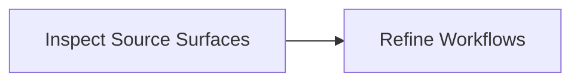

# srg-linux-paths / usr Subsystem System Review Graph

Generated: `2026-06-08T20:57:41+00:00`
Scope: Generated starter subsystem map for usr in /private/tmp/srg-linux-paths.
One line: Starter manifest generated from repository language, build, docs, and test surfaces.
Depth: `overview`

## Bigger Picture

This is an inferred starter map. It detects language and project surfaces, then asks maintainers or agents to refine actual workflows, gates, and boundaries.

## Current Truth

- `atlas_parent`: `srg-linux-paths`
- `detected_languages`: `["c_cpp"]`
- `file_limit`: `6000`
- `files_seen`: `23`
- `runtime_behavior_proven`: `false`
- `scanner`: `language_neutral_starter`
- `subsystem_path`: `usr`

## Source Links

| Source | Notes |
|---|---|
| [Linux kernel repository](https://github.com/torvalds/linux) | Public source repository used for the path-tree stress test. |
| [Linux kernel commit 2d3090a](https://github.com/torvalds/linux/commit/2d3090a8aeb596a26935db0955d46c9a5db5c6ce) | Merge tag 'v7.1-p5' of git://git.kernel.org/pub/scm/linux/kernel/git/herbert/crypto-2.6 |

## Report Registers

These registers turn the map into an audit surface: what is covered, what evidence supports it, what remains open, and what a reviewer should do next.

### Coverage Register

| Area | Count | What It Means | Reviewer Use |
|---|---:|---|---|
| Systems | 1 | Bounded contexts, services, subsystems, or product surfaces. | Use this to see whether the report maps the main operating areas. |
| Artifacts | 2 | Inspectable files, APIs, tables, dashboards, reports, or outputs. | Use this to trace where system claims can be inspected. |
| Schemas/contracts | 4 | Public or sanitized contracts for artifacts and handoffs. | Use this to rebuild examples without touching private data. |
| Decision gates | 1 | Rules that advance, wait, block, or require human review. | Use this to find where the system controls action. |
| Workflows | 2 | Lifecycle steps from input to output. | Use this to follow what happens end to end. |
| Graph edges | 9 | Explicit and derived relationships between manifest nodes. | Use this to audit connectivity and missing relationships. |
| Child maps | 0 | Linked subsystem maps for large repositories. | Use this to drill into a map-of-maps instead of one flat report. |
| Blueprint sections | 0 | Source-evidence-backed operating flows. | Use this to review deep behavior claims with proof anchors. |
| Blueprint evidence rows | 0 | Source paths, symbols, roles, and proof levels. | Use this to verify whether blueprint claims are source-backed. |
| Source links | 2 | External or public references used by the report. | Use this to confirm the report's public evidence base. |
| Known boundaries | 4 | Open limits, unproven claims, redactions, or scope exclusions. | Use this to avoid treating the report as stronger than it is. |
| Review questions | 5 | Questions a maintainer, auditor, or agent should answer next. | Use this as the human follow-up queue. |
| Rebuild phases | 1 | Documented commands or phases for reproducing the report. | Use this to regenerate or verify the report locally. |

### Evidence Register

| Evidence | Kind | Coverage | Proof | Reviewer Use |
|---|---|---|---|---|
| [Linux kernel repository](https://github.com/torvalds/linux) | source link | whole report | declared | Public source repository used for the path-tree stress test. |
| [Linux kernel commit 2d3090a](https://github.com/torvalds/linux/commit/2d3090a8aeb596a26935db0955d46c9a5db5c6ce) | source link | whole report | declared | Merge tag 'v7.1-p5' of git://git.kernel.org/pub/scm/linux/kernel/git/herbert/crypto-2.6 |
| dummy-include/, gen_init_cpio.c | source_surface | unknown | safe_to_share | Detected C / C++ source and build surfaces. |
| Makefile, include/Makefile | config | unknown | safe_to_share | Detected build, package, container, or configuration files. |
| SourceSurface | detected_contract | path, language_stack, build_markers | contract declared | A detected source/build surface that needs human review. |
| DocumentationSurface | detected_contract | path, purpose | contract declared | Detected docs that may explain system behavior. |
| TestSurface | detected_contract | path, purpose | contract declared | Detected tests that may prove behavior. |
| ConfigSurface | detected_contract | path, purpose | contract declared | Detected build/config/deployment surface. |

### Gap Register

| Gap | Area | Status | Boundary | Next Step |
|---|---|---|---|---|
| Known boundary | whole report | open | Scanner output is inferred from file paths and markers. | Accept the boundary or add evidence that closes it. |
| Known boundary | whole report | open | Runtime behavior, production deployment, and ownership are not proven. | Accept the boundary or add evidence that closes it. |
| Known boundary | whole report | open | Maintainers or agents should refine workflows, gates, and boundaries before audit use. | Accept the boundary or add evidence that closes it. |
| Known boundary | whole report | open | Generated from Linux path metadata only; use the public source commit before making technical claims. | Accept the boundary or add evidence that closes it. |
| System truth boundary | C / C++ Surface | review | Detected from repository files; runtime behavior is not proven. | Inspect this boundary before making stronger behavior claims. |
| Blueprint not declared | whole report | optional | No source-backed blueprint sections were declared. | Add blueprint sections when the report needs source-level proof. |

### Action Register

| Action | Owner | Status | Trigger | Expected Output |
|---|---|---|---|---|
| Review question | maintainer / auditor | open | Which detected language surfaces are real subsystems? | Answer from source, tests, docs, logs, or maintainer knowledge. |
| Review question | maintainer / auditor | open | Which directories are generated or vendor noise? | Answer from source, tests, docs, logs, or maintainer knowledge. |
| Review question | maintainer / auditor | open | Where are APIs, CLIs, configs, migrations, docs, and tests? | Answer from source, tests, docs, logs, or maintainer knowledge. |
| Review question | maintainer / auditor | open | Which workflows move data or decisions end to end? | Answer from source, tests, docs, logs, or maintainer knowledge. |
| Review question | maintainer / auditor | open | Which gates block unsafe or unreviewed behavior? | Answer from source, tests, docs, logs, or maintainer knowledge. |
| Resolve boundary | maintainer / auditor | open | Scanner output is inferred from file paths and markers. | Accept as scope or add proof that closes it. |
| Resolve boundary | maintainer / auditor | open | Runtime behavior, production deployment, and ownership are not proven. | Accept as scope or add proof that closes it. |
| Resolve boundary | maintainer / auditor | open | Maintainers or agents should refine workflows, gates, and boundaries before audit use. | Accept as scope or add proof that closes it. |
| Resolve boundary | maintainer / auditor | open | Generated from Linux path metadata only; use the public source commit before making technical claims. | Accept as scope or add proof that closes it. |
| Rebuild phase | maintainer / agent | repeatable | scan | Generate a starter manifest from repository surfaces. |

## Lifecycle Map



## Expansion Index

| Level | Use It To Answer | Report Section |
|---|---|---|
| 0. Situation | What is true now? | Current Truth |
| 0.25. Registers | What is covered, proven, open, and actionable? | Report Registers |
| 0.5. Atlas | Which child map should I open next? | Map Of Maps |
| 0.75. Blueprint | Which source-backed flows explain the whole system? | Blueprint Sections |
| 1. Flow | How does the system move end to end? | Lifecycle Map |
| 2. Ownership | Which subsystem owns which artifact? | Artifact And Schema Map |
| 3. Control | Which rules advance, wait, or block? | Gate Map |
| 4. Implementation | Which files, APIs, docs, or outputs should I inspect? | System Details |
| 5. Audit | What should an external reviewer ask next? | Review Questions |

This is an overview report. Rebuild with `--depth standard` or `--depth deep` to expand artifacts, gates, schemas, workflows, and per-system drill-downs.

## Systems

| System | Owner | Stack | Architecture | Lifecycle | Boundary | Ideal Target |
|---|---|---|---|---|---|---|
| C / C++ Surface | unknown | C, C++ | detected source surface | source files -> build/test docs -> inferred system role | Detected from repository files; runtime behavior is not proven. | Replace this starter node with exact subsystem ownership and workflows. |

## Architecture Patterns

### Mixed-language repository

- Works for: C, C++, Java, C#, Python, JavaScript/TypeScript, Go, Rust, and mixed repos
- How to map it: Detect language/build/test/doc surfaces first, then refine into exact systems and workflows.
- What to redact: Publish paths and contracts, not private records or secrets.

## Walkthroughs

### From scan to real system review

Run scan, inspect detected surfaces, replace broad language nodes with real subsystems, then add workflows and gates.

```json
{
  "refine": [
    "systems",
    "artifacts",
    "workflows",
    "decision_gates"
  ],
  "scan": "system-review-graph scan --repo . --out system_review_manifest.json"
}
```

## Review Questions

- Which detected language surfaces are real subsystems?
- Which directories are generated or vendor noise?
- Where are APIs, CLIs, configs, migrations, docs, and tests?
- Which workflows move data or decisions end to end?
- Which gates block unsafe or unreviewed behavior?

## Rebuild Recipe

### scan

- Goal: Generate a starter manifest from repository surfaces.

```bash
system-review-graph scan --repo . --out system_review_manifest.json
```

## Known Boundaries

- Scanner output is inferred from file paths and markers.
- Runtime behavior, production deployment, and ownership are not proven.
- Maintainers or agents should refine workflows, gates, and boundaries before audit use.
- Generated from Linux path metadata only; use the public source commit before making technical claims.
