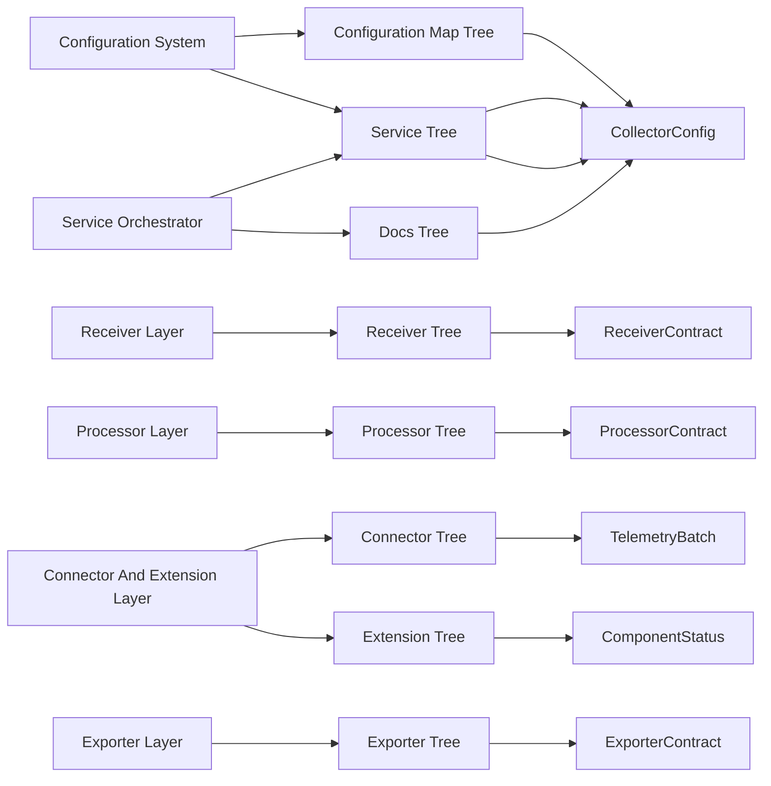
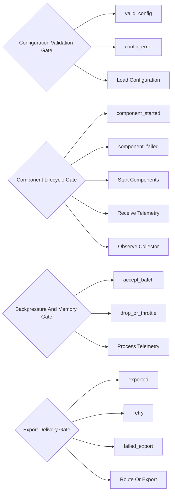
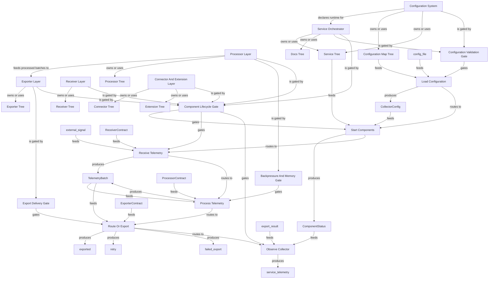

# OpenTelemetry Collector Public Repo System Review Graph

Generated: `2026-06-08T20:57:31+00:00`
Scope: A public-safe system map of the OpenTelemetry Collector open-source repository based on public source directories and documentation.
One line: The OpenTelemetry Collector routes telemetry through configurable receivers, processors, connectors, extensions, and exporters.
Depth: `deep`

## Bigger Picture

This example shows how to map a component pipeline repo. The system is a configurable telemetry service: configuration declares pipelines, receivers ingest signals, processors transform or batch them, connectors can bridge pipelines, exporters send telemetry onward, extensions add service capabilities, and service orchestration manages startup, shutdown, and observability.

## Current Truth

- `example_type`: `actual_public_repo`
- `repo`: `open-telemetry/opentelemetry-collector`
- `source_accessed_at`: `2026-06-08`
- `private_database_required`: `false`
- `production_data_required`: `false`
- `official_maintainer_audit`: `false`

## Source Links

| Source | Notes |
|---|---|
| [GitHub repository](https://github.com/open-telemetry/opentelemetry-collector) | Primary public source used for repo identity and source paths. |
| [OpenTelemetry Collector documentation](https://opentelemetry.io/docs/collector/) | Public docs for collector concepts and configuration. |
| [OpenTelemetry project](https://opentelemetry.io/) | Public project context for telemetry standards. |

## Report Registers

These registers turn the map into an audit surface: what is covered, what evidence supports it, what remains open, and what a reviewer should do next.

### Coverage Register

| Area | Count | What It Means | Reviewer Use |
|---|---:|---|---|
| Systems | 6 | Bounded contexts, services, subsystems, or product surfaces. | Use this to see whether the report maps the main operating areas. |
| Artifacts | 8 | Inspectable files, APIs, tables, dashboards, reports, or outputs. | Use this to trace where system claims can be inspected. |
| Schemas/contracts | 6 | Public or sanitized contracts for artifacts and handoffs. | Use this to rebuild examples without touching private data. |
| Decision gates | 4 | Rules that advance, wait, block, or require human review. | Use this to find where the system controls action. |
| Workflows | 6 | Lifecycle steps from input to output. | Use this to follow what happens end to end. |
| Graph edges | 51 | Explicit and derived relationships between manifest nodes. | Use this to audit connectivity and missing relationships. |
| Child maps | 0 | Linked subsystem maps for large repositories. | Use this to drill into a map-of-maps instead of one flat report. |
| Blueprint sections | 0 | Source-evidence-backed operating flows. | Use this to review deep behavior claims with proof anchors. |
| Blueprint evidence rows | 0 | Source paths, symbols, roles, and proof levels. | Use this to verify whether blueprint claims are source-backed. |
| Source links | 3 | External or public references used by the report. | Use this to confirm the report's public evidence base. |
| Known boundaries | 4 | Open limits, unproven claims, redactions, or scope exclusions. | Use this to avoid treating the report as stronger than it is. |
| Review questions | 5 | Questions a maintainer, auditor, or agent should answer next. | Use this as the human follow-up queue. |
| Rebuild phases | 2 | Documented commands or phases for reproducing the report. | Use this to regenerate or verify the report locally. |

### Evidence Register

| Evidence | Kind | Coverage | Proof | Reviewer Use |
|---|---|---|---|---|
| [GitHub repository](https://github.com/open-telemetry/opentelemetry-collector) | source link | whole report | declared | Primary public source used for repo identity and source paths. |
| [OpenTelemetry Collector documentation](https://opentelemetry.io/docs/collector/) | source link | whole report | declared | Public docs for collector concepts and configuration. |
| [OpenTelemetry project](https://opentelemetry.io/) | source link | whole report | declared | Public project context for telemetry standards. |
| receiver/ | source_directory | collector | safe_to_share | Defines receiver interfaces, helpers, and built-in receiver components. |
| processor/ | source_directory | collector | safe_to_share | Defines processors that transform, batch, limit, or otherwise mediate telemetry. |
| exporter/ | source_directory | collector | safe_to_share | Defines exporters and exporter helper behavior. |
| connector/ | source_directory | collector | safe_to_share | Defines connectors that can route telemetry between pipelines. |
| extension/ | source_directory | collector | safe_to_share | Defines service extensions such as auth, zpages, memory limiters, and capabilities. |
| service/ | source_directory | collector | safe_to_share | Coordinates configuration, pipelines, component lifecycle, telemetry, and host capabilities. |
| confmap/ | source_directory | collector | safe_to_share | Loads and resolves configuration maps and providers. |
| docs/ | public_docs | docs | safe_to_share | Documents collector behavior, proposals, and images. |
| CollectorConfig | configuration_contract | receivers, processors, exporters, service.pipelines | contract declared | Declares which components exist and how telemetry flows through pipelines. |
| ReceiverContract | component_contract | component_id, signal_type, endpoint, start_status | contract declared | Describes an ingest component that accepts telemetry. |
| ProcessorContract | component_contract | component_id, signal_type, transform_policy, failure_policy | contract declared | Describes transformation, batching, filtering, memory, or enrichment behavior. |
| ExporterContract | component_contract | component_id, destination, retry_policy, queue_policy | contract declared | Describes where telemetry is sent and how failures are handled. |
| TelemetryBatch | data_contract | signal_type, resource_attrs, scope, records | contract declared | Represents telemetry moving through a pipeline. |
| ComponentStatus | health_contract | component_id, status, error, observed_at | contract declared | Represents component lifecycle and health state. |

### Gap Register

| Gap | Area | Status | Boundary | Next Step |
|---|---|---|---|---|
| Known boundary | whole report | open | This is a public educational map, not an official OpenTelemetry maintainer audit. | Accept the boundary or add evidence that closes it. |
| Known boundary | whole report | open | It maps the collector architecture at a high level, not every component or distribution. | Accept the boundary or add evidence that closes it. |
| Known boundary | whole report | open | Real enterprise reviews should use fake or redacted telemetry payloads. | Accept the boundary or add evidence that closes it. |
| Known boundary | whole report | open | A full audit should inspect exact config, component versions, tests, runtime metrics, and deployment policy. | Accept the boundary or add evidence that closes it. |
| System truth boundary | Configuration System | review | Configuration describes desired telemetry flow; startup gates decide whether it can run. | Inspect this boundary before making stronger behavior claims. |
| System truth boundary | Receiver Layer | review | A receiver only starts when configuration and lifecycle checks pass. | Inspect this boundary before making stronger behavior claims. |
| System truth boundary | Processor Layer | review | Processor behavior is bounded by pipeline order and configuration. | Inspect this boundary before making stronger behavior claims. |
| System truth boundary | Connector And Extension Layer | review | Connectors and extensions can change topology or service behavior; they must start cleanly. | Inspect this boundary before making stronger behavior claims. |
| System truth boundary | Exporter Layer | review | Delivery depends on destination, queue, retry, and failure policy. | Inspect this boundary before making stronger behavior claims. |
| System truth boundary | Service Orchestrator | review | The service can expose health and telemetry, but configured components determine data path. | Inspect this boundary before making stronger behavior claims. |
| Blueprint not declared | whole report | optional | No source-backed blueprint sections were declared. | Add blueprint sections when the report needs source-level proof. |

### Action Register

| Action | Owner | Status | Trigger | Expected Output |
|---|---|---|---|---|
| Review question | maintainer / auditor | open | How does configuration become a running telemetry pipeline? | Answer from source, tests, docs, logs, or maintainer knowledge. |
| Review question | maintainer / auditor | open | Which gates prevent invalid config or failed components from processing telemetry? | Answer from source, tests, docs, logs, or maintainer knowledge. |
| Review question | maintainer / auditor | open | Where are backpressure, memory, queue, retry, and delivery policies enforced? | Answer from source, tests, docs, logs, or maintainer knowledge. |
| Review question | maintainer / auditor | open | How can a reviewer audit topology without seeing customer telemetry payloads? | Answer from source, tests, docs, logs, or maintainer knowledge. |
| Review question | maintainer / auditor | open | Which component health and service telemetry artifacts would prove runtime behavior? | Answer from source, tests, docs, logs, or maintainer knowledge. |
| Resolve boundary | maintainer / auditor | open | This is a public educational map, not an official OpenTelemetry maintainer audit. | Accept as scope or add proof that closes it. |
| Resolve boundary | maintainer / auditor | open | It maps the collector architecture at a high level, not every component or distribution. | Accept as scope or add proof that closes it. |
| Resolve boundary | maintainer / auditor | open | Real enterprise reviews should use fake or redacted telemetry payloads. | Accept as scope or add proof that closes it. |
| Resolve boundary | maintainer / auditor | open | A full audit should inspect exact config, component versions, tests, runtime metrics, and deployment policy. | Accept as scope or add proof that closes it. |
| Rebuild phase | maintainer / agent | repeatable | validate | Check the OpenTelemetry Collector public repo manifest. |
| Rebuild phase | maintainer / agent | repeatable | build | Generate the OpenTelemetry Collector system review report. |

## Lifecycle Map

```mermaid
flowchart LR
  load_configuration["Load Configuration"]
  start_components["Start Components"]
  receive_telemetry["Receive Telemetry"]
  process_telemetry["Process Telemetry"]
  route_or_export["Route Or Export"]
  observe_collector["Observe Collector"]
  load_configuration --> start_components["Start Components"]
  start_components --> receive_telemetry["Receive Telemetry"]
  receive_telemetry --> process_telemetry["Process Telemetry"]
  process_telemetry --> route_or_export["Route Or Export"]
  route_or_export --> observe_collector["Observe Collector"]
```



## Artifact And Schema Map



## Gate Map



## Relationship Graph



## Expansion Index

| Level | Use It To Answer | Report Section |
|---|---|---|
| 0. Situation | What is true now? | Current Truth |
| 0.25. Registers | What is covered, proven, open, and actionable? | Report Registers |
| 0.5. Atlas | Which child map should I open next? | Map Of Maps |
| 0.75. Blueprint | Which source-backed flows explain the whole system? | Blueprint Sections |
| 1. Flow | How does the system move end to end? | Lifecycle Map |
| 2. Ownership | Which subsystem owns which artifact? | Artifact And Schema Map |
| 3. Control | Which rules advance, wait, or block? | Gate Map |
| 4. Implementation | Which files, APIs, docs, or outputs should I inspect? | System Details |
| 5. Audit | What should an external reviewer ask next? | Review Questions |

## Systems

| System | Owner | Stack | Architecture | Lifecycle | Boundary | Ideal Target |
|---|---|---|---|---|---|---|
| Configuration System | collector | Go, YAML | configuration and provider layer | config file/provider -> CollectorConfig -> pipeline graph | Configuration describes desired telemetry flow; startup gates decide whether it can run. | Every pipeline is explicit, valid, and inspectable before startup. |
| Receiver Layer | collector | Go | component ingest layer | external telemetry -> receiver -> pipeline | A receiver only starts when configuration and lifecycle checks pass. | Telemetry ingress is explicit and observable. |
| Processor Layer | collector | Go | pipeline transformation layer | TelemetryBatch -> processor chain -> TelemetryBatch | Processor behavior is bounded by pipeline order and configuration. | Transformations are predictable, measurable, and resource-aware. |
| Connector And Extension Layer | collector | Go | component extension layer | component config -> started connector/extension -> runtime capability | Connectors and extensions can change topology or service behavior; they must start cleanly. | Optional capabilities are explicit and health-reporting. |
| Exporter Layer | collector | Go | component egress layer | TelemetryBatch -> exporter -> destination | Delivery depends on destination, queue, retry, and failure policy. | Export behavior is reliable, backpressure-aware, and observable. |
| Service Orchestrator | collector | Go | service runtime | valid config -> start components -> run pipelines -> shutdown | The service can expose health and telemetry, but configured components determine data path. | A running collector is explainable from config to component status. |

## System Details

### Configuration System

- Purpose: Loads and resolves collector configuration into service pipelines.
- Code surfaces: `confmap/`, `service/`
- Artifacts: `confmap_tree`, `service_tree`
- Decision gates: `config_validation_gate`
- Boundary: Configuration describes desired telemetry flow; startup gates decide whether it can run.
- Ideal target: Every pipeline is explicit, valid, and inspectable before startup.

Artifact expansion:

| Artifact | Kind | Schema | Path | Why It Matters |
|---|---|---|---|---|
| Configuration Map Tree | source_directory | CollectorConfig | confmap/ | Loads and resolves configuration maps and providers. |
| Service Tree | source_directory | CollectorConfig | service/ | Coordinates configuration, pipelines, component lifecycle, telemetry, and host capabilities. |

Gate expansion:

| Gate | Inputs | Outputs | Risk Boundary |
|---|---|---|---|
| Configuration Validation Gate | CollectorConfig | valid_config, config_error | The collector should not start an invalid pipeline. |

Workflow touchpoints:

| Step | Actor | Consumes | Produces | Gates |
|---|---|---|---|---|
| Load Configuration | Configuration System | config_file, confmap_tree | CollectorConfig | config_validation_gate |
| Start Components | Service Orchestrator | CollectorConfig, service_tree | ComponentStatus | component_lifecycle_gate |

### Receiver Layer

- Purpose: Accepts telemetry from external sources and injects it into pipelines.
- Code surfaces: `receiver/`
- Artifacts: `receiver_tree`
- Decision gates: `component_lifecycle_gate`
- Boundary: A receiver only starts when configuration and lifecycle checks pass.
- Ideal target: Telemetry ingress is explicit and observable.

Artifact expansion:

| Artifact | Kind | Schema | Path | Why It Matters |
|---|---|---|---|---|
| Receiver Tree | source_directory | ReceiverContract | receiver/ | Defines receiver interfaces, helpers, and built-in receiver components. |

Gate expansion:

| Gate | Inputs | Outputs | Risk Boundary |
|---|---|---|---|
| Component Lifecycle Gate | ReceiverContract, ProcessorContract, ExporterContract, ComponentStatus | component_started, component_failed | Telemetry should flow only after required components start successfully. |

Workflow touchpoints:

| Step | Actor | Consumes | Produces | Gates |
|---|---|---|---|---|
| Start Components | Service Orchestrator | CollectorConfig, service_tree | ComponentStatus | component_lifecycle_gate |
| Receive Telemetry | Receiver Layer | external_signal, ReceiverContract | TelemetryBatch | component_lifecycle_gate |
| Observe Collector | Service Orchestrator | ComponentStatus, export_result | service_telemetry | component_lifecycle_gate |

### Processor Layer

- Purpose: Transforms, batches, limits, or filters telemetry before export.
- Code surfaces: `processor/`
- Artifacts: `processor_tree`
- Decision gates: `backpressure_gate`, `component_lifecycle_gate`
- Boundary: Processor behavior is bounded by pipeline order and configuration.
- Ideal target: Transformations are predictable, measurable, and resource-aware.

Artifact expansion:

| Artifact | Kind | Schema | Path | Why It Matters |
|---|---|---|---|---|
| Processor Tree | source_directory | ProcessorContract | processor/ | Defines processors that transform, batch, limit, or otherwise mediate telemetry. |

Gate expansion:

| Gate | Inputs | Outputs | Risk Boundary |
|---|---|---|---|
| Backpressure And Memory Gate | TelemetryBatch, ComponentStatus | accept_batch, drop_or_throttle | A collector should protect host resources under load. |
| Component Lifecycle Gate | ReceiverContract, ProcessorContract, ExporterContract, ComponentStatus | component_started, component_failed | Telemetry should flow only after required components start successfully. |

Workflow touchpoints:

| Step | Actor | Consumes | Produces | Gates |
|---|---|---|---|---|
| Start Components | Service Orchestrator | CollectorConfig, service_tree | ComponentStatus | component_lifecycle_gate |
| Receive Telemetry | Receiver Layer | external_signal, ReceiverContract | TelemetryBatch | component_lifecycle_gate |
| Process Telemetry | Processor Layer | TelemetryBatch, ProcessorContract | TelemetryBatch | backpressure_gate |
| Observe Collector | Service Orchestrator | ComponentStatus, export_result | service_telemetry | component_lifecycle_gate |

### Connector And Extension Layer

- Purpose: Bridges pipelines and adds service-level capabilities.
- Code surfaces: `connector/`, `extension/`
- Artifacts: `connector_tree`, `extension_tree`
- Decision gates: `component_lifecycle_gate`
- Boundary: Connectors and extensions can change topology or service behavior; they must start cleanly.
- Ideal target: Optional capabilities are explicit and health-reporting.

Artifact expansion:

| Artifact | Kind | Schema | Path | Why It Matters |
|---|---|---|---|---|
| Connector Tree | source_directory | TelemetryBatch | connector/ | Defines connectors that can route telemetry between pipelines. |
| Extension Tree | source_directory | ComponentStatus | extension/ | Defines service extensions such as auth, zpages, memory limiters, and capabilities. |

Gate expansion:

| Gate | Inputs | Outputs | Risk Boundary |
|---|---|---|---|
| Component Lifecycle Gate | ReceiverContract, ProcessorContract, ExporterContract, ComponentStatus | component_started, component_failed | Telemetry should flow only after required components start successfully. |

Workflow touchpoints:

| Step | Actor | Consumes | Produces | Gates |
|---|---|---|---|---|
| Start Components | Service Orchestrator | CollectorConfig, service_tree | ComponentStatus | component_lifecycle_gate |
| Receive Telemetry | Receiver Layer | external_signal, ReceiverContract | TelemetryBatch | component_lifecycle_gate |
| Observe Collector | Service Orchestrator | ComponentStatus, export_result | service_telemetry | component_lifecycle_gate |

### Exporter Layer

- Purpose: Sends processed telemetry to configured destinations.
- Code surfaces: `exporter/`
- Artifacts: `exporter_tree`
- Decision gates: `export_delivery_gate`, `component_lifecycle_gate`
- Boundary: Delivery depends on destination, queue, retry, and failure policy.
- Ideal target: Export behavior is reliable, backpressure-aware, and observable.

Artifact expansion:

| Artifact | Kind | Schema | Path | Why It Matters |
|---|---|---|---|---|
| Exporter Tree | source_directory | ExporterContract | exporter/ | Defines exporters and exporter helper behavior. |

Gate expansion:

| Gate | Inputs | Outputs | Risk Boundary |
|---|---|---|---|
| Export Delivery Gate | TelemetryBatch, ExporterContract | exported, retry, failed_export | Telemetry delivery failures should follow retry and queue policy. |
| Component Lifecycle Gate | ReceiverContract, ProcessorContract, ExporterContract, ComponentStatus | component_started, component_failed | Telemetry should flow only after required components start successfully. |

Workflow touchpoints:

| Step | Actor | Consumes | Produces | Gates |
|---|---|---|---|---|
| Start Components | Service Orchestrator | CollectorConfig, service_tree | ComponentStatus | component_lifecycle_gate |
| Receive Telemetry | Receiver Layer | external_signal, ReceiverContract | TelemetryBatch | component_lifecycle_gate |
| Route Or Export | Connector And Exporter Layers | TelemetryBatch, ExporterContract | exported, retry, failed_export | export_delivery_gate |
| Observe Collector | Service Orchestrator | ComponentStatus, export_result | service_telemetry | component_lifecycle_gate |

### Service Orchestrator

- Purpose: Coordinates component lifecycle, pipelines, host capabilities, and service telemetry.
- Code surfaces: `service/`, `component/`
- Artifacts: `service_tree`, `docs_tree`
- Decision gates: `config_validation_gate`, `component_lifecycle_gate`
- Boundary: The service can expose health and telemetry, but configured components determine data path.
- Ideal target: A running collector is explainable from config to component status.

Artifact expansion:

| Artifact | Kind | Schema | Path | Why It Matters |
|---|---|---|---|---|
| Service Tree | source_directory | CollectorConfig | service/ | Coordinates configuration, pipelines, component lifecycle, telemetry, and host capabilities. |
| Docs Tree | public_docs | CollectorConfig | docs/ | Documents collector behavior, proposals, and images. |

Gate expansion:

| Gate | Inputs | Outputs | Risk Boundary |
|---|---|---|---|
| Configuration Validation Gate | CollectorConfig | valid_config, config_error | The collector should not start an invalid pipeline. |
| Component Lifecycle Gate | ReceiverContract, ProcessorContract, ExporterContract, ComponentStatus | component_started, component_failed | Telemetry should flow only after required components start successfully. |

Workflow touchpoints:

| Step | Actor | Consumes | Produces | Gates |
|---|---|---|---|---|
| Load Configuration | Configuration System | config_file, confmap_tree | CollectorConfig | config_validation_gate |
| Start Components | Service Orchestrator | CollectorConfig, service_tree | ComponentStatus | component_lifecycle_gate |
| Receive Telemetry | Receiver Layer | external_signal, ReceiverContract | TelemetryBatch | component_lifecycle_gate |
| Observe Collector | Service Orchestrator | ComponentStatus, export_result | service_telemetry | component_lifecycle_gate |

## Artifacts

| Artifact | Kind | Schema | Owner | Path | Redaction | Purpose |
|---|---|---|---|---|---|---|
| Receiver Tree | source_directory | ReceiverContract | collector | receiver/ | safe_to_share | Defines receiver interfaces, helpers, and built-in receiver components. |
| Processor Tree | source_directory | ProcessorContract | collector | processor/ | safe_to_share | Defines processors that transform, batch, limit, or otherwise mediate telemetry. |
| Exporter Tree | source_directory | ExporterContract | collector | exporter/ | safe_to_share | Defines exporters and exporter helper behavior. |
| Connector Tree | source_directory | TelemetryBatch | collector | connector/ | safe_to_share | Defines connectors that can route telemetry between pipelines. |
| Extension Tree | source_directory | ComponentStatus | collector | extension/ | safe_to_share | Defines service extensions such as auth, zpages, memory limiters, and capabilities. |
| Service Tree | source_directory | CollectorConfig | collector | service/ | safe_to_share | Coordinates configuration, pipelines, component lifecycle, telemetry, and host capabilities. |
| Configuration Map Tree | source_directory | CollectorConfig | collector | confmap/ | safe_to_share | Loads and resolves configuration maps and providers. |
| Docs Tree | public_docs | CollectorConfig | docs | docs/ | safe_to_share | Documents collector behavior, proposals, and images. |

## Schemas And Contracts

| Name | Kind | Required Fields | Privacy Notes | Purpose |
|---|---|---|---|---|
| CollectorConfig | configuration_contract | receivers, processors, exporters, service.pipelines |  | Declares which components exist and how telemetry flows through pipelines. |
| ReceiverContract | component_contract | component_id, signal_type, endpoint, start_status |  | Describes an ingest component that accepts telemetry. |
| ProcessorContract | component_contract | component_id, signal_type, transform_policy, failure_policy |  | Describes transformation, batching, filtering, memory, or enrichment behavior. |
| ExporterContract | component_contract | component_id, destination, retry_policy, queue_policy |  | Describes where telemetry is sent and how failures are handled. |
| TelemetryBatch | data_contract | signal_type, resource_attrs, scope, records |  | Represents telemetry moving through a pipeline. |
| ComponentStatus | health_contract | component_id, status, error, observed_at |  | Represents component lifecycle and health state. |

## Decision Gates

### Configuration Validation Gate

- Inputs: `CollectorConfig`
- Outputs: `valid_config, config_error`
- Human gate: `false`
- Risk boundary: The collector should not start an invalid pipeline.

| If | Then |
|---|---|
| all referenced components exist and pipeline shape is valid | valid_config |
| missing component, invalid signal type, or bad setting | config_error |

### Component Lifecycle Gate

- Inputs: `ReceiverContract, ProcessorContract, ExporterContract, ComponentStatus`
- Outputs: `component_started, component_failed`
- Human gate: `false`
- Risk boundary: Telemetry should flow only after required components start successfully.

| If | Then |
|---|---|
| component starts and reports healthy | component_started |
| component fails startup or dependency check | component_failed |

### Backpressure And Memory Gate

- Inputs: `TelemetryBatch, ComponentStatus`
- Outputs: `accept_batch, drop_or_throttle`
- Human gate: `false`
- Risk boundary: A collector should protect host resources under load.

| If | Then |
|---|---|
| resource limits allow processing | accept_batch |
| queue or memory policy triggers | drop_or_throttle |

### Export Delivery Gate

- Inputs: `TelemetryBatch, ExporterContract`
- Outputs: `exported, retry, failed_export`
- Human gate: `false`
- Risk boundary: Telemetry delivery failures should follow retry and queue policy.

| If | Then |
|---|---|
| destination accepts batch | exported |
| temporary failure and retry policy allows | retry |
| permanent failure or queue exhausted | failed_export |

## Workflows

| Step | Actor | Consumes | Gates | Produces | Next | Purpose |
|---|---|---|---|---|---|---|
| Load Configuration | Configuration System | config_file, confmap_tree | config_validation_gate | CollectorConfig | start_components | Resolve component and pipeline configuration. |
| Start Components | Service Orchestrator | CollectorConfig, service_tree | component_lifecycle_gate | ComponentStatus | receive_telemetry | Start receivers, processors, exporters, connectors, and extensions. |
| Receive Telemetry | Receiver Layer | external_signal, ReceiverContract | component_lifecycle_gate | TelemetryBatch | process_telemetry | Bring traces, metrics, or logs into a configured pipeline. |
| Process Telemetry | Processor Layer | TelemetryBatch, ProcessorContract | backpressure_gate | TelemetryBatch | route_or_export | Apply configured processing and protect host resources. |
| Route Or Export | Connector And Exporter Layers | TelemetryBatch, ExporterContract | export_delivery_gate | exported, retry, failed_export | observe_collector | Send telemetry onward or route it through another pipeline. |
| Observe Collector | Service Orchestrator | ComponentStatus, export_result | component_lifecycle_gate | service_telemetry |  | Expose service status and runtime telemetry for operators. |

## Architecture Patterns

### Component pipeline

- Works for: Telemetry agents, ETL jobs, event routers, streaming processors, and plugin frameworks
- How to map it: Map config, components, pipeline topology, lifecycle gates, backpressure gates, and delivery gates.
- What to redact: Expose component names and contracts; redact customer endpoints, secrets, and payload content.

### Enterprise API-only review

- Works for: Platforms where reviewers cannot access databases or deployed services
- How to map it: Use public component contracts, fake config, health states, and delivery-policy examples.
- What to redact: Do not publish production telemetry, endpoint URLs, tokens, tenant names, or incident traces.

## Walkthroughs

### One telemetry batch through a pipeline

A config declares a pipeline. The service starts components. A receiver accepts telemetry, processors transform or batch it, connectors can route it, and exporters deliver it with retry and queue policies.

```json
{
  "gates": [
    "config_validation_gate",
    "component_lifecycle_gate",
    "backpressure_gate",
    "export_delivery_gate"
  ],
  "path": [
    "CollectorConfig",
    "ReceiverContract",
    "TelemetryBatch",
    "ProcessorContract",
    "ExporterContract"
  ],
  "signals": [
    "traces",
    "metrics",
    "logs"
  ]
}
```

### How to audit without customer telemetry

A reviewer can use fake config and public component contracts to understand topology, gates, and failure handling without seeing production payloads.

```json
{
  "requires_customer_payloads": false,
  "safe_artifacts": [
    "receiver/",
    "processor/",
    "exporter/",
    "connector/",
    "extension/",
    "service/",
    "confmap/"
  ]
}
```

## Review Questions

- How does configuration become a running telemetry pipeline?
- Which gates prevent invalid config or failed components from processing telemetry?
- Where are backpressure, memory, queue, retry, and delivery policies enforced?
- How can a reviewer audit topology without seeing customer telemetry payloads?
- Which component health and service telemetry artifacts would prove runtime behavior?

## Rebuild Recipe

### validate

- Goal: Check the OpenTelemetry Collector public repo manifest.

```bash
system-review-graph validate --manifest examples/actual_repos/opentelemetry_collector/system_review_manifest.json
```

### build

- Goal: Generate the OpenTelemetry Collector system review report.

```bash
system-review-graph build --manifest examples/actual_repos/opentelemetry_collector/system_review_manifest.json --out-dir examples/actual_repos/opentelemetry_collector/reports
```

## Known Boundaries

- This is a public educational map, not an official OpenTelemetry maintainer audit.
- It maps the collector architecture at a high level, not every component or distribution.
- Real enterprise reviews should use fake or redacted telemetry payloads.
- A full audit should inspect exact config, component versions, tests, runtime metrics, and deployment policy.
