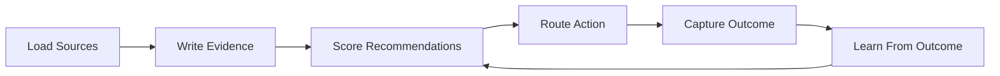
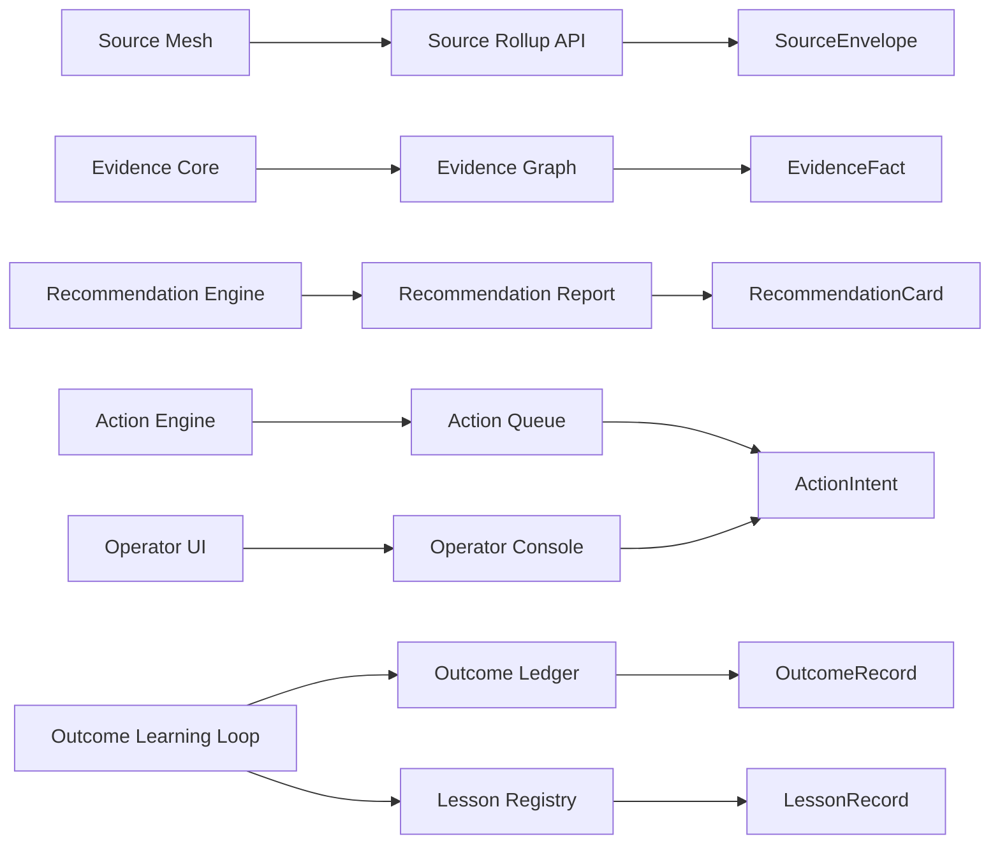
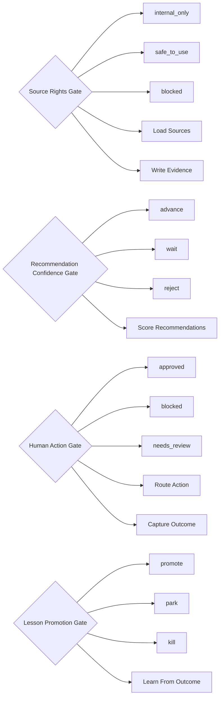
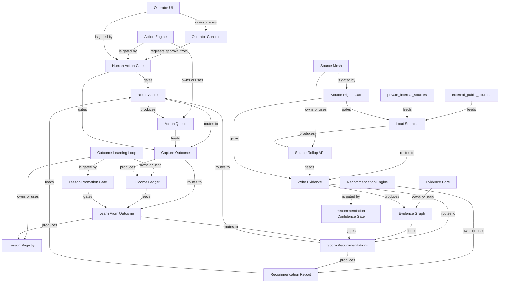

# Fictional AI Ops System Review Graph

Generated: `2026-06-08T20:57:31+00:00`
Scope: A fictional public-safe AI operations system used as an open-source example.
One line: Code-review graph shows the files; this system-review graph shows how evidence becomes recommended action, outcome, and lesson.
Depth: `deep`

## Bigger Picture

This example shows how a team can explain a complex system without exposing private databases. The system collects safe source summaries, stores evidence contracts, recommends actions, blocks risky operations behind human review, captures outcomes, and turns lessons into better rules.

## Current Truth

- `recommendations_today`: `12`
- `actions_allowed_without_human`: `4`
- `actions_requiring_human_review`: `8`
- `unsafe_action_bypass_count`: `0`
- `outcomes_pending_capture`: `3`
- `production_database_exposed`: `false`

## Report Registers

These registers turn the map into an audit surface: what is covered, what evidence supports it, what remains open, and what a reviewer should do next.

### Coverage Register

| Area | Count | What It Means | Reviewer Use |
|---|---:|---|---|
| Systems | 6 | Bounded contexts, services, subsystems, or product surfaces. | Use this to see whether the report maps the main operating areas. |
| Artifacts | 7 | Inspectable files, APIs, tables, dashboards, reports, or outputs. | Use this to trace where system claims can be inspected. |
| Schemas/contracts | 6 | Public or sanitized contracts for artifacts and handoffs. | Use this to rebuild examples without touching private data. |
| Decision gates | 4 | Rules that advance, wait, block, or require human review. | Use this to find where the system controls action. |
| Workflows | 6 | Lifecycle steps from input to output. | Use this to follow what happens end to end. |
| Graph edges | 38 | Explicit and derived relationships between manifest nodes. | Use this to audit connectivity and missing relationships. |
| Child maps | 0 | Linked subsystem maps for large repositories. | Use this to drill into a map-of-maps instead of one flat report. |
| Blueprint sections | 0 | Source-evidence-backed operating flows. | Use this to review deep behavior claims with proof anchors. |
| Blueprint evidence rows | 0 | Source paths, symbols, roles, and proof levels. | Use this to verify whether blueprint claims are source-backed. |
| Source links | 0 | External or public references used by the report. | Use this to confirm the report's public evidence base. |
| Known boundaries | 4 | Open limits, unproven claims, redactions, or scope exclusions. | Use this to avoid treating the report as stronger than it is. |
| Review questions | 6 | Questions a maintainer, auditor, or agent should answer next. | Use this as the human follow-up queue. |
| Rebuild phases | 3 | Documented commands or phases for reproducing the report. | Use this to regenerate or verify the report locally. |

### Evidence Register

| Evidence | Kind | Coverage | Proof | Reviewer Use |
|---|---|---|---|---|
| GET /internal/source-rollups | api | data-platform | public_summary_only | Returns sanitized source summaries. |
| private://evidence_graph | private_database | data-platform | schema_only | Canonical internal evidence store. |
| reports/recommendations.json | json_report | intelligence | safe_to_share | Reviewable recommendation cards. |
| queue://action-intents | queue | operations | counts_only | Downstream actions waiting for execution or review. |
| reports/outcomes.jsonl | jsonl_ledger | operations | safe_to_share | Reality feedback from executed or skipped actions. |
| reports/lessons.jsonl | jsonl_ledger | research | safe_to_share | Validated lessons and parked rule changes. |
| app://operator | ui | operations | public_summary_only | Shows recommendations, blockers, approvals, outcomes, and lessons. |
| SourceEnvelope | sanitized_event | source_id, observed_at, source_type, summary, rights_status | contract declared | Describes a source observation without exposing raw vendor payloads. |
| EvidenceFact | graph_fact | fact_id, subject, kind, payload, valid_at, source_ref | contract declared | Stores traceable evidence used by recommendations. |
| RecommendationCard | decision_input | recommendation_id, subject, confidence, reason, evidence_refs, risk_level | contract declared | Explains why the system recommends an action. |
| ActionIntent | downstream_action | action_id, recommendation_id, action_type, human_gate_required, status | contract declared | Represents a proposed action before execution. |
| OutcomeRecord | reality_feedback | outcome_id, action_id, capture_status, result, evidence_refs | contract declared | Captures whether action created the intended result. |
| LessonRecord | learning_loop | lesson_id, outcome_id, lesson, rule_change_status | contract declared | Turns outcomes into validated or parked rule changes. |

### Gap Register

| Gap | Area | Status | Boundary | Next Step |
|---|---|---|---|---|
| Known boundary | whole report | open | This report explains architecture and system behavior; it does not prove production correctness. | Accept the boundary or add evidence that closes it. |
| Known boundary | whole report | open | Sanitized examples must not be treated as real data. | Accept the boundary or add evidence that closes it. |
| Known boundary | whole report | open | A passing gate in a report still needs implementation tests in the actual system. | Accept the boundary or add evidence that closes it. |
| Known boundary | whole report | open | Human/legal/security gates should be implemented in production code, not only documented. | Accept the boundary or add evidence that closes it. |
| System truth boundary | Source Mesh | review | Source summaries are not product claims. | Inspect this boundary before making stronger behavior claims. |
| System truth boundary | Evidence Core | review | Database remains private; public report exposes only schema and examples. | Inspect this boundary before making stronger behavior claims. |
| System truth boundary | Recommendation Engine | review | A recommendation is not an executed action. | Inspect this boundary before making stronger behavior claims. |
| System truth boundary | Action Engine | review | Restricted actions require approval before execution. | Inspect this boundary before making stronger behavior claims. |
| System truth boundary | Outcome Learning Loop | review | A lesson does not change future behavior until promotion is validated. | Inspect this boundary before making stronger behavior claims. |
| System truth boundary | Operator UI | review | UI reads canonical reports and requests actions; it does not invent truth. | Inspect this boundary before making stronger behavior claims. |
| Source links missing | whole report | open | No external source links were declared. | Add public repo, docs, issue, or design references. |
| Blueprint not declared | whole report | optional | No source-backed blueprint sections were declared. | Add blueprint sections when the report needs source-level proof. |

### Action Register

| Action | Owner | Status | Trigger | Expected Output |
|---|---|---|---|---|
| Review question | maintainer / auditor | open | Which source and evidence artifacts prove each recommendation? | Answer from source, tests, docs, logs, or maintainer knowledge. |
| Review question | maintainer / auditor | open | Which decision gate blocks unsafe downstream action? | Answer from source, tests, docs, logs, or maintainer knowledge. |
| Review question | maintainer / auditor | open | Which actions require human approval and why? | Answer from source, tests, docs, logs, or maintainer knowledge. |
| Review question | maintainer / auditor | open | Where is the outcome captured after action or no-action? | Answer from source, tests, docs, logs, or maintainer knowledge. |
| Review question | maintainer / auditor | open | Which lessons are promoted, parked, or killed based on reality feedback? | Answer from source, tests, docs, logs, or maintainer knowledge. |
| Review question | maintainer / auditor | open | What can be safely reviewed if the production database remains private? | Answer from source, tests, docs, logs, or maintainer knowledge. |
| Resolve boundary | maintainer / auditor | open | This report explains architecture and system behavior; it does not prove production correctness. | Accept as scope or add proof that closes it. |
| Resolve boundary | maintainer / auditor | open | Sanitized examples must not be treated as real data. | Accept as scope or add proof that closes it. |
| Resolve boundary | maintainer / auditor | open | A passing gate in a report still needs implementation tests in the actual system. | Accept as scope or add proof that closes it. |
| Resolve boundary | maintainer / auditor | open | Human/legal/security gates should be implemented in production code, not only documented. | Accept as scope or add proof that closes it. |
| Rebuild phase | maintainer / agent | repeatable | validate | Check the manifest shape. |
| Rebuild phase | maintainer / agent | repeatable | build | Generate JSON and Markdown reports. |
| Rebuild phase | maintainer / agent | repeatable | review | Read the system as an operating map. |

## Lifecycle Map



## Artifact And Schema Map



## Gate Map



## Relationship Graph



## Expansion Index

| Level | Use It To Answer | Report Section |
|---|---|---|
| 0. Situation | What is true now? | Current Truth |
| 0.25. Registers | What is covered, proven, open, and actionable? | Report Registers |
| 0.5. Atlas | Which child map should I open next? | Map Of Maps |
| 0.75. Blueprint | Which source-backed flows explain the whole system? | Blueprint Sections |
| 1. Flow | How does the system move end to end? | Lifecycle Map |
| 2. Ownership | Which subsystem owns which artifact? | Artifact And Schema Map |
| 3. Control | Which rules advance, wait, or block? | Gate Map |
| 4. Implementation | Which files, APIs, docs, or outputs should I inspect? | System Details |
| 5. Audit | What should an external reviewer ask next? | Review Questions |

## Systems

| System | Owner | Stack | Architecture | Lifecycle | Boundary | Ideal Target |
|---|---|---|---|---|---|---|
| Source Mesh | data-platform | Python, TypeScript | loader mesh | source -> SourceEnvelope -> source rights gate | Source summaries are not product claims. | Every source has freshness, rights, and retry metadata. |
| Evidence Core | data-platform | PostgreSQL, Python | private evidence graph | SourceEnvelope -> EvidenceFact -> graph neighborhood | Database remains private; public report exposes only schema and examples. | Every recommendation can trace back to facts and sources. |
| Recommendation Engine | intelligence | Python | batch plus API scoring | EvidenceFact -> RecommendationCard -> confidence gate | A recommendation is not an executed action. | Every recommendation has evidence, confidence, failure modes, and next action. |
| Action Engine | operations | Python, Redis | event-driven workflow | RecommendationCard -> ActionIntent -> human gate | Restricted actions require approval before execution. | Every action intent has an outcome slot. |
| Outcome Learning Loop | research | Python | ledger and validation loop | ActionIntent -> OutcomeRecord -> LessonRecord -> promotion gate | A lesson does not change future behavior until promotion is validated. | Knowledge becomes wisdom through observed outcomes. |
| Operator UI | operations | TypeScript, React | report-backed control room | reports -> UI -> operator decision -> action intent | UI reads canonical reports and requests actions; it does not invent truth. | Operator can run the day from one evidence-backed control room. |

## System Details

### Source Mesh

- Purpose: Collects sanitized source summaries from internal and public systems.
- Code surfaces: `loaders/`, `services/source_rollups`
- Artifacts: `source_rollup_api`
- Decision gates: `source_rights_gate`
- Boundary: Source summaries are not product claims.
- Ideal target: Every source has freshness, rights, and retry metadata.

Artifact expansion:

| Artifact | Kind | Schema | Path | Why It Matters |
|---|---|---|---|---|
| Source Rollup API | api | SourceEnvelope | GET /internal/source-rollups | Returns sanitized source summaries. |

Gate expansion:

| Gate | Inputs | Outputs | Risk Boundary |
|---|---|---|---|
| Source Rights Gate | SourceEnvelope.rights_status | internal_only, safe_to_use, blocked | No downstream product or public claim uses a source unless rights are clear. |

Workflow touchpoints:

| Step | Actor | Consumes | Produces | Gates |
|---|---|---|---|---|
| Load Sources | Source Mesh | external_public_sources, private_internal_sources | source_rollup_api | source_rights_gate |
| Write Evidence | Evidence Core | source_rollup_api | evidence_graph | source_rights_gate |

### Evidence Core

- Purpose: Stores facts, relationships, and reasoning traces used by recommendations.
- Code surfaces: `db/migrations`, `services/evidence`
- Artifacts: `evidence_graph`
- Decision gates: `none`
- Boundary: Database remains private; public report exposes only schema and examples.
- Ideal target: Every recommendation can trace back to facts and sources.

Artifact expansion:

| Artifact | Kind | Schema | Path | Why It Matters |
|---|---|---|---|---|
| Evidence Graph | private_database | EvidenceFact | private://evidence_graph | Canonical internal evidence store. |

Workflow touchpoints:

| Step | Actor | Consumes | Produces | Gates |
|---|---|---|---|---|
| Write Evidence | Evidence Core | source_rollup_api | evidence_graph | source_rights_gate |
| Score Recommendations | Recommendation Engine | evidence_graph | recommendation_report | recommendation_confidence_gate |

### Recommendation Engine

- Purpose: Turns evidence into reviewable recommendation cards.
- Code surfaces: `engine/recommendations`
- Artifacts: `recommendation_report`
- Decision gates: `recommendation_confidence_gate`
- Boundary: A recommendation is not an executed action.
- Ideal target: Every recommendation has evidence, confidence, failure modes, and next action.

Artifact expansion:

| Artifact | Kind | Schema | Path | Why It Matters |
|---|---|---|---|---|
| Recommendation Report | json_report | RecommendationCard | reports/recommendations.json | Reviewable recommendation cards. |

Gate expansion:

| Gate | Inputs | Outputs | Risk Boundary |
|---|---|---|---|
| Recommendation Confidence Gate | RecommendationCard.confidence, RecommendationCard.evidence_refs | advance, wait, reject | Weak or ungrounded recommendations cannot become action intents. |

Workflow touchpoints:

| Step | Actor | Consumes | Produces | Gates |
|---|---|---|---|---|
| Score Recommendations | Recommendation Engine | evidence_graph | recommendation_report | recommendation_confidence_gate |
| Route Action | Action Engine | recommendation_report | action_queue | human_action_gate |

### Action Engine

- Purpose: Routes approved recommendations into bounded action intents.
- Code surfaces: `workers/action_engine`
- Artifacts: `action_queue`
- Decision gates: `human_action_gate`
- Boundary: Restricted actions require approval before execution.
- Ideal target: Every action intent has an outcome slot.

Artifact expansion:

| Artifact | Kind | Schema | Path | Why It Matters |
|---|---|---|---|---|
| Action Queue | queue | ActionIntent | queue://action-intents | Downstream actions waiting for execution or review. |

Gate expansion:

| Gate | Inputs | Outputs | Risk Boundary |
|---|---|---|---|
| Human Action Gate | ActionIntent.action_type, RecommendationCard.risk_level | approved, blocked, needs_review | External sends, money movement, deletion, legal claims, and user-visible changes need approval. |

Workflow touchpoints:

| Step | Actor | Consumes | Produces | Gates |
|---|---|---|---|---|
| Route Action | Action Engine | recommendation_report | action_queue | human_action_gate |
| Capture Outcome | Outcome Worker | action_queue | outcome_ledger | human_action_gate |

### Outcome Learning Loop

- Purpose: Captures what happened and converts outcomes into lessons.
- Code surfaces: `workers/outcomes`, `workers/lessons`
- Artifacts: `outcome_ledger`, `lesson_registry`
- Decision gates: `lesson_promotion_gate`
- Boundary: A lesson does not change future behavior until promotion is validated.
- Ideal target: Knowledge becomes wisdom through observed outcomes.

Artifact expansion:

| Artifact | Kind | Schema | Path | Why It Matters |
|---|---|---|---|---|
| Outcome Ledger | jsonl_ledger | OutcomeRecord | reports/outcomes.jsonl | Reality feedback from executed or skipped actions. |
| Lesson Registry | jsonl_ledger | LessonRecord | reports/lessons.jsonl | Validated lessons and parked rule changes. |

Gate expansion:

| Gate | Inputs | Outputs | Risk Boundary |
|---|---|---|---|
| Lesson Promotion Gate | OutcomeRecord.result, LessonRecord.rule_change_status | promote, park, kill | One good outcome is not enough to change future system behavior. |

Workflow touchpoints:

| Step | Actor | Consumes | Produces | Gates |
|---|---|---|---|---|
| Capture Outcome | Outcome Worker | action_queue | outcome_ledger | human_action_gate |
| Learn From Outcome | Research Worker | outcome_ledger | lesson_registry | lesson_promotion_gate |

### Operator UI

- Purpose: Shows recommendations, approvals, outcomes, and lessons without owning truth.
- Code surfaces: `apps/operator`
- Artifacts: `operator_console`
- Decision gates: `human_action_gate`
- Boundary: UI reads canonical reports and requests actions; it does not invent truth.
- Ideal target: Operator can run the day from one evidence-backed control room.

Artifact expansion:

| Artifact | Kind | Schema | Path | Why It Matters |
|---|---|---|---|---|
| Operator Console | ui | ActionIntent | app://operator | Shows recommendations, blockers, approvals, outcomes, and lessons. |

Gate expansion:

| Gate | Inputs | Outputs | Risk Boundary |
|---|---|---|---|
| Human Action Gate | ActionIntent.action_type, RecommendationCard.risk_level | approved, blocked, needs_review | External sends, money movement, deletion, legal claims, and user-visible changes need approval. |

Workflow touchpoints:

| Step | Actor | Consumes | Produces | Gates |
|---|---|---|---|---|
| Route Action | Action Engine | recommendation_report | action_queue | human_action_gate |
| Capture Outcome | Outcome Worker | action_queue | outcome_ledger | human_action_gate |

## Artifacts

| Artifact | Kind | Schema | Owner | Path | Redaction | Purpose |
|---|---|---|---|---|---|---|
| Source Rollup API | api | SourceEnvelope | data-platform | GET /internal/source-rollups | public_summary_only | Returns sanitized source summaries. |
| Evidence Graph | private_database | EvidenceFact | data-platform | private://evidence_graph | schema_only | Canonical internal evidence store. |
| Recommendation Report | json_report | RecommendationCard | intelligence | reports/recommendations.json | safe_to_share | Reviewable recommendation cards. |
| Action Queue | queue | ActionIntent | operations | queue://action-intents | counts_only | Downstream actions waiting for execution or review. |
| Outcome Ledger | jsonl_ledger | OutcomeRecord | operations | reports/outcomes.jsonl | safe_to_share | Reality feedback from executed or skipped actions. |
| Lesson Registry | jsonl_ledger | LessonRecord | research | reports/lessons.jsonl | safe_to_share | Validated lessons and parked rule changes. |
| Operator Console | ui | ActionIntent | operations | app://operator | public_summary_only | Shows recommendations, blockers, approvals, outcomes, and lessons. |

## Schemas And Contracts

| Name | Kind | Required Fields | Privacy Notes | Purpose |
|---|---|---|---|---|
| SourceEnvelope | sanitized_event | source_id, observed_at, source_type, summary, rights_status | Raw source bodies and credentials are never included. | Describes a source observation without exposing raw vendor payloads. |

Example `SourceEnvelope`:

```json
{
  "observed_at": "2026-06-08T14:00:00Z",
  "rights_status": "internal_review",
  "source_id": "support_summary",
  "source_type": "ticket_rollup",
  "summary": "12 tickets mention billing delay"
}
```

| EvidenceFact | graph_fact | fact_id, subject, kind, payload, valid_at, source_ref | Payload should be redacted or fake in public examples. | Stores traceable evidence used by recommendations. |
| RecommendationCard | decision_input | recommendation_id, subject, confidence, reason, evidence_refs, risk_level |  | Explains why the system recommends an action. |
| ActionIntent | downstream_action | action_id, recommendation_id, action_type, human_gate_required, status |  | Represents a proposed action before execution. |
| OutcomeRecord | reality_feedback | outcome_id, action_id, capture_status, result, evidence_refs |  | Captures whether action created the intended result. |
| LessonRecord | learning_loop | lesson_id, outcome_id, lesson, rule_change_status |  | Turns outcomes into validated or parked rule changes. |

## Decision Gates

### Source Rights Gate

- Inputs: `SourceEnvelope.rights_status`
- Outputs: `internal_only, safe_to_use, blocked`
- Human gate: `false`
- Risk boundary: No downstream product or public claim uses a source unless rights are clear.

| If | Then |
|---|---|
| rights_status == blocked | blocked |
| rights_status == internal_review | internal_only |
| rights_status == approved | safe_to_use |

### Recommendation Confidence Gate

- Inputs: `RecommendationCard.confidence, RecommendationCard.evidence_refs`
- Outputs: `advance, wait, reject`
- Human gate: `false`
- Risk boundary: Weak or ungrounded recommendations cannot become action intents.

| If | Then |
|---|---|
| confidence >= 0.75 and evidence_refs present | advance |
| confidence >= 0.5 | wait |
| missing evidence | reject |

### Human Action Gate

- Inputs: `ActionIntent.action_type, RecommendationCard.risk_level`
- Outputs: `approved, blocked, needs_review`
- Human gate: `true`
- Risk boundary: External sends, money movement, deletion, legal claims, and user-visible changes need approval.

| If | Then |
|---|---|
| risk_level == high | needs_review |
| action_type in external_send, deletion, money_movement | needs_review |
| approval missing for restricted action | blocked |

### Lesson Promotion Gate

- Inputs: `OutcomeRecord.result, LessonRecord.rule_change_status`
- Outputs: `promote, park, kill`
- Human gate: `false`
- Risk boundary: One good outcome is not enough to change future system behavior.

| If | Then |
|---|---|
| repeated positive outcomes and validation pass | promote |
| evidence incomplete | park |
| negative or unsafe outcome | kill |

## Workflows

| Step | Actor | Consumes | Gates | Produces | Next | Purpose |
|---|---|---|---|---|---|---|
| Load Sources | Source Mesh | external_public_sources, private_internal_sources | source_rights_gate | source_rollup_api | write_evidence | Create sanitized source summaries. |
| Write Evidence | Evidence Core | source_rollup_api | source_rights_gate | evidence_graph | score_recommendations | Persist traceable facts without exposing private records. |
| Score Recommendations | Recommendation Engine | evidence_graph | recommendation_confidence_gate | recommendation_report | route_action | Generate reviewable recommendation cards. |
| Route Action | Action Engine | recommendation_report | human_action_gate | action_queue | capture_outcome | Create bounded action intents. |
| Capture Outcome | Outcome Worker | action_queue | human_action_gate | outcome_ledger | learn_from_outcome | Record what happened after action or no-action. |
| Learn From Outcome | Research Worker | outcome_ledger | lesson_promotion_gate | lesson_registry | score_recommendations | Improve or reject future rules. |

## Architecture Patterns

### Open-source library

- Works for: Python, JavaScript, Rust, Go, Java, or mixed-language libraries
- How to map it: Map public APIs as artifacts, type contracts as schemas, CI/release checks as gates, and examples as walkthroughs.
- What to redact: Usually safe to share full paths and examples.

### Private enterprise microservice

- Works for: Teams that cannot expose databases or production internals
- How to map it: Map services, APIs, queues, and sanitized contracts. Use logical names for private infrastructure.
- What to redact: Publish schema-only or counts-only artifacts for sensitive stores.

### Data platform

- Works for: Warehouses, data lakes, ELT/ETL pipelines, reporting systems
- How to map it: Map source loaders, quality checks, marts, dashboards, rights/freshness gates, and report outputs.
- What to redact: Expose table contracts and quality counts, not raw records.

### AI or agent system

- Works for: LLM apps, agent swarms, RAG systems, ML workflows
- How to map it: Map tools, memory, prompts, retrieval artifacts, eval gates, human approvals, and outcome loops.
- What to redact: Remove secrets, user content, private prompts, and production traces.

### Embedded or microarchitecture-style system

- Works for: Firmware, hardware interfaces, compiler/runtime internals, chips, robotics
- How to map it: Map interface contracts, telemetry, safety thresholds, state machines, and fault gates.
- What to redact: Publish logical interfaces and safety boundaries, not proprietary layouts or confidential specs.

## Walkthroughs

### From source to action

A source rollup says billing-delay tickets increased. The evidence graph stores a redacted fact. The recommendation engine creates a card. The action engine proposes customer communication. The human action gate requires approval because this is external communication.

```json
{
  "fact": "billing delay mentions increased",
  "gate": "human_action_gate",
  "recommendation": "prepare customer update",
  "result": "needs_review",
  "source": "support_summary"
}
```

### From outcome to lesson

An approved action produces a positive outcome. The lesson loop records that early customer communication reduced repeat tickets. The lesson is parked until repeated validation proves the rule should be promoted.

```json
{
  "lesson": "early communication may reduce repeat tickets",
  "outcome": "repeat tickets down 18%",
  "promotion": "park_until_repeated"
}
```

### Private database review

The database is never exposed. Reviewers see the EvidenceFact contract, redaction policy, source counts, and decision gates. They can understand behavior without seeing private rows.

```json
{
  "database": "private://evidence_graph",
  "public_view": "schema_only",
  "reviewable": [
    "contract",
    "gate",
    "artifact purpose",
    "redaction policy"
  ]
}
```

## Review Questions

- Which source and evidence artifacts prove each recommendation?
- Which decision gate blocks unsafe downstream action?
- Which actions require human approval and why?
- Where is the outcome captured after action or no-action?
- Which lessons are promoted, parked, or killed based on reality feedback?
- What can be safely reviewed if the production database remains private?

## Rebuild Recipe

### validate

- Goal: Check the manifest shape.

```bash
system-review-graph validate --manifest examples/fictional_ai_ops/system_review_manifest.json
```

### build

- Goal: Generate JSON and Markdown reports.

```bash
system-review-graph build --manifest examples/fictional_ai_ops/system_review_manifest.json --out-dir examples/fictional_ai_ops/reports
```

### review

- Goal: Read the system as an operating map.

```bash
open examples/fictional_ai_ops/reports/system_review_graph.md
```

## Known Boundaries

- This report explains architecture and system behavior; it does not prove production correctness.
- Sanitized examples must not be treated as real data.
- A passing gate in a report still needs implementation tests in the actual system.
- Human/legal/security gates should be implemented in production code, not only documented.
